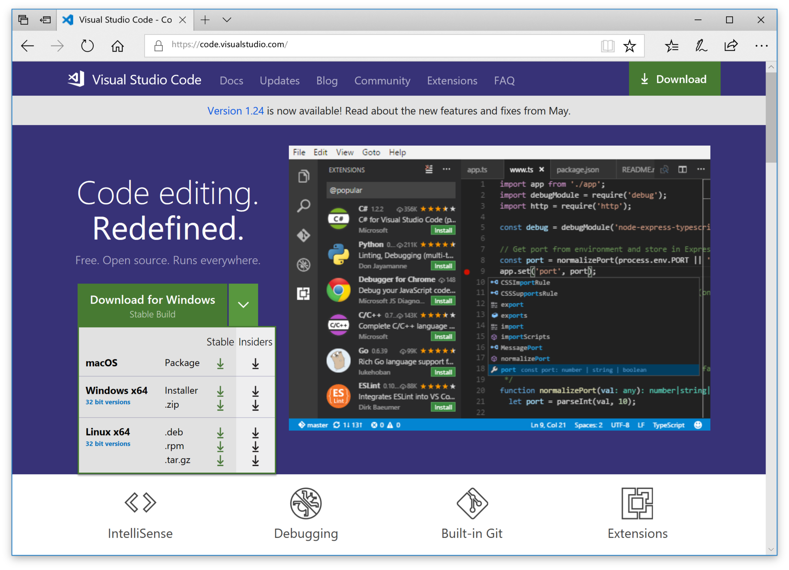
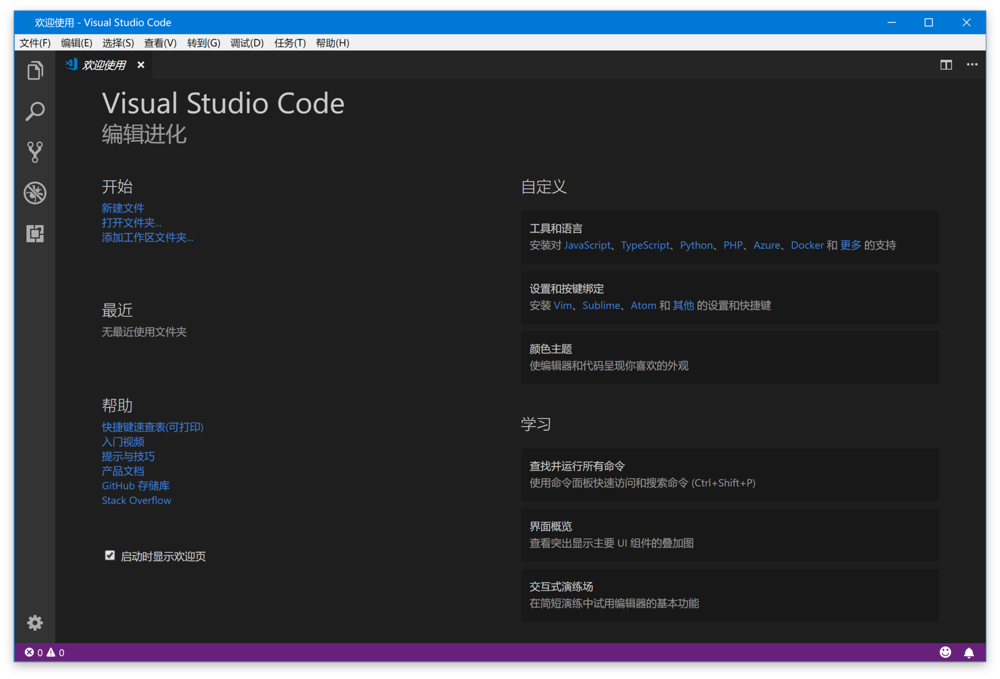
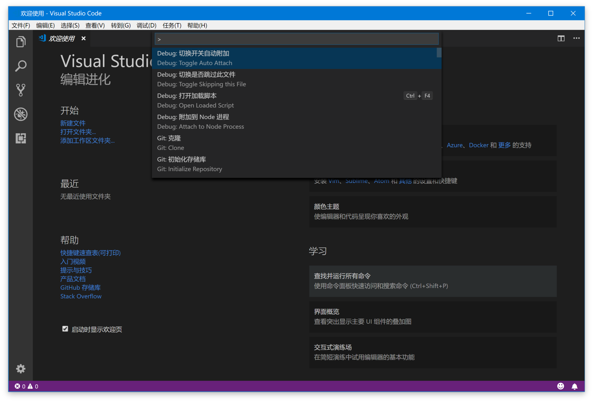
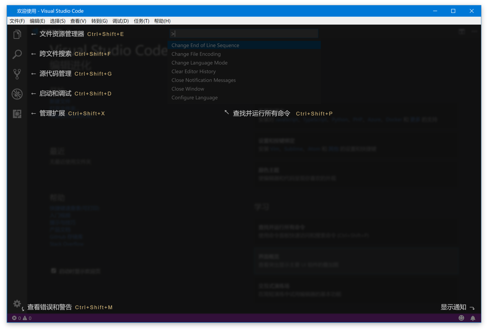
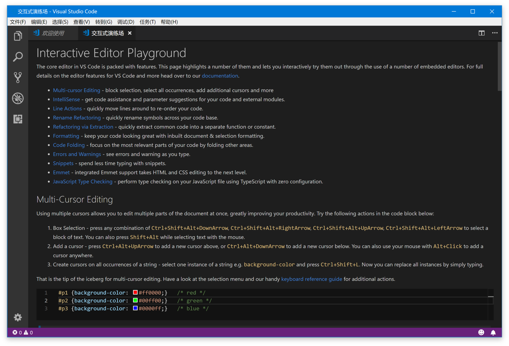
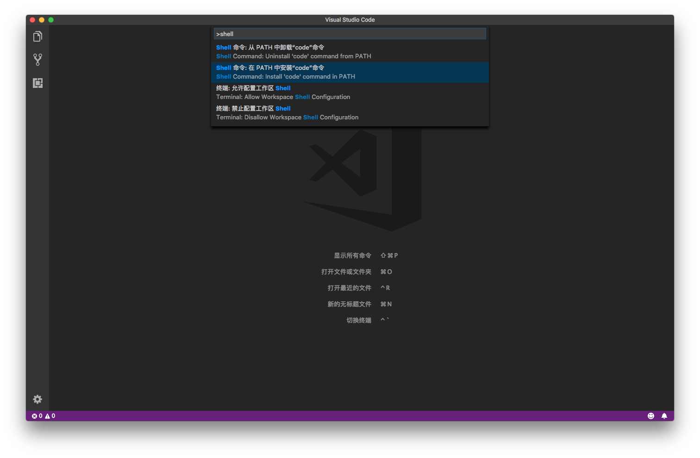
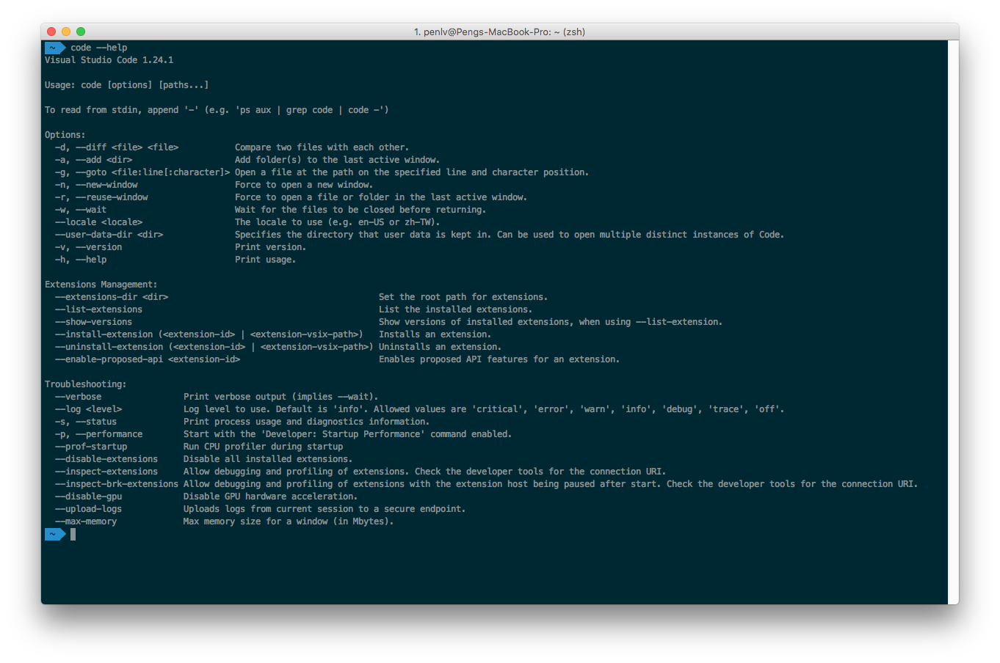

# 03 | 如何快速上手VS Code?

mp3: https://res001.geekbang.org/resource/audio/3b/d5/3b81279abba05e345362c508a93120d5.mp3

前面我们聊到了VS Code的历史以及定位，相信你已经开始摩拳擦掌，跃跃欲试希望充分利用VS Code来提高编程效率了。但是别急，万事总有个开头儿，今天我们先来聊一下 VS Code 的安装和更新、VS Code 初次使用的指引界面、语言设置，以及命令行使用等基础问题，以便你能快速上手VS Code。

安装与版本选择
-------

VS Code 有两个不同的发布渠道：一个是我们经常使用的稳定版（Stable），每个月发布一个主版本；另外一个发布渠道叫做 Insiders，每周一到周五 UTC 时间早上6点从最新的代码发布一个版本，这也是 VS Code 团队在使用的版本，目标是可以第一时间用上自己新加的功能并及时发现问题。微软内部对这个做法还有个专门的名词，叫做“吃自己的狗粮” (eat your own dog food)。

除去VS Code核心开发团队，现在全世界大概还有一万五千名用户在使用 Insiders 版本。不过，如果你刚刚接触 VS Code ，那么稳定版本肯定更适合你。但如果你已经使用 VS Code 有一段时间，我还是非常推荐你试一试 Insiders ，因为使用这个版本有这样几个好处：

1.  **你可以尽早使用上最新的功能**。一般来说新功能会先在 Insiders 版本里上线，运行一段时间稳定后，会随着当月的稳定版本发布。但如果是改动比较大的功能，比如编辑器网格布局、自定义 Windows 菜单栏，可能会在 Insiders 里运行两个月才会最终推向所有用户。
    
2.  **你可以深度参与 VS Code 产品的开发过程**。一个新功能首次被添加到 Insiders 版本时，往往是不成熟的，而你可以在 GitHub 上第一时间反馈你对这个新功能的看法和建议，甚至可以为它贡献代码。
    

下载和安装 Insiders 版本也很简单，打开 VS Code 官网（[https://code.visualstudio.com](https://code.visualstudio.com)），点击绿色下载按钮旁的下拉按钮，就可以针对不同平台选择可用的 Insiders 版本了。而且，VS Code 安装完之后就会自动更新，你并不需要前往官网重新下载。同时，专栏里面使用的 VS Code 版本也将是最新的稳定版，这样便于大家理解。

在VS Code官网下载Insiders版本

初次使用
----

VS Code 第一次启动后会显示一个“欢迎使用”的页面，这个界面主要是方便你快速打开文件、文件夹以及访问历史文件，同时还会附带一些帮助信息，比如“快捷键速查表”。

首次启动VS Code，你将看到的“欢迎使用”页面

你可以多多点击和访问这个界面上的各种链接和按钮，主动发现和了解你可能感兴趣的功能。这里我主要讲一下“学习”区域的三个功能：**命令面板、界面概览和交互式演习场**。

### 1\. 命令面板

首先来看命令面板，它是 VS Code 快捷键的主要交互界面，你可以通过 F1 或者“Cmd+Shift+P ”(Windows 上是 “Ctrl+Shift+P”) 打开。这里提醒一下，如无特殊说明，我在这个专栏里默认基于macOS平台进行讲解，但也会本着为你提供方便的原则，同时给出Windows或Linux平台下的操作说明。通过编辑器来实现高效编程的思路是一致的，这和具体的使用平台无关，所以你大可不必为此担心。  

同时按下 Cmd + Shift + P，就可以打开命令面板

你可以在命令面板中快速搜索命令并且执行。如果你的 VS Code 是简体中文版，那么你可以在命令面板里使用中文或者英文来搜索命令。VS Code 的绝大多数命令都可以在命令面板里搜到，所以熟练使用命令面板，你就可以摆脱鼠标，完全通过键盘操作来完成全部编码工作。

### 2\. 界面概览

第二个是界面概览，它展示了 VS Code 默认界面里的不同部件的位置、名称和快捷键。VS Code 强调无鼠标操作，但是对于初学者而言快捷键的记忆是个麻烦，这个界面恰好可以帮助你渡过最初的不适应阶段。

界面概览，展示 VS Code 默认界面里的不同部件的位置、名称和快捷键

### 3\. 交互式演习场

第三个是交互式演习场，打开这个界面，你会看到一个全英文的初学者教程，其中通过各种交互示例给出了 VS Code 的核心功能，展示了一些高级代码编辑功能的使用，每个功能都会有一个代码片段和编辑器供你实时使用。

交互式演习场（Interactive Editor Playground）

这个界面现在还没有中文版，不过没有关系，它里面提到的所有功能我都会在这个专栏中详细介绍。

命令行的使用
------

接下来我们看一下命令行的使用。命令行你应该不陌生，我们脑海中的大神级程序员都是可以在Linux中随意敲打长串的命令，或是与黑客斗智斗勇，或是解决某个紧急的线上问题。而对于VS Code而言，最基础的命令行当然是让你能够不动鼠标，就能快速打开界面了。

如果你是 Windows用户，安装并重启系统后，你就可以在命令行中使用 `code` 或者 `code-insiders`了，如果你希望立刻而不是等待重启后使用，可以将 VS Code 的安装目录添加到系统环境变量 `PATH`中， Windows 64 位下的 VS Code 安装路径是 `C:\Program FIles\Microsoft VS Code`下。

如果你是在 macOS 上使用，安装后打开命令面板，搜索`Shell 命令：在 PATH 中安装 “Code” 命令`并执行，然后重启终端模拟就可以了。

搜索 \`Shell 命令，在 PATH 中安装 “Code” 命令\`并执行

如果你是使用 Linux 的话，我相信你一定知道怎么在终端中调用 VS Code。

接下来，我们看一下 VS Code 的命令行都支持哪些操作，这里我先运行了 `code --help`来打印出 VS Code 命令行所支持的所有参数。

运行 \`code --help\`的结果页面

最基本的命令行使用方式是在 `code` 命令后加上文件或者文件夹的地址，这样VS Code 就会在一个新窗口中打开这个文件或文件夹。

如果你希望使用已经打开的窗口来打开文件，可以在 `code` 命令后添加参数 `-r`来进行窗口的复用。

在已经打开的窗口来打开当前目录

你也可以使用参数 `-g <file:line[:character]>` 打开文件，然后滚动到文件中某个特定的行和列，比如输入 `code -r -g package.json:128`命令，你就可以打开 package.json 这个文件，然后自动跳转到 128 行。这个命令可以方便你从终端里快速地在 VS Code 里打开一个文件进行预览，一个特别常见的例子就是当我们使用脚本执行某个命令，这个命令告诉我们某个文件的某一行出现了错误，我们就能够快速定位了。

通过命令行打开文件，并滚动至特定的行

VS Code 也可以用来比较两个文件的内容，你只需使用 `-d`参数，并传入两个文件路径，比如输入 `code -r -d a.txt b.txt`命令，就可以比较a.txt和b.txt两个文件的内容了。有了这个命令，你就可以既使用命令行运行脚本，也可以借助 VS Code 的图形化界面进行文件内容的对比了。

通过命令行，比较两个文件的内容

VS Code 命令行除了支持打开磁盘上的文件以外，也接受来自管道中的数据。这样你就可以将原本在命令行中展示的内容，实时地展示在 VS Code 里，然后在编辑器中搜索和修改。比如，你可以把当前目录下所有的文件名都展示在编辑器里，此时只需使用`ls | code -`命令。

将命令行 ls 的执行结果在 VS Code 的编辑器中打开

另外，VS Code 命令行还能够管理插件，查看 VS Code 的运行情况，记录和分析 VS Code 运行性能，这些我会在之后的章节介绍。当然，你也可以现在小试牛刀，试试它的威力。

在我的日常工作中，经常会使用终端来操作脚本。这个时候，如果我需要打开 VS Code，使用命令行来打开 VS Code 再方便不过了。另外 VS Code 的命令行的各个参数，其实能够定制 VS Code 是怎样运行的，比如`--disable-extensions`、`--max-memory`，它们都有特殊的应用场景。当然，如果你发现了哪个配置是你特别希望默认就打开的，那么你可以在 shell 环境里创建一个别名 (alias)，而不用局限于 `code` 这个命令。

因为这个专栏的大部分内容都是操作相关，所以在专栏的最后，我想你都应该迫不及待地去练习、学习这些新特性，而我呢，则会在评论区静候你的反馈，有任何问题，都可以留言告诉我，我尽力帮你解决。

加油，你才刚刚踏入旅程。

* * *

