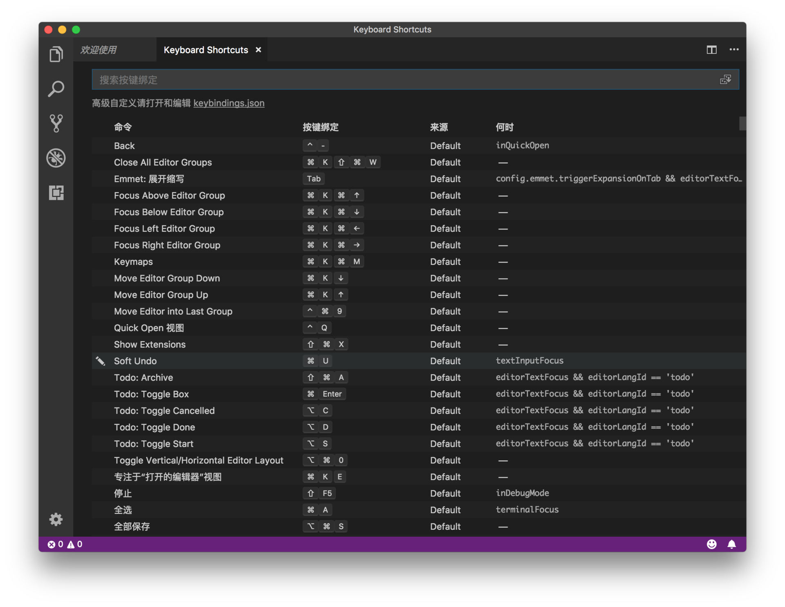
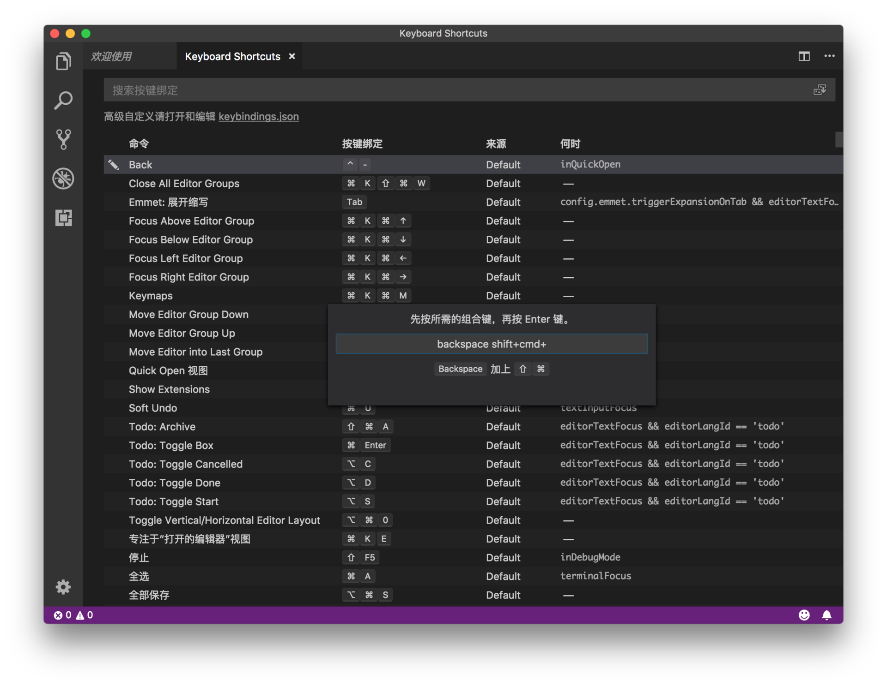

# 04 | 如何做到双手不离键盘？

mp3: https://res001.geekbang.org/resource/audio/47/a8/47b6475a52262f2bc8bd406dbadfe7a8.mp3

要想提高编码效率，你首先要掌握基本的文本操作快捷键。Vim 编辑器就因为其高效且独特的文本操作方式而知名。

2016年的时候，我同时在开发维护 VS Code 中的编辑器以及 Vim 插件，经常在这两套完全不同的快捷键之间切换。我的切实感受是，熟记 VS Code 的这套快捷键后，很多核心操作的效率是可以和 Vim 匹敌的，而且很多 VS Code 不支持的 Vim 快捷键也可以通过插件的方式来实现。

双手不离键盘
------

关于快捷键插件的开发，我在后面会讲，今天先来谈一谈核心的键盘操作：**光标的移动、文本的选择、文本的删除，以及如何为编辑器命令绑定快捷键**。

### 1\. 光标移动

移动光标最常用的就是方向键，但是方向键每次只能把光标移动一个位置，可以说是一种相对低效的方式。试想你打算把光标移动到当前行的行末，在没有鼠标的情况下，你可能需要按下右方向键几秒甚至十几秒钟。

不过，不用担心。虽然 VS Code 是基于 Web 技术开发的非原生应用，但是它支持针对单词、行、代码块、整个文档等多种光标移动方式。

今天，我会借助一段非常简单的 5 行 JavaScript 代码来讲解这些操作。

    function foo() {
      bar();
    }
    
    foo();
    

**首先是针对单词的光标移动**。这个你应该比较熟悉，绝大多数原生的编辑应用和文本框都支持。这也是我自己最常用的一组快捷键。

下面这张图显示，第一行代码中的第一个单词是 function，一共8个字符，光标的位置在第五个字符 t 的后面。当你想把光标直接移动到整个单词，也就是 function 的前面，你只需按下 Option（Windows 上是 Ctrl 键）和左方向键。相反，如果要把光标移动到单词的末尾，只需要按下 Option 和右方向键就好了。

按下 Option 和左方向键，把光标移动到当前单词的最前面

我们都知道，一直按着方向键，光标就可以不停地，一个字符一个字符地在文档中移动。但如果你同时按住 Option 和方向键，那么光标移动的颗粒度就变成了单词，你就可以在文档中以单词为单位不停地移动光标了。

持续按下 Option 和右方向键，在文档中以单词为单位不停移动

**第二种方式是把光标移动到行首或者行末**。比如第一行代码是 function foo() {，你只需按住 Cmd + 左方向键（Windows 上是 Home 键），就可以把光标移动到了这行的第一列；而如果你按住 Cmd 和右方向键（Windows 上是 End 键），光标就会被移动到 { 的后面。

按住 Cmd 和左右键把光标移动到行首或者行尾

**接下来一种是对于代码块的光标移动**。很多编程语言都使用花括号将代码块包裹起来，比如 if、for 语句等，你很可能会希望通过一个快捷键，就能实现在代码块的始末快速跳转。比如在这5行代码示例中，第一行到第三行代码是函数 foo 的定义，由一对花括号包裹起来，当你把光标放在花括号上时，只需按下 Cmd + Shift + \\（Windows 上是 Ctrl + Shift + \\），就可以在这对花括号之间跳转。

按下 Cmd + Shift + \\ 在一对花括号之间跳转

**最后一种基础的光标操作就是移动到文档的第一行或者最后一行**，你只需按下 Cmd 和上下方向键即可（Windows 上是 Ctrl + Home/End 键）。

按下 Cmd 加上下方向键跳转到文档第一行或者最后一行

### 2\. 文本选择

掌握了上面的快捷键之后，你还可以非常轻松地掌握文本选择的操作。因为对于基于单词、行和整个文档的光标操作，你只需要多按一个 Shift 键，就可以在移动光标的同时选中其中的文本。

比如说，你把光标放在第一行代码第四个字符 c 的后面，按下 Option 加左方向键，你就可以把光标跳转到 function 这个单词的开头，这个在前面我有讲过。如果你同时按下 Option + 左方向键+ Shift 键，那么你就能把光标到 function 单词开头之间的所有字符全部选中，也就是选中 func 这四个字符。

同时按住 Option + 左方向键 + Shift 键，选中当前单词开头到光标之间的所有字符

同理，假设说光标放在第二行，然后你按下 Cmd、Shift 和上下方向键，就能把第二行光标到第一行，或者最后一行之间的字符选中。是不是很简单呢？

macOS: Cmd + Shift + Up/Down

对于代码块的文本选择， VS Code 默认没有绑定快捷键。那么，是不是就没办法了呢？

当然不是。你可以先使用命令面板找到命令 “选择括号所有内容” 并运行。后面我还会讲述如何为一些未绑定快捷键的命令绑定自己熟悉的快捷键，请稍安勿躁。

### 3\. 删除操作

了解了光标移动和文本选择，再来看删除操作，就变得相对简单了。

比如你想把当前行中光标之前的文本全部删除，就可以先选中这段文本（Windows/Linux: Home + Shift，macOS: Cmd + Left + Shift )，然后再按删除键。不过对于频繁使用的删除操作，你肯定希望单次操作就可以完成任务，而不是重复地选择文本然后删除，那么你需要记住下面几个命令。

(1)假设你把光标放在第二行代码的中间位置，然后按下 Cmd 和 Backspace（MacOS上就是“fn + delete”的组合，Windows 上未绑定快捷键，可以打开命令面板运行“删除右侧所有内容”），就能够把第二行代码光标后（右侧）的字符全部删掉。

按下 Cmd + Backspace 删除当前行光标后所有文本

(2)按下 Cmd 和 Delete 键则是删除当前行中光标前（左侧）的所有内容（Windows 上未绑定快捷键，可以打开命令面板运行“删除左侧所有内容”）。

按下 Cmd + Delete 删除当前行光标前的所有文本

(3)删除单词内的字符与此类似。假设把光标放在第一行第四个字符 c 的后面。Option 加左方向键把光标**移动**到 function 这个单词的开头，Option加左方向键再加 Shift 即可**选中** func 这四个字符，而Option 加 Delete 则会**删除** func 这四个字符。这里你可能看出来了，这些快捷键共同的是 Option 键，然后通过按下 Shift 或者 Delete 键，来达到不同的效果。

Option + Delete 把当前单词里光标前的字符删除

(4)相反地，Option 加 Backspace（MacOS上就是“fn + delete”的组合） 则会删除 function 的后四个字符 tion。

Option + Backspace 把当前单词里光标后的字符删除

### 4\. 自定义快捷键

前面我们提到，VS Code 内置了很多的命令，但是并没有为每个命令都提供一个快捷键，毕竟快捷键的组合总是有限的。不过 VS Code 提供了快捷键的修改和自定义功能，这样你就可以根据自己的使用习惯，给自己常用的命令指定顺手的快捷键。

首先你可以打开命令面板（你还记得它的快捷键不？），搜索“打开键盘快捷方式”然后执行，这时你将看到相对应的界面。

键盘快捷方式界面

然后通过搜索找到你希望修改快捷键的命令，双击，接下来你只要按下你期望的快捷键，最后按下回车键就可以了。

修改快捷键界面

比如，你可以搜索“选择括号内所有内容”，双击，按下"Cmd + Shift + \]"，然后按下回车，这个快捷键就绑定上了。

按下 Cmd Shift \] 选中括号内所有内容

有了这个快捷键，你就不需要打开命令面板找到这个命令再执行了。看到这里你可能会问，“如果我按下某个快捷键所绑定的命令不是我想要的，但是我又不知道这个命令的名字怎么办？”

VS Code 的快捷键修改界面已经考虑到了这一点，你可以在搜索框内搜索你使用的快捷键，然后就可以看到这个快捷键当前对应的命令是哪个。

快捷键搜索界面

比如，在上面的示例里，你通过搜索 “cmd+backspace”这组快捷键，发现它对应的命令是“删除左侧所有内容”，但你不希望使用这个命令，那你就可以通过右键选择删除该快捷键的绑定。

小结
--

今天这篇文章主要讲解了光标的移动、文本的选择和删除所对应的快捷键，并且研究了如何修改和自定义快捷键。你不妨试着刻意地把这些快捷键运用到日常的编码中去，刚开始肯定会慢一些，不过你的肌肉肯定能迅速记住它们。

如果你早就熟悉了这些快捷键，那么不妨试试对快捷键进行修改，我相信 VS Code 内置的快捷键绑定不总是完美的，希望你能找到你自己的最佳实践。

还是老话，我在评论区等你，欢迎交流讨论。

* * *

