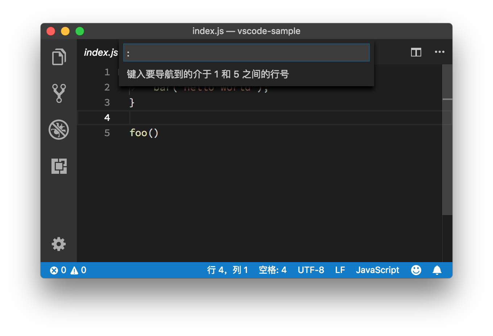
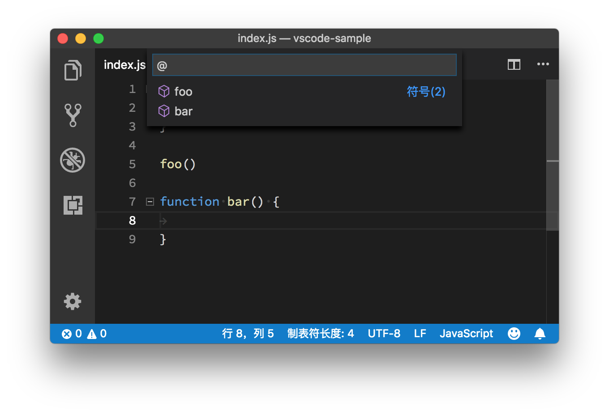

# 07 | 如何快速在文件、符号、代码之间跳转？

mp3: https://res001.geekbang.org/resource/audio/26/18/2606563464b8429690fe7cba510c4618.mp3

今天的内容，跟之前略有些不一样。在前面的几讲里，我们的侧重点一直是 VS Code 的“编辑器”特性。编辑器命令、快捷键、多光标，无一例外都是想要提高编辑文本的效率。

但相信你还记得，在专栏的第二讲 “VS Code的Why、How 和What”里我提到过，VS Code 是想在传统编辑器和 IDE 之间找到一个平衡点，让你在编辑器上也一样能体验到 IDE 那些出色的语言支持。

今天，我们就会一起探讨， VS Code 是如何借力于编程语言支持，让代码的跳转更智能的。

文件跳转
----

当你在开发一个新功能或者修复一个 Bug的时候，你同时在阅读和修改的文件可能就有几个或者十几个。从资源管理器里打开文件固然方便，但是如果这个项目里的文件非常多，并且经常需要在资源管理器里寻找文件，那“眼花缭乱”的，肯定要浪费你不少宝贵的时间。

在VS Code中，解决这个问题的第一个方法，就是按下 “Ctrl+Tab”，然后继续按着 “Ctrl”键但是松开 “Tab” 键，这样你就可以打开一个文件列表，这个列表罗列了当前打开的所有文件。接下来，你可以通过按下 “Tab”键在这个列表里跳转，选择你想要打开的文件。最后选到你想打开的文件后，松开 “Ctrl” 键，这个文件就被打开了。

通过“Ctrl+Tab”组合键选择并打开文件

不过，使用这个方式切换文件，最大的问题在于，文件一旦多了，你就得不停地按 “Tab” 键，没完没了地上下跳转和挑选，这会是一个恼人的耗费时间和眼力的操作。

还好，VS Code 在命令面板里提供了一种支持搜索的文件跳转方式。当你按下 “Cmd + P” （Windows 上是 Ctrl + P）时，就会跳出一个最近打开文件的列表，同时在列表的顶部还有一个搜索框。

看到这里想必你应该明白了，你可以使用这个搜索框来快速地找到你想要的文件，然后按下 “Enter” 键直接打开，这整个过程简单而且顺畅。

按下“Cmd + P”打开最近打开的文件列表

在这里，我再分享给你一个小技巧，当你找到目标文件后，可以按下 “Cmd + Enter ” （Windows 上是 Ctrl + Enter）组合键。你会发现与上面不一样的是，这个文件在一个新的编辑器窗口中打开了（关于编辑器窗口的管理，我会在之后的章节里介绍）。

按下 “Cmd + Enter ”组合键在新窗口中打开文件

行跳转
---

打开某一个文件之后，你的另外一个需求可能就是要快速跳转到这个文件的某一行。你可能会想，VS Code是不是可以像Vim那样，输入“:13”就能跳转到第13行。是的，VS Code也提供了一种极为简单的方式来支持行跳转，你只需要按下 “Ctrl + g”，紧接着编辑器就会出现一个输入框。如下图所示：

按下 “Ctrl + g”，调出行输入框

你会惊喜地发现，这个输入框的第一个字符就是 “:”，在这之后输入数字，你就能够将光标快速地移动到那一行。是不是很便捷？

输入行数3，跳转到第3行

接下来我再给你介绍一个高阶组合技巧。如果你想跳转到某个文件的某一行，你只需要先按下 “Cmd + P”，输入文件名，然后在这之后加上 “:”和指定行号即可。

跳转到指定文件的指定行数

符号 (Symbols) 跳转
---------------

文件跳转和行跳转，是代码跳转的基本操作，也是日常编码中的高频操作。不过有的时候，你可能会希望能够立刻跳转到文件里的类定义，或者函数定义的位置。为了支持这种跳转，VS Code 提供了一套 API 给语言服务插件，它们可以分析代码，告诉 VS Code 项目或者文件里有哪些类、哪些函数或者标识符（我们把这些统称为符号）。

如果要在一个文件里的符号之间跳转，你只需按下 “Cmd + Shift + O” （Windows 上是 Ctrl + Shift + O），就能够看到当前文件里的所有符号。

使用 “Cmd + Shift + O”组合键，调出当前文件的符号

使用方向键，或者搜索，找到你想要的符号后，按下回车，就能够立刻跳转到那个符号的位置。如下图所示：

通过符号功能跳转到指定的代码位置

请注意，在按下 “Cmd + Shift +O”后，输入框里有一个 “@”符号，这个符号在这里的意义，我会在后面的章节里去介绍，你可以先留个心眼。这时，如果你输入 “:”，就可以将当前文件的所有符号，进行分类，这样搜索符号也就更加方便。

对当前文件的所有符号进行分类

有些语言除了提供单个文件里的符号，还支持在多个文件里进行符号跳转。比如在 VS Code 里，如果你打开了多个 JavaScript 文件，就可以按下 “Cmd + T” （Windows 上是 Ctrl + T），搜索这些文件里的符号。

通过“Cmd + T”，搜索多个文件的符号

定义 (Definition) 和实现 (implementation) 跳转
---------------------------------------

符号跳转依托于语言插件对代码的分析，已经算得上具备一定的智能特性，但是它还是不够精确。比如说我们看到某个函数的调用，想要知道这个函数的接口定义是什么样的，它的实现细节是什么样的，光靠符号跳转，还是会不方便。我们需要的是直接跳转到定义和实现的位置，Java程序员看到这里一定会深有感触。

当然，这个功能也需要语言本身的支持。比如说当你在使用 TypeScript 时，按下 F12，就可以跳转到函数的定义处。

F12跳转到函数定义的位置

也可以按下 “Cmd + F12” （Windows 上是 Ctrl + F12），跳转到函数的实现的位置。

Cmd + F12 跳转到函数实现的位置

而在书写 JavaScript 时，因为并没有接口（interface）的概念，定义和实现恰好是相同的。

JavaScript 里 F12 和 Cmd + F12 效果一样

引用 (Reference) 跳转
-----------------

很多时候，除了要知道一个函数或者类的定义和实现以外，你可能还希望知道它们被谁引用了，以及在哪里被引用了。这时你只需要将光标移动到函数或者类上面，然后按下 “Shift + F12”，VS Code 就会打开一个引用列表和一个内嵌的编辑器。在这个引用列表里，你选中某个引用，VS Code 就会把这个引用附近的代码展示在这个内嵌的编辑器里。

Shift+ F12打开函数引用预览

小结
--

今天我介绍了如何在文件之间跳转，如何跳转到某个文件的某行代码，以及如何在编程语言插件的帮助下，跳转到符号、定义、实现和引用的位置。对这些命令和快捷键熟练掌握后，你就不用像“无头苍蝇”一样在编辑器里找代码了。

不过这并不是VS Code里代码跳转功能的全部，在之后的学习过程中，我还会给你展示更多的快捷方式，所以尽情感受你灵活的双手随心所欲地在代码之间跳转吧。

* * *

