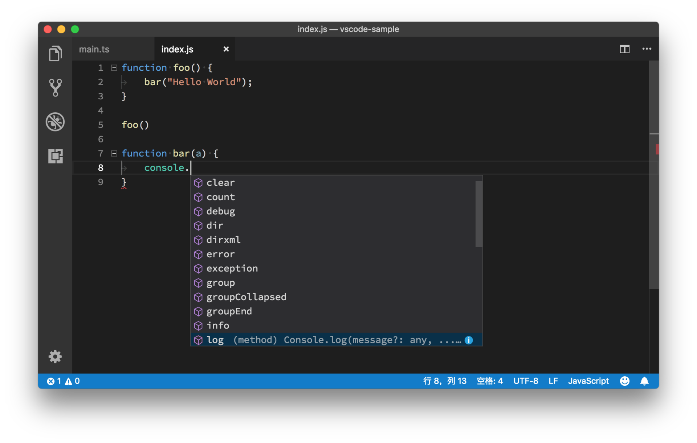
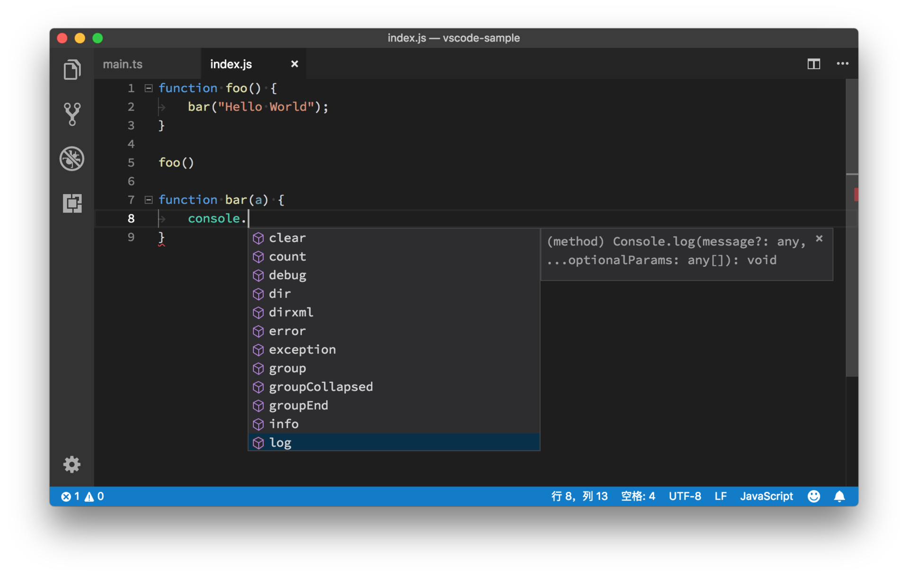
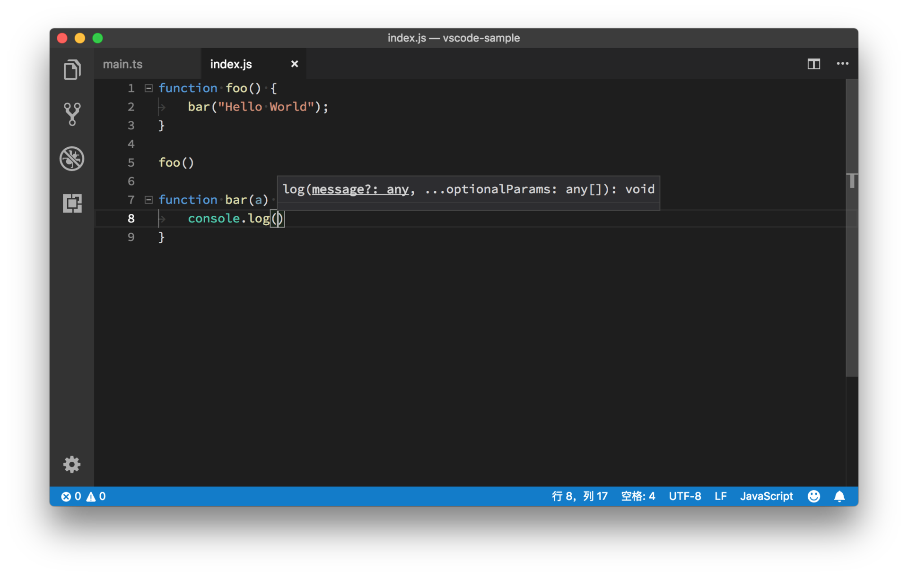
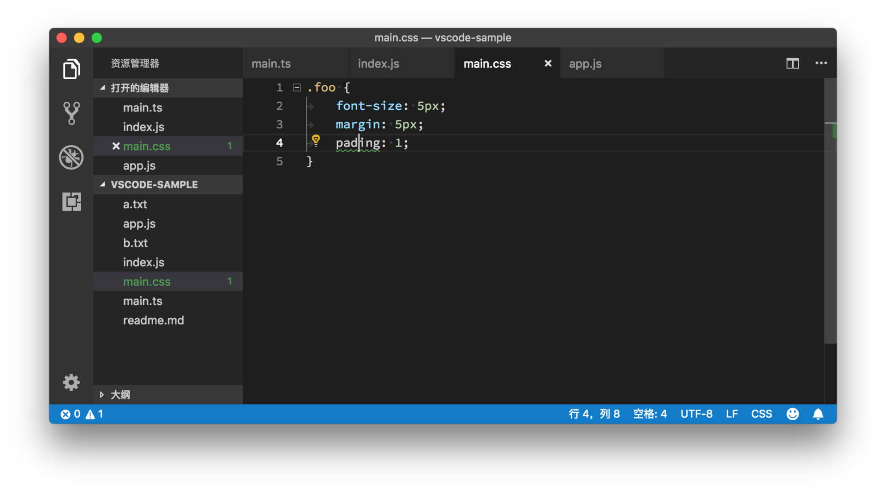

# 09 | 代码自动补全、快速修复和重构的二三事

mp3: https://res001.geekbang.org/resource/audio/52/9b/5225fb930edd55825fa16f2e48ec969b.mp3

专栏的第一部分“基础入门”，至今已经进行了接近三个礼拜。现在我们终于要进入 VS Code 语言支持功能的核心地带，也就是，代码自动补全和重构。

这又是一个非常容易引起口水战的话题。很多 IDE 的拥趸非常喜爱或者离不开 IDE 的一个重要原因就是，代码自动补全和重构。通常 IDE 对特定的编程语言和框架理解非常好，当你书写代码的时候，往往不用打完全部字符，IDE 就能够提示你有哪些可以使用的 API，你要使用哪个函数，还有帮助你更好地进行代码的重构。甚至在这样人人都提人工智能的时代，大家已经开始尝试使用 AI 来做智能提示，他们号称通过大数据分析其他人遇到类似问题的时候使用什么样的 API 或者算法，然后给你推荐现成的代码片段。听起来就有点可怕，是不是？

智能提示，就像是一把双刃剑。我们肯定不能写每一行代码都依赖开发工具给我们的提示或建议，然后没了智能提示就手足无措。往近了说，如果我们过分依赖开发工具的话，那么换工作遇到白板面试的时候可能就会抓瞎了。

但是软件开发的模式本来就在发展，我们也很难说永远只对着终端、像编辑文本一样完成所有工作，还是需要看看，怎么借助开发工具，去把查文档、查接口、代码检查和重构等工作自动化，从而把时间和思考留给更重要的事情。

二者本身就需要平衡，就像开车一样，自动挡和手动挡并不是非黑即白的关系。自动挡或者说自动驾驶是未来趋势，但会手动挡你也总不会吃亏，所谓技不压身吧。

好了，今天让我们来一起看一下 VS Code 里的代码自动补全、快速修复和重构相关的功能。

自动补全
----

VS Code 当中的自动补全内容，其实是由语言服务来提供的。我们在 “VS Code 的Why、How 和 What”文章里介绍过，VS Code 为编程语言工作者提供了统一的 API ，即 Language Server Protocol，每种语言都能够通过实现这个 API 在 VS Code 上得到类似 IDE 的开发体验，而各个语言根据这个 API 实现的服务，就被称为**语言服务**。

语言服务会根据当前的项目、当前的文件，以及光标所在的位置，为我们提供一个建议列表。这个列表包含了在当前光标位置下我们可能会输入的代码。当我们不断地输入字符，VS Code 就会根据当前输入的字符，在这个列表进行过滤。

    function foo() {
     bar("Hello World");
    }
    
    foo()
    
    function bar(a) {
     
    }
    

今天我们继续使用一段 JavaScript 代码来做例子。当我们在编辑器里输入 `console.`之后，VS Code 里的 JavaScript 语言服务，会给我们建议与 `console`相关的 API。

VS Code提示的与console相关的API

当我们找到了合适的函数后，按下 Tab 键或者回车键就可以将其补全。

补全选中的函数

如果我们偶尔觉得这个自动补全窗口是多余的，希望暂时不看到它，可以按下 Escape 键将其隐藏。后续如果希望再次看到这个窗口，除了通过打字来将其调出以外，我们还可以按下 “Ctrl + 空格键”来手动地调出建议列表。

通过“Ctrl + 空格键”手动调出建议列表

刚才我们提到，VS Code 会根据我们输入的字符在这个建议列表里进行过滤。同时，这个过滤是允许我们犯一点小错误的，比如打字特别快的时候少打一个字母，VS Code 也能处理这个情况。比如在下面的动图里，我想使用 console 里的 debug 函数，但是我只打了 db 两个字母，建议列表依然为我提供了 debug 这个选项。

输入 db ，建议窗口提示 debug

### 快速预览

有的时候，当我们看到一个建议列表里的某个函数名，我们可能并不能够立刻想起它的作用是什么，它的参数定义是什么样的。这时候我们可以单击当前这一项建议的最右侧的蓝色图标。

log函数的蓝色图标（最右侧）

点击这个图标后，建议列表旁边就有出现一个快速预览的窗口，而这个窗口里面呈现的就是这个函数的定义。具体如下图：

编辑器提示log函数相关的函数定义

除了使用鼠标键外，我们还可以使用 “Ctrl+空格键”组合键来快速调出这个快速预览窗口。

### 参数预览

最后，当我们从建议列表选择了一个函数，然后输入括号，准备开始输入参数时，我们会看到一个参数预览的悬浮框。通过这个参数预览的窗口，我们可以知道这个函数可以传入哪些参数，它们的参数类型又是什么样的。如下图所示：

函数参数预览的悬浮框

同样的，隐藏这个窗口的快捷键也是 Escape。如果你想再次将其调出的话，需要按下 “Cmd + Shift + Space” （Windows 上是 Ctrl + Shift + Space）。

自动补全设置
------

上面的这几个窗口，它们都是通过我们输入的内容自动触发的，也就是说，编程语言决定了我们什么时候看到什么内容。虽然我们可以通过快捷键将其快速地关闭和唤出，但是有的时候自动补全窗口出现得过于频繁，也是会影响我们的编程体验的，毕竟悬浮窗口会遮盖一部分代码，影响我们的阅读。

不过，我们可以通过几个设置，控制自动补全窗口出现的频率和方式，甚至这个窗口的大小。

首先我们可以通过设置 “editor.quickSuggestions” 来决定在什么语境下自动补全窗口会被唤出。默认设置如下：

      "editor.quickSuggestions": {
        "other": true,
        "comments": false,
        "strings": false
      }
    

这个配置有三个选项：other、comments和strings。其中，comments 就是代码注释，strings 就是指字符串。默认情况下，当光标在代码注释或者字符串里，自动补全窗口就不会被自动唤出了。但如果你希望这个窗口永远不被自动唤出，那么你就需要将“other” 也改为 “false”。

这时你可能会问了，如果关闭了这个设置，我想看到自动补全该怎么办呢？不用担心，当你按下 “Ctrl + 空格键” 之后，这个窗口依然会被打开，不管设置是关闭还是开启的状态。看到这个设置，你肯定也就明白了，为什么默认情况下你在写注释的时候没有代码自动补全的提示了吧。

参数预览窗口也是一样的，你可以通过参数 “editor.parameterHints.enabled” 将其关闭。当你觉得自己需要看一看参数预览时，按下快捷键或者通过命令面板就能够将其打开了。

上面的这个设置决定“是与否”的问题，但你也可以控制自动补全窗口出现的时间。自动补全窗口监听文件内容的变化，当你停止输入时，它就会试着给你提供建议。但是有的时候你打字稍微快一些，自动补全窗口才刚刚出现，你就输入了更多的内容，紧接着代码服务就要重新计算并提供建议了。如果你希望减少这种不必要的提示，可以增大设置 “editor.quickSuggestionsDelay” 的值，这样在你输入完代码后，自动补全窗口就会多等一会儿，然后再跳出来。

其他几个自动补全的设置，你可以在设置里搜一搜 “editor.suggest”，自己修改玩一玩。

快速修复
----

语言服务除了在书写代码的时候提供提示以外，还能够帮我们分析当前的代码，检测出他们潜在的问题，然后提供快速修复的方案。比如在下面的 CSS 代码中，我们拼错了 `padding` 这个属性。

    .foo {
     font-size: 5px;
     margin: 5px;
     pading: 1;
    }
    

编辑器中，我们能在 `pading`下看到了绿色的波浪线，并且在这行的行首，看到一个灯泡的图标。

代码提示的灯泡图标

点击这个灯泡的图标，我们就能看到一个新的列表，列表里就是语言服务提供的修复这个错误的操作建议。

修复错误相关的建议

在这个例子里，我们要做的就是选择第一个操作建议，把`pading`换成 `padding`。除了点击这个黄色的灯泡图标，我们也可以按下 “Cmd+.” （Windows 上是 Ctrl + . ）来调出这个快速修复的建议列表。

通过快捷键调出建议列表

在之前的学习过程中，就有同学留言问过，不确定什么时候能够看到这个黄色的灯泡图标。编辑器在你把光标移动到这个错误或者警告所在的代码上时才会展示这个图标。

重构
--

重构这个功能，相信你已经在频繁地使用了。

当我们想修改一个函数或者变量的名字时候，我们只需把光标放到函数或者变量名上，然后按下 F2，这样这个函数或者变量出现的地方就都会被修改。

整体修改bar函数的函数名

这个操作并不是一个粗暴的搜索关键词并替换，在上面的动图中你可以看到，最后一行代码里有个 `bar3`函数调用，但当我们去重命名 `bar`这个函数时，`bar3`并没有受到影响。

除了重命名外，另一个常用的重构的操作就是把一段长代码抽取出来转成一个单独的函数。在VS Code中，我们只需选中那段代码，点击黄色的灯泡图标，然后选择对应的重构操作即可。

通过智能提示操作提取新函数

要注意的是，并不是每个语言服务都支持重构的操作。如果你选中一段代码后，但没有看到那个黄色的灯泡图标，那么也就是说你使用的这门语言可能还没有支持快速重构。

基于单词的自动补全
---------

上面提到的几个功能，它们都依托于语言服务来提供内容。但是有的时候，语言服务并不完美。编辑器于是提供了一种相对 “笨” 一些的提示，那就是基于单词的提示。编辑器通过分析当前的文件里的内容，进行简单的正则表达式匹配，给我们建议已经出现过的单词。

当然，如果你觉得语言服务的提示已经足够好了，不需要这么暴力、这么笨的文本提示，那你也可以通过设置 “editor.wordBasedSuggestions” 将其关闭。

小结
--

今天我们聊到了VS Code相关的代码自动补全、快速修复和重构相关的操作，这里我再强调下，这些操作在VS Code里，都是需要特定的语言服务来支持的。目前来看，Java、JavaScript、Python、PHP、Golang等主流语言在VS Code中都已经得到了很不错的支持，你可以尽情尝试。

代码补全相关的操作我相信对于大部分人都不陌生，这里面也没有很多的技巧，如果你之前已经知道，那全当本节内容是复习。如果你之前不清楚，那一定要记得课后练习，这些智能操作可真是能帮你省不少力气呢。

最后，欢迎在评论区留言讨论。

* * *

