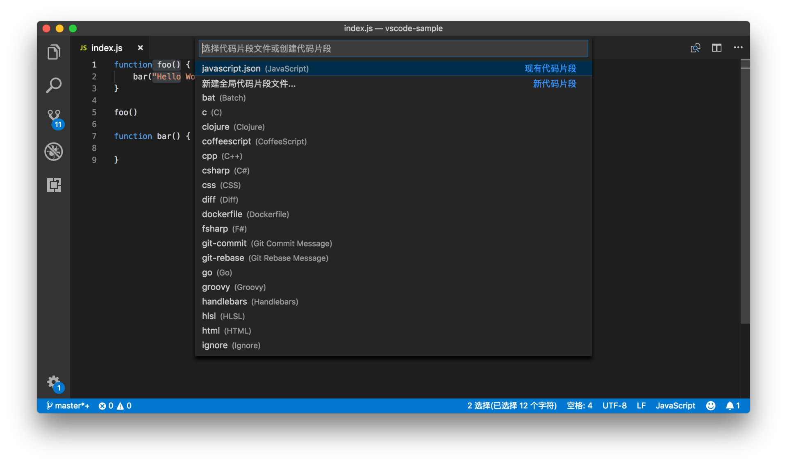
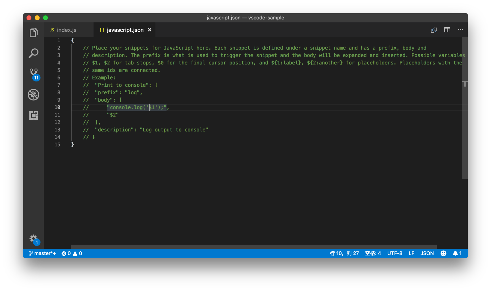
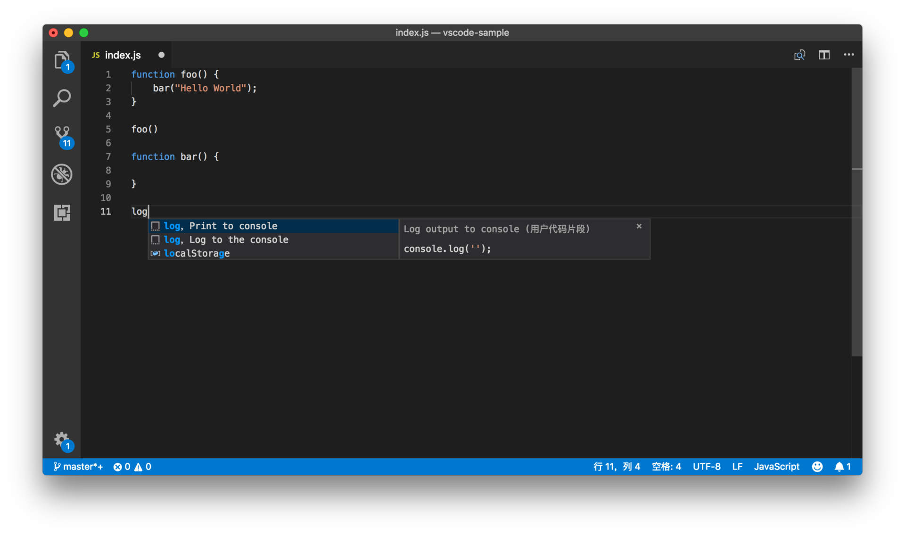

# 10 | 拒绝重复，你的代码百宝箱：如何书写code snippet？

mp3: https://res001.geekbang.org/resource/audio/2d/81/2d2b5d69a27a3ae19bad76de3f257181.mp3

在上一讲中，我们提到了编程语言服务能给我们提供智能的自动补全，帮助我们减少重复代码的输入。这些补全，都是由编程语言提供的，它会分析当前代码的上下文，并给出合适的建议。

但是有的时候，我们经常输入的代码是业务强相关的，语言服务没法做出优化；或者是一些我们经常使用的定式，比如循环语句、创建一个新的类或者一个 UI 控件，我们经常写类似的代码，只不过每次都要做细微的修改。对于这些代码，我们可以将它们抽象成模板，保存起来，等下次要使用的时候直接调用即可。

这就是我们今天要讲的主题：**代码片段（code snippet）**。

代码片段是对常用代码的一个抽象，它保留了大部分不变的代码，然后把需要经常变动的部分，换成变量，这样等下次调用它的时候，只需要把这些变量换成我们需要的就可以了。

上面的这段描述，可能还是太抽象了，下面我们通过一个例子来看看代码片段究竟长什么样，以及是怎么来使用的。

首先，我们打开命令面板，搜索“配置用户代码片段”（Configure User Snippets）并且执行。这时候我们会看到一个列表，让我们选择语言。这里我们依然选择 JavaScript 作为我们的示例语言，不用担心，代码都是非常简单和易于理解的。

命令面板，搜索“配置用户代码片段”并且执行

选择完语言后，我们就能看到一个 JSON 文件被打开了，这个文件里的内容，现在都是被注释掉的。我们可以选中第七行到第十四行，按下 “Cmd+ /”取消注释。

JavaScript 代码片段模版

此时，呈现在我们面前的这个 JSON 文件，就是我们今天要讲的主角：**代码片段**。

    {
        "Print to console": {
            "prefix": "log",
            "body": [
                "console.log('$1');",
                "$2"
            ],
            "description": "Log output to console"
        }
    }
    

你已经看到了，这个代码片段文件，是一个 JSON 文件，它的根对象下面的所有子节点都是一个单独的代码片段，并能够被我们调用和插入编辑器。这个代码片段对象的键（key）是这个代码片段的名字，我们在书写时只要保证这个名字跟当前文件里的其他代码片段不冲突就可以了。

在上面的例子里，这个代码片段的名字叫做 “Print to console”。这个代码片段对象的值，也就是花括号里的代码，必须要包含 “prefix” 前缀和 “body” 内容这两个属性。同时，这个值还可以包含 “description” 描述这个属性，但这个属性不是必须的。

“prefix” 的作用是，当我们在编辑器里打出跟 “prefix” 一样的字符时，我们就能在建议列表里看到这个代码片段的选项，然后我们按下 Tab 键，就能够将这个代码片段的 “body” 里面的内容插入到编辑器里。如果这个代码片段有 “description” 这个属性的话，那么我们还能够在建议列表的快速查看窗口里看到这段 “description”。

比如现在我们可以打开一个 JavaScript 文件（还以之前的一段代码为例），然后输入 log，你就能够在建议列表里看到 “Print to console”这个建议。

输入 log 即可看到 Print to console 代码片段

然后再按下回车或者 Tab 键，就能够将这个代码片段插入编辑器了。

Tab Stop
--------

“body” 里的内容，并不只是一个纯文本，它其实是一个模板。要让它像模板一样工作，我们就需要先理解一个概念，叫做 **Tab Stop**。

像我们现在研究的这个代码片段里，当 “body” 内容被插入到编辑器后，你会发现，内容里 的`$1`和 `$2`不见了，取而代之的是两个竖线。这`$1`和 `$2`就是 Tab Stop，意思是，当我们按下 Tab 键之后，光标移动到的位置。当这段代码片段被插入到编辑器后，编辑器会把光标移动到`$1`所在的位置，然后如果你再按一次 Tab 键，光标则会立刻移动到 `$2`的位置。

如果没有这个功能，我们输入 `log` 后，只能自动地把 `console.log()` 插入到编辑器里，接下来我们需要手动地把光标移动到括号里面，然后填入我们想要打印的参数。这之后，当我们需要新起一行写代码时，还得按下 “Cmd + Enter”创建新的一行并将光标移动到下一行。但有了 Tab Stop后，上面的这些繁琐的操作就可以简化为一次 “Tab” 键了。

在下面的动图里，我们可以看到，代码片段被插入编辑器中后，光标就被自动地放到了引号的中间；我们输入 “bar” 后，按下了 Tab 键，光标就又自动地移动到了下一行的开头，然后我们就可以继续输入代码了。

代码片段被插入编辑器中后，光标被自动地放到了引号的中间

将光标移动到上一个 Tab Stop 的位置的快捷键也很好记，我们只要按下 “Shift + Tab” 就可以了。

但要注意的是，Tab Stop 的作用，并不只是简单地减少重复操作，它还能够真正发挥模板的功效。

当我们插入一段常用的代码，或循环语句，或Switch 语句，虽然大部分代码都是一样，但是也有很多地方需要根据当前的上下文修改，比如说参数的名字。在这样的代码片段中，我们可以在所有需要修改的地方插入 Tab Stop，当代码片段被插入编辑器后，我们只需要通过按下 “Tab”键，就可以快速地跳到这些位置，将它们修改成我们需要的值。

占位符
---

在我们插入 Tab Stop 的时候，除了 `$1`、 `$2` 这样的语法，我们还可以填入 `${1:label}`，在这个格式下，代码片段被插入编辑器里时，$1 的位置处，会预先填入 `label`这个值，并且 `label` 会被选中。

对于这个值我们称之为占位符，顾名思义，这个值是我们在代码片段中预先设置好的。如果我们觉得这个值可以用，那就不需要修改了，直接按 Tab 键跳到下一个 Tab Stop 继续编辑。如果觉得要换成一个新的值，那么也只需直接打字就可以将其替换，因为这个占位符已经被光标选中了。

这里我们对上面的代码片段进行一点修改：

        "Print to console": {
            "prefix": "log",
            "body": [
                "console.log(${1:i});",
                "$2"
            ],
            "description": "Log output to console"
        }
    

我们将 `$1` 改成了 `${1:i}`，那么当log 这个代码片段被插入时，我们将看到`console.log(i);`，同时 `i` 被选中。比如在下面的循环语句里，我们就不用更改`i`了。

    for (var i = 0; i < 5; i++) {
        
    }
    

插入代码片段后，无需更改占位符

而在接下来这个循环语句里，循环的 index 是 j，所以我们就需要将`i`换成 `j`。

    for (var j = 0; j < 5; j++) {
        
    }
    

插入代码片段后，将占位符改为 j

上面我们提到了，有的时候如果占位符刚好是我们想要的，我们就不需要再做任何的修改了，我们可以按住 Tab 键，不断地跳过各个 Tab Stop，也可以直接按下 Escape 键，跳出代码片段的编辑模式，之后继续我们的其他编辑操作。

多光标
---

在前面的文章中，我们已经知道多光标能够大幅度减少重复劳动，而在代码片段里，我们也可以使用多光标的特性。

上面提到我们可以用 ${1:label} 来指定 Tab Stop 和占位符，但其实我们也可以在代码片段的多个位置使用同样的 Tab Stop 。

举个例子，我们可以在代码片段中三个不同的位置插入 $1，这样编辑器就会为这三个不同的位置，分别创建一个光标，然后当我们打字的时候，他们就会被一起修改。

下面，我们就一起来给上面的代码片段加上多光标的特性。

        "Print to console": {
            "prefix": "log",
            "body": [
                "console.log(${1:i});",
                "console.log(${1:i} + 1); // ${1:i} + 1",
                "$2"
            ],
            "description": "Log output to console"
        }
    

    for (var j = 0; j < 5; j++) {
        
    }
    

插入了 log 这个代码片段，然后将循环的 index 换成了 j

预设变量
----

上面我们提到了，在每个 Tab Stop 的位置，我们可以提供占位符，也就是提前预设好一些值。但这些占位符是我们提前写在代码片段里的，跟当前代码的上下文往往没什么关系。不过，VS Code 的代码片段支持里，还提供了一种模板，叫做**预设变量**。

比如说，我们想在代码片段里的某个位置使用剪切板的内容，那么我们在那个位置写上 `$CLIPBOARD` 就好了，如果我们希望插入代码片段后自己可以修改这个值，也可以将它放在一个 Tab Stop 里面，语法则是 `${1:$CLIPBOARD}`。

除了剪切板，VS Code 还支持其他数十个预设值，大家可以按需自行[查看文档](https://code.visualstudio.com/docs/editor/userdefinedsnippets#_variables)，自己尝试。

小结
--

今天我们一起研究了代码片段这个功能，这可能是迄今为止内容最长一篇文章了，但是我依然只是介绍了代码片段的基本概念和使用。

要想真正掌握它，你就需要练习上面的内容，并且自己多尝试，根据文档里介绍的各个知识点组合使用。对了，VS Code 的代码片段语法是基于 TextMate 的，不仅 VS Code，Atom 和 Sublime 也都支持这个语法，你可以在网上找些其他人分享的代码片段，通过阅读这些他人书写的代码片段来学习和精进，相信这也会是你一个不错的学习途径。

* * *

