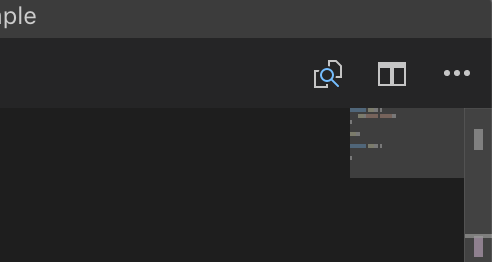
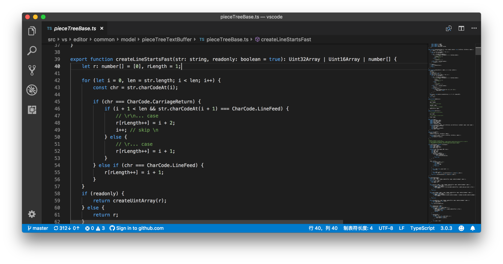

# 11 | 一定要用好代码折叠、小地图和面包屑特性

mp3: https://res001.geekbang.org/resource/audio/c7/ae/c7df5c55ad23dc00881488187d2909ae.mp3

在前面的章节里，我们已经学习了如何利用悬停窗口、建议列表等特性快速了解函数、变量的定义，同时也知道了怎么能够利用快捷键或者鼠标便捷地进行代码跳转。换句话说，我们学习的是如何能够在编辑器里轻松地看到“更多”内容，以及如何能够更快速或高效率地跳转。

今天，我们再一起重新换个角度，看看怎么能在编辑器里看到“更少”的内容，或者尽可能地只看自己想看的内容。

这里我们要介绍的功能，就是**代码折叠、小地图和面包屑**。

代码折叠
----

首先，我们一起来看一下编辑器中最基础的代码折叠方式。

很多编程语言都使用花括号来包裹代码块。比如说类的定义、函数的定义、条件判断语句或者循环语句，它们都是用花括号作为一个代码块的开始和结尾。而VS Code 就是通过对花括号的匹配来决定哪些代码块是能够被折叠的。

比如在下面的这段 JavaScript 代码中：

    function foo() {
     bar("Hello World");
    }
    
    foo()
    
    function bar(a) {
     
    }
    

前三行里是一个foo的函数，并且这个函数当中只有一行内容。

当我们把鼠标移动到行号的附近时，就能够看到一个类似于减号的标记，同时鼠标指针变成了手的形状。

鼠标移动到行号附近

此时若我们单击这个图标，就能够看到 `foo`函数内部的这行代码消失了，取而代之的则是三个点的缩略图。

代码被折叠

在代码被折叠后，行号附近的这个图标就变成了一个加号的形状，若再点击这个加号就能把这段代码展开。

折叠代码被展开

以上内容就是代码折叠最基本的概念，相信对此大家早就已经非常熟悉了。下面我们再来一起看一下有哪些折叠和展开代码的快捷键。

### 快捷键

首先是折叠和展开代码的两个快捷键。

当我们按下 “Cmd + Option + 左方括号”（Windows 上是 Ctrl + Shift + 左方括号），当前光标所处的最内层的、可以被折叠的代码就会被**折叠**起来。请注意，我们在这里加了两个限制条件，“最内层”和“可以被折叠”。我们可以先用下面一个小例子来理解这两个条件。

    for (var i = 0; i < 5; i++) {
     if (true) {
        console.log(false);
      }
    }
    

在这段代码里，最外层是一个循环语句，内层则是一个条件语句。当我们把光标放在第三行，所对应的这个条件语句就是最内层且可以被折叠的代码。

相对应的，**展开**最内层的、可以被展开的代码块的快捷键则是 “Cmd + Option + 右方括号”（Windows 上是 Ctrl + Shift + 右方括号）。当然，若能记住前面那个快捷键，那这个也就不难被记住了。

如果我们想把从当前光标位置开始，一直到最外层的，所有可以被折叠的部分递归地折叠起来，该使用什么快捷键呢？这时我们需要依次按下 “Cmd + K ”“Cmd + 左方括号”（Windows 上是 Ctrl + K、Ctrl + 左方括号）。而至于如何递归地展开，不用问你肯定也知道，是：依次按下“Cmd + K ”“Cmd + 右方括号”。

那如果我们想把当前编辑器里的所有可以被折叠的代码一次性全部折叠起来，该怎么操作呢？这时我们只需依次按下 “Cmd + K”“Cmd + 0”（Windows 上是 Ctrl + K，Ctrl + 0）即可。而全部展开它们则是依次按下 “Cmd + K”“Cmd + J” （Windows 上是 Ctrl + K，Ctrl + J）。不过，平心而论，我觉得这两个快捷键的设置并不是很友好，若你也觉得这样，那你也可以摒弃它们，然后在命令面板中绑定自己喜欢的快捷键。

上面我们介绍了可折叠代码的层级关系，以及如何折叠最内层的代码。当你在命令面板里搜索“折叠” （Fold）时，相信你也看到了“折叠级别 1” “折叠级别2” 等等，你可以想一想，它们的作用是什么？又可以用于哪些场景呢？

### 基于语言定义的代码折叠

上面讲述的代码折叠的判断方式，是通过花括号或者代码缩进的检测来实现的。但若遇到不使用花括号或者缩进不正确的代码时，可能就不能实现这样的操作了。为此，VS Code 给语言服务提供了一个接口，语言服务可以动态地检测代码，然后告诉 VS Code 哪段代码是可以被折叠的。

这样一来，VS Code 就不用傻傻地检查花括号的匹配了，并且我们写代码的时候也不用为了折叠而更改代码风格了。

除了让语言服务参与到代码折叠的定义当中来，VS Code 还给了用户一定的控制权。也就是说，我们可以通过在代码注释里书写特殊的关键词来申明，哪一行是可折叠代码的开始，哪一段则是这个可折叠代码块的结束。

举例子可能要比解释定义要来的容易一些，所以我们一起看下面的这段 Java 代码：

    public class Main {
      // region Main
      public static void main(String[] args) {
      }
      // endregion
    }
    

其中，`// region Main` 申明了一个可折叠代码块的开始，而`// endregion`则申明了这段可折叠代码的结束。当我们把鼠标指针移动到行号附近时，我们能够看到三个加号，说明这段代码包含了三个可折叠的代码块，两个是由花括号控制的，一个则是基于特殊的语言的定义。

通过对应的关键词来控制Java 代码的折叠

至于哪个语言可以使用哪些关键词来控制代码的折叠，还请参考 [VS Code 的官方文档](https://code.visualstudio.com/docs/editor/codebasics#_folding)。

小地图
---

今天要介绍的第二个功能，叫做**小地图**。细心的你可能已经发现了，在之前所有的截图里，我都把小地图关掉了。这是因为图片小，而小地图又比较占地方。

但是如果你是在一个比较大的屏幕上工作，需要快速了解整个文件的全貌，并且还能靠鼠标快速地移动，那么这时小地图就很有用了。这个功能默认是打开的，所以你无需特别设置。这个使用起来比较简单，你可以像我在图中展示的那样试着打开一个较大的文件，感受一下它的妙处。

使用小地图上下滚动代码

很多游戏中也有类似的小地图功能，不知道你有没有似曾相识的感觉。

除了控制小地图是否打开，编辑器还为我们提供了几个渲染的配置项。比如说，默认情况下，小地图会将每个字符都渲染出来。但是我们并不能真正地通过小地图来看代码，我们只是要看个大概结构罢了，那么我们可以打开命令面板，搜索“打开设置”（Open Settings），进入设置界面后，搜索 “editor.minimap.renderCharacters”，找到后将其关闭，这样一来，所有的字符，都会被渲染成一个个小色块。

将小地图里的文字渲染成小色块

同样的，我们还可以通过 “editor.minimap.maxColumn” 来控制小地图里每一行渲染多少个字符。很多时候我们只需看下每行代码前的缩进和前面的代码高亮，就能看出个大概来了。

面包屑
---

最后一个要介绍的功能，叫做 **Breadcrumb**，翻译过来就是**面包屑导航**，主要是展示目前的代码在整个工程里的路径，同时你还能够看出这个代码所在位置的结构层级并且可以快速跳转。这个功能相信你在浏览文档类的网站时经常能看到，而在 VS Code 中你能够看到则是当前的光标、在哪个符号或者函数里，然后是哪个文件中、在哪个文件夹下，等等。

不过，VS Code 在最近几个月才添加了面包屑这个功能，并且默认是关闭的。要打开这个功能，我们需要“打开设置”（Open Settings），搜索 “breadcrumbs.enabled”，找到后将它打开。

打开面包屑功能

在上图中，从左到右，我们能够看到一层一层文件夹的名字，然后是当前文件名，最后则是光标所在的函数的名字。我们可以通过点击这个工具栏上的文字，然后进行文件夹、文件或者是函数的跳转。

进行文件夹、文件或者是函数的跳转

这里我还可以分享一点这个功能的技术细节，面包屑这个功能除了 UI 部分，它底层的服务其实都是早就存在的。就比如说在上面的截图中，面包屑左侧的文件结构，跟我们在资源管理器看到的是一样的；右侧的函数名之类的，则是来自语言服务提供的符号；至于在这些文件和符号之间的快速跳转，更没有超出我们在第七讲 “如何快速在文件、符号、代码之间跳转？”里介绍的内容。

换句话说，面包屑的功能，可以当作一种新的文件、内容预览和快速跳转的方式。

小结
--

今天介绍的几个功能里，我最常用的就是代码折叠了。所以在这一讲的最后，我跟大家分享一下我使用代码折叠的心得。

VS Code 的代码量非常大，现在大约有 40 万行代码，我自己肯定无法一下子了解熟悉所有的功能。所以，每次当我需要去了解一个新功能时，我都会先把所有类和函数全部折叠起来，了解一下它的大致“形状”，然后再依次展开我感兴趣的函数，仔细斟酌。我觉得很多时候，这个方法比代码调试还来得有效。所以我希望代码折叠也能同样帮助到你的工作！

* * *

