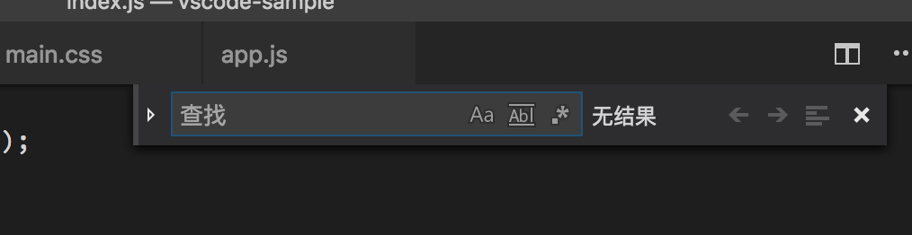

# 12 |  极速搜索有时候比Intellisense还重要

mp3: https://res001.geekbang.org/resource/audio/f6/a8/f61b93e15b221faab1deb3e23c6137a8.mp3

在前面的几个章节中，我们介绍了 VS Code 如何在语言服务的支持下提供了代码检查和修复、智能跳转、自动补全等功能。

但是，语言支持并不总是完美的。像 Rust、TypeScript 等语言的支持，是由语言实现者们直接操刀的，所以它们做得就相对完整些；而第三方开发者提供的语言服务，可能就不一定尽善尽美了。那这是不是就意味着想要快速查询代码并且跳转就没有办法呢？

所以今天我们重新回到原点，来看一下如何使用编辑器自带的文本搜索功能，快速地穿梭于海量的代码之中。在我看来，一个功能丰富且快速的搜索，在很多情况下甚至会比语言服务还要来得有用。

单文件搜索
-----

我们把光标放在编辑器当中，然后按下 “Cmd + F” （Windows 上是 Ctrl + F），就能够快速地调出搜索窗口（可能这个命令你早就发现了或者经常使用了）。当我们调出搜索窗口的时候，编辑器就会把当前光标所在位置的单词自动填充到搜索框中。与此同时，当前文件里和搜索关键词相同的单词都会被高亮出来。

自动填充搜索关键词的好处在于，当我们按下 “Cmd +F” 搜索这个单词之后，我们还能够立刻通过回车键或者 “shift+回车键” 在所有搜索结果当中快速跳转。

“Cmd +F”搜索，按下 Enter 键在搜索结果当中快速跳转

这里需要注意的事情是，当我们开始搜索的时候，光标已经被移动到了搜索框当中，如果在这时候我们继续打字的话，那原有的搜索关键词将会被修改。

按下“Cmd +F”调出搜索框，修改搜索关键词

如果我们希望找到搜索结果后，接下来就直接修改编辑器中的内容，那么就得将光标重新移动到编辑器当中，听起来就挺不方便的，是不是？

这种情况下，我们不妨换一个快捷键。首先我们将光标移动到我们想要搜索的单词处，然后按下 “Cmd + G”（Windows 上是 F3），此时我们同样调出了搜索框，但与前面 “Cmd +F ”这个快捷键不同的是，这时光标依然是在编辑器当中，而不是在搜索框中。

然后我们通过不断按下“Cmd + G”就能够在搜索结果之间自上而下地循环跳转，这时我们只需直接打字就能对代码进行修改了。

“Cmd + G”直接搜索关键字并在编辑器内跳转，可以直接修改编辑器中的内容

当然如果我们想要在搜索结果里自下而上地跳转，也是可以通过快捷键实现的，只需多增加一个 shift 键即可，也就是按下 “Cmd + Shift + G” （Windows 上是 Shift + F3）来实现自下而上的跳转。

如果你的键盘上有功能键的话，那这个快捷键实现起来就更方便了。你可以通过 F3 和 “Shift + F3” 实现 “Cmd + G” 和 “Cmd + Shift + G” 一样的功能。

下面我们再一起来看下这个搜索框中都有哪些功能。

当我们在搜索框中打字的时候，搜索操作是自动触发的，而无需我们再按下回车键去手动地执行搜索这个操作。

除了搜索纯文本以外，搜索框还支持多种不同的搜索方式。比如，在搜索框的最右侧，就有三个配置按钮。

搜索框最右侧的三个配置按钮

**第一个是大小写敏感**。这个很好理解，就是在文档中搜索关键词的时候，搜索的结果是否要跟关键词大小写完全一致。默认情况下，VS Code 的搜索是不区分大小写的，也就是说哪怕大小写不一样，也会算到搜索结果里去。但如果我们不想要这个特性，就可以点击这个按钮，或者按下 “Cmd+Option+C” （Windows 上是 Alt + C）来关闭它。

打开大小写敏感设置

**第二个是全单词匹配**。有的时候我们搜索的单词恰好是别的某个单词中间的一部分，如果我们不希望这样的结果出现在搜索结果中，那么就可以点击这个按钮或按下 “Cmd+Option+W”（Windows 上是 Alt + W）来关闭它。

打开全单词匹配设置

**第三个，就是正则表达式匹配了**。当我们点击这个按钮或按下 “Cmd + Option + R”（Windows 上是 Alt + R），就能够打开正则表达式的支持，然后在搜索框中输入正则表达式来搜索。要注意的是，编辑器中的这个搜索框，它里面的正则表达式使用的是 JavaScript 的正则引擎。

打开正则表达式匹配

这三个功能的快捷键的配置，相信你已经看出其中的诀窍了，它们分别使用了 Case、Word 和 Regular Expression 的第一个字母作为快捷键的一部分，若你知道是这几个单词，那相信对应的快捷键你就不会容易忘了。

除了这三个搜索设置以外，在搜索窗口关闭按钮的左侧，相信你还能看到一个特别的图标。那这个按钮的功能是什么呢？

我们可以先选中一段文本，然后按下 “Cmd + F” 调出搜索框，这之后点击这个按钮，就可以将这段文本的范围设置为接下来的搜索区域。然后当我们在输入框里输入关键字后，编辑器就只会在这个区域里进行搜索。

在文本选择范围内进行搜索

搜索配置
----

上面我们提到的功能，都是 VS Code 的默认行为。但也有部分用户不喜欢搜索框的一部分行为，比如说自动填充搜索关键词。那你可以打开设置，搜索 “editor.find.seedSearchStringFromSelection”来关闭它。

也有个别用户觉得，如果选中了多行文本，那么当开始搜索时，应该自动地只在这几行代码里进行搜索。要达成这样的目的，你则需要打开设置“editor.find.autoFindInSelection” 。

单文件替换
-----

在搜索到我们想要的结果之后，我们可以直接在文件中进行修改，也可以使用替换窗口进行批量替换。如果你在使用鼠标或者是触控板的话，只需按一下搜索窗口最左侧的箭头按钮即可打开替换框。

打开替换框

替换框的后面，一共有两个按钮：第一个能够替换单个搜索结果，第二个则能够替换全部的搜索结果。它们对应的快捷键我就不多加赘述，我们只需把鼠标指针移动到它们上面，就能够看到了。

替换框后面的两个按钮：替换单个和替换全部

我们也可以通过快捷键直接调出替换窗口。最常用的命令就是按下 “Cmd + Option + F”（Windows 上是 Ctrl + H）键，这样当前光标所在的单词就会被用作为搜索关键词，同时编辑器将光标移动到替换窗口中，我们只需直接输入想要替换的关键词就行了，是不是很便捷呢？

“Cmd + Option + F”直接调出替换窗口

当然，如果你在书写完替换文本后，觉得搜索关键词需要修改，那你可以按下“Shift + Tab” 键将光标移动到上面的搜索输入框里。“Tab”和“Shift + Tab”键能够帮助你在这两个输入框直接进行跳转。

多文件搜索和替换
--------

虽然在“基础入门”这个部分中，我们一直都在介绍编辑器的各种功能，但是，为了把搜索这样的一个功能介绍完整，我们今天就再讲一下在 VS Code 当中如何使用多文件搜索。

多文件搜索的运行方法跟单文件搜索非常类似。单文件搜索，我们是通过按下“Cmd+ F”来调出搜索窗口的，而多文件搜索则是通过按下 “Cmd + Shift + F” （Windows 上是 Ctrl + Shift + F）来调出多文件搜索的视图。

“Cmd + Shift + F” ，调出多文件搜索视图

在这样一个视图中，我们看到了熟悉的搜索输入框，以及大小写敏感、全单词匹配和正则表达式三个配置按钮。搜索框的左侧则是下拉按钮，点击即可调出替换框。

默认情况下，当我们调出多文件搜索的视图时，VS Code 会在当前打开的文件夹下进行搜索。不过，要发挥多文件搜索的更大功效，我们可以通过书写配置来决定在哪些子文件夹下进行搜索，以及过滤掉哪些特殊的文件或者文件夹。

要完成这样的配置，我们需要点击搜索框下三个点形状的图标，点开后，我们能看到两个输入框，它们的名字分别是“**包含的文件**” 和 “**排除的文件**”。这两个配置的书写格式是 glob，很多编程语言和配置都会使用 glob 来模糊匹配文件名和文件夹，估计你已经有所了解。而如果你不熟悉的话，就当作是课后作业了，这一定不是你最后一次需要书写 glob。

多文件搜索配置
-------

多文件的配置比单文件里的搜索框还要更多一些，你可以打开设置搜索 “search” 看看都有哪些。这里我主要介绍两个被用户修改比较频繁的设置。

**第一个是“search.collapseResults”**。它是用来控制是否自动展开搜索结果。默认的配置是 “auto” 自动， 也就是说，VS Code 会根据搜索结果的多少来决定是否要将某个文件下的搜索结果展开，如果某个文件夹下的结果过多的话，就会将其暂时折叠，用户需要展开结果。我自己喜欢将其设置为 “alwaysExpand”，这样我每次都能直接看到结果了。

**第二个是 “search.location” ，也就是多文件搜索视图的位置**。默认情况下，搜索视图会出现在侧边栏。但是 VS Code 同样允许你把搜索视图放到底部面板中去，你只需将其修改为 “panel” 即可。相信很多用户都跟我一样，使用过非常多把搜索视图放在底部的开发工具，并且很习惯了，那这个设置就能够帮助到我们。

最后，我再给 macOS 用户介绍一个 macOS 系统上特有的搜索功能，叫做**共享搜索记录**。这个功能需要通过设置 “editor.find.globalFindClipboard” 和 “search.globalFindClipboard” 打开。当这个功能被打开之后，我们在 VS Code 中的搜索关键词和搜索记录，都会被共享给系统，然后当我们打开别的支持这个功能的应用时，比如 Safari 或者 Chrome 浏览器，按下 “Cmd + F”键，就会发现同样的搜索关键词已经被自动填充到搜索框中了。

小结
--

我在今天文章的最开头说，一个功能丰富且快速的搜索，在很多情况下甚至比语言服务还要来得有用。这是因为，VS Code 里的多文件搜索太快了，就拿我自己来说，当我对某个类或者函数的名字有个大概的印象，我都会使用多文件搜索，进行模糊匹配，基本都能找到想要的结果。这比绞尽脑汁想出到底是哪个具体的类、名字是啥，然后使用语言服务来找到它在哪里被使用了，要快捷得多。虽说很暴力，但不得不说也很有效。

好了，总结来说，今天我们一起研究了如何利用搜索这样一个最基础的功能，让我们在代码之间自由穿梭。不过要想掌握好搜索，你还得学好正则表达式，得学习 glob 语法，“课业压力”不小，加油！

* * *

