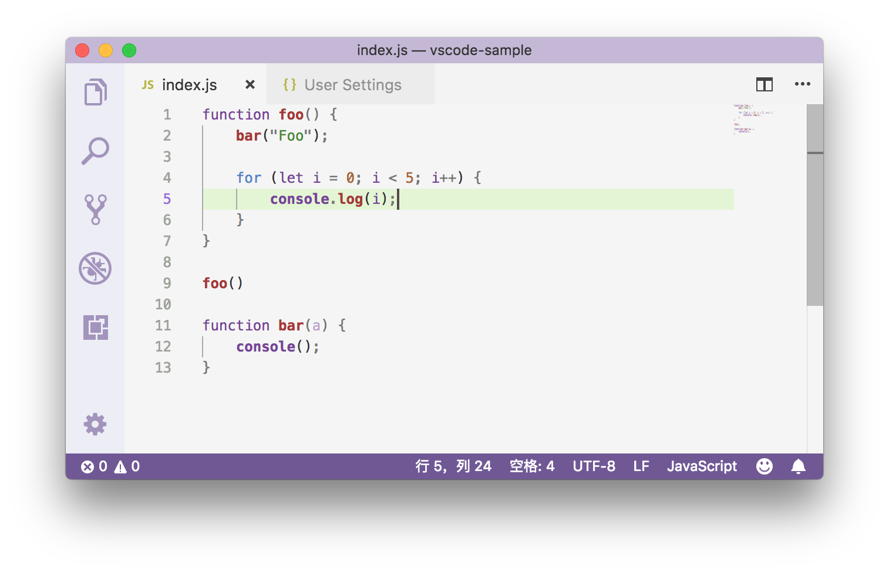
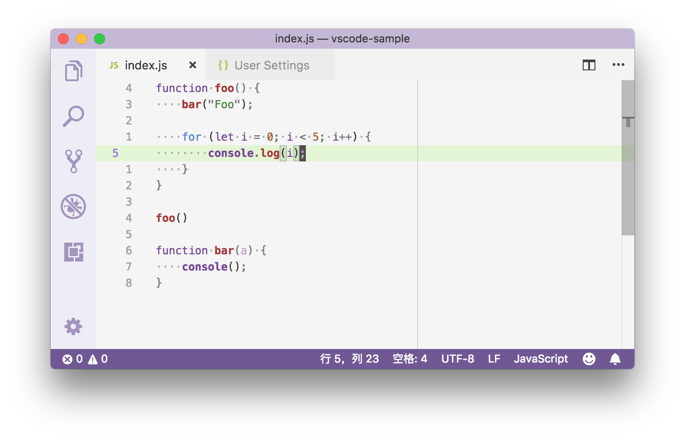

# 13 | 优化你的编辑器设置

mp3: https://res001.geekbang.org/resource/audio/da/b5/daec31c6b209dd3c2cc5f57351bfa5b5.mp3

今天我们终于到了“基础入门”部分的最后一篇：优化你的编辑器设置。在前面的章节中，我们主要介绍了编辑器的功能，并且是尽量介绍编辑器默认推荐的设置。但在实际工作中，我们是需要根据自己的个人喜好以及项目的不同特性来对编辑器进行一定修改的。

这里我们可以先一起来玩一个“大家来找茬”的游戏：图1是使用没有修改过任何编辑器设置的 VS Code 打开的一个 JavaScript 的文件，而图2是使用经过了不少的个性化定制的编辑器打开的同一个文件，请问你能从中看出多少个不同点呢？

图 1

图 2

好了，这里我就不卖关子了。其实为了达到图2的这个效果，我一共做出了七个设置的修改，形成了“六个变化”。并且这几个设置都是被大家频繁使用的，是用于个性化定制编辑器的设置。

那下面我们一起来看一看这“六个变化”分别是什么。

第一个变化，你可能一下子就注意到了，那就是编辑器最左侧的行号。在图1中，行号代表的是每一行代码所处的位置，也就是在当前文件中处于第几行，是绝对行数。而在图2中，行号则显示的是每一行代码相对于当前光标所在位置的行的距离，是相对行数。经常使用 Vim 的用户一定非常熟悉这个功能。除了改变行号的值以外，你还能够将行号完全隐藏起来，也就是使整体代码不显示行号。这控制整个行号显示与否及如何显示对应的编辑器设置是 `editor.lineNumbers`。

第二个比较明显的变化是，在图2中你能够在不少代码行前面看到灰色的“点”，这每一个“点”都代表着一个空格符。你可以通过设置 `editor.renderWhitespace: all` 让编辑器将所有的空格符、制表符等全部都渲染出来。这样你就能够一眼看出这个文件中使用的究竟是制表符还是空格符，以及有没有在哪里不小心多打了一个空格等。

第三个比较明显的变化就是编辑器中间的几个竖线。在图1中，第二行到第六行代码的中间，从内到外你能够依次看到两个竖线。这两个竖线就是**缩进参考线**。编辑器会根据你指定的制表符的长度，来决定缩进参考线的位置。这样你就可以非常清楚地知道代码有没有正确地缩进，而且也方便你区分出不同代码块之间的层级关系。这个功能是可以通过 “editor.renderIndentGuides” 来控制开关的。

而图2中的竖线则不一样了，它叫做**垂直标尺**。如果你的项目中有规定说每一行代码不得超过多少个字符，比如说120个字符，那么你就可以将标尺设置为120，即 “editor.rulers: \[120\]”。这样的话编辑器就会在第120个字符所在的位置处画出这样一条垂直的竖线，所以你一眼就可以看出自己的代码是否达标。

第四个变化是，在编辑器的最右侧，很明显在图 1 中，你能够看到小地图 Minimap；而在图 2 中，这个功能则被关闭了。这是因为我找代码一般更习惯使用搜索功能，所以通常我在笔记本上使用编辑器时，都会将小地图功能关闭，这样的话就能够留出更多的空间给其他 UI 组件。这里我是通过 “editor.minimap.enabled” 来控制它的显示与否。

上面介绍的那些都是比较容易发现的区别，你可能很快就能找出来。但接下来这两个“区别”的发现可能要相较稍微难一些。

仔细对比后，你会发现第五个变化是光标的样式。在图1中，光标是一条竖线，而在图2中光标则相对粗一些。编辑器中的光标样式有非常多种，你可以控制粗细，也可以控制它怎么闪烁。你需要调整的设置是 “editor.cursorBlinking” “editor.cursorStyle” 和 “editor.cursorWidth”。

第六个变化，也就是最后一个配置，则是跟颜色有关。在图 1 中，第五行的代码下有一个绿色的背景色。通过这样一个背景色的改变，你能够清楚地看到哪一行代码是当前光标所在的位置。而在图 2 中，我则是通过更改设置 `editor.renderLineHighlight: "all"` 把当前代码行的行号下的背景色也修改了，所以你可以看到图 2 的行号 5 的背景色也成为了绿色，整体上看起来更统一。

上面的这些设置决定了编辑器看起来怎么样，而下面我们再一起来看一下有哪些设置能够决定我们在编辑器里的书写体验。

第一个不得不提及的话题就是：**空格还是制表符**？在 VS Code 的代码里，我们通常使用的是制表符，但是使用空格的同学们也不用紧张，因为编辑器会根据你所打开的文件夹或者项目来决定该使用空格还是制表符。也就是说，如果你的项目中使用的都是空格符的话，那么当你在书写代码的时候，每次按下 Tab 键，编辑器输入的就会是空格。

如果你并不希望 VS Code 的自动检测来控制制表符或者空格键的使用，那你可以通过设置 “editor.detectIndentation” 来禁用它。这之后，你在书写代码时，空格或者制表符的使用，则是由设置 “editor.insertSpaces” 来决定的；而每一个制表符所对应的空格符的长度是由设置 “editor.tabSize” 来控制。这两个设置往往是需要搭配在一起使用的。

另外一个因人而异，或者受项目、团队影响比较大的就是**代码风格**了。如果一个团队想要保证所有人的代码风格都是一致的，那么可以在编辑器中使用格式化工具。而如果你喜欢的方式是先不管三七二十一，把代码写完，然后保存代码，再统一进行格式化的修改，那么你可以设置 “editor.formatOnSave: true”。而如果你希望编辑器在你打字的时候就自动帮你校正代码格式的话，则可以将设置 “editor.formatOnType: true” 打开。

对了，说到文件保存，默认情况下，你需要按下“Cmd + S”来保存文件，但是其实你也可以修改设置 “files.autoSave” 来对文件进行自动保存。但由于很多自动化的脚本工具是根据文件状态的改变来触发运行的，所以为了避免频繁触发这些脚本，你也可以将 “files.autoSave” 设置为 “delay”，然后使用 “files.autoSaveDelay” 控制在你打完字多久后保存文件。

小 Tip
-----

上面的这些设置可能相对来说中规中矩，如果你问我，哪个编辑器的设置最让我惊喜和意外，我觉得 “files.defaultLanguage”当仁不让。

当你按下 Cmd + N （Windows 上是 Ctrl + N）在编辑器里创建一个新文件的时候，这个新的文件会被识别为普通文本文件，你在里面书写内容时并没有合适的语法高亮和自动补全，所以你可能会经常看到有些用户，创建了新的空文件后，然后再去调整文件的语言类型。

但是，如果通过把 “files.defaultLanguage” 设置为你想要的语言，比如说，把它设置成 “Markdown”，那么创建空文件的时候，VS Code 就会把它当作一个 Markdown 文件，然后你在里面能够得到 Markdown 的所有语言支持。

我在工作的时候，也会拿 VS Code 来写会议记录，当我突然有了一个新的想法，我就会立刻创建新文件，无需任何改动，就能够书写各种 Markdown 的语法，并且得到正确的代码高亮。这就是我心目中的最佳编辑器设置。

小结
--

以上就是我在日常工作中常用的编辑器设置，当然这只是所有设置中小小的一部分。更多的设置，你可以通过搜索 “editor” 这个词找到，你不妨一个个都过一遍，看看它们都是干什么的，以及它们能不能帮助到你的工作。

除了一个个研究这些设置，你还可以通过功能的名字，进一步搜索。比如说，如果你想看看有哪些小地图的设置可以修改，那你在设置里搜索 “editor minimap” 就可以了。至于其他的功能，也是非常类似的，拿我们在前面的章节里介绍的功能来说，它们分别是：

*   editor cursor， 是跟光标渲染和多光标相关的设置；
*   editor find， 是与编辑器内搜索相关的设置；
*   editor font， 是与字体有关的设置；
*   editor format， 是代码格式化；
*   editor suggest， 是和自动补全、建议窗口等相关的配置。

了解编辑器的同时，我也建议你顺带熟悉一下这些功能的英文名字，可以有助你更快地定位这些功能的设置。好了，这就是我今天介绍的全部，欢迎你在评论区留言，分享你的编辑器设置的技巧。

* * *

