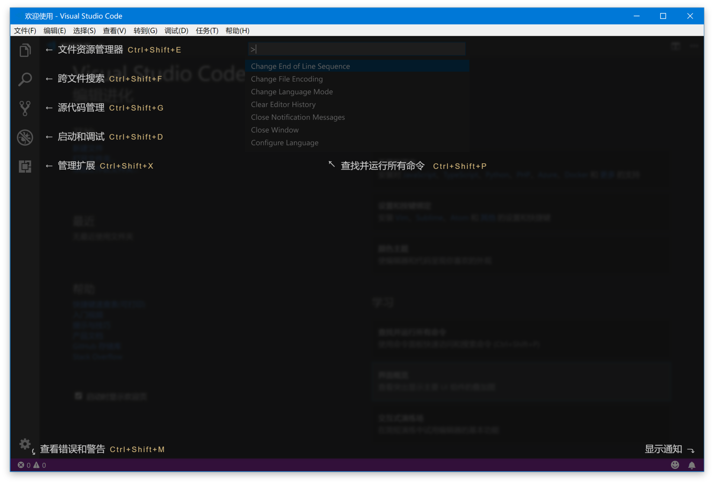
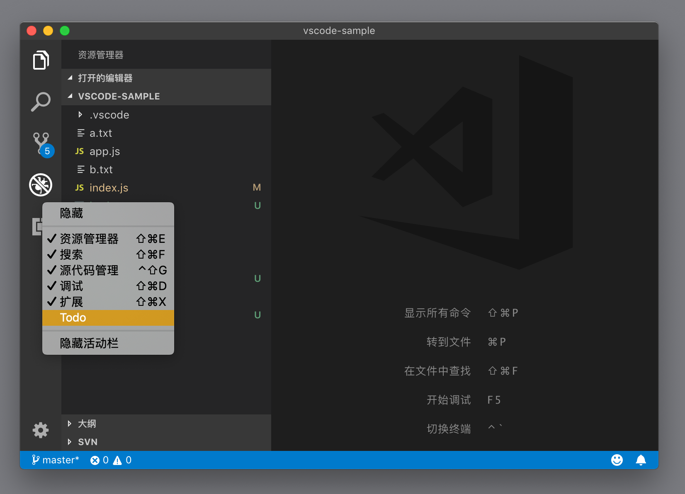
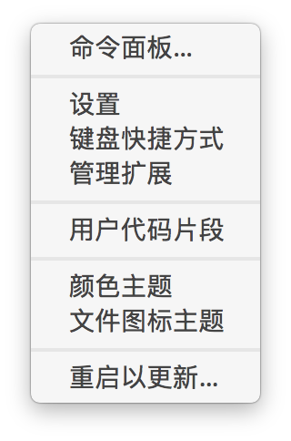
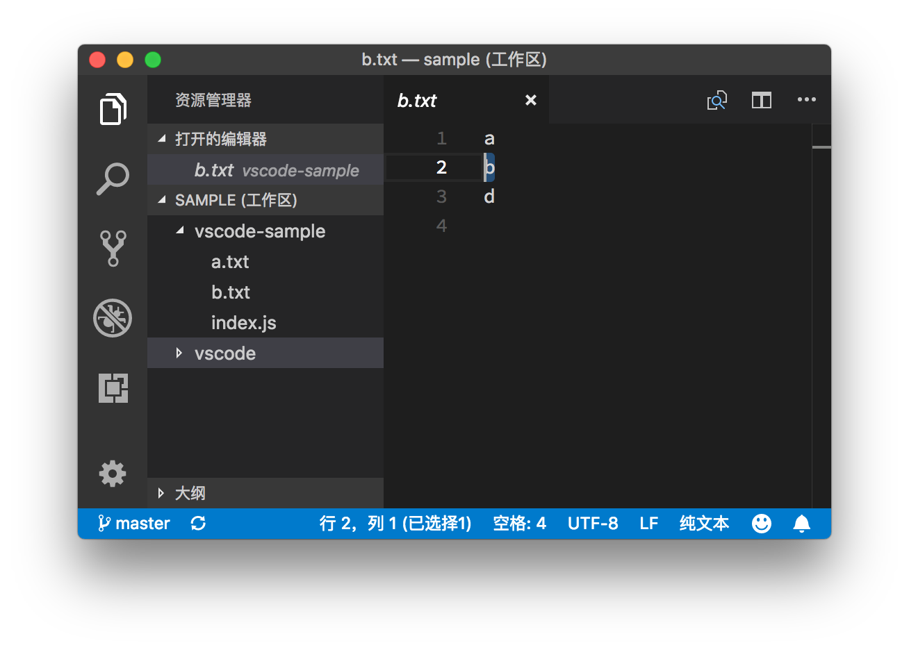
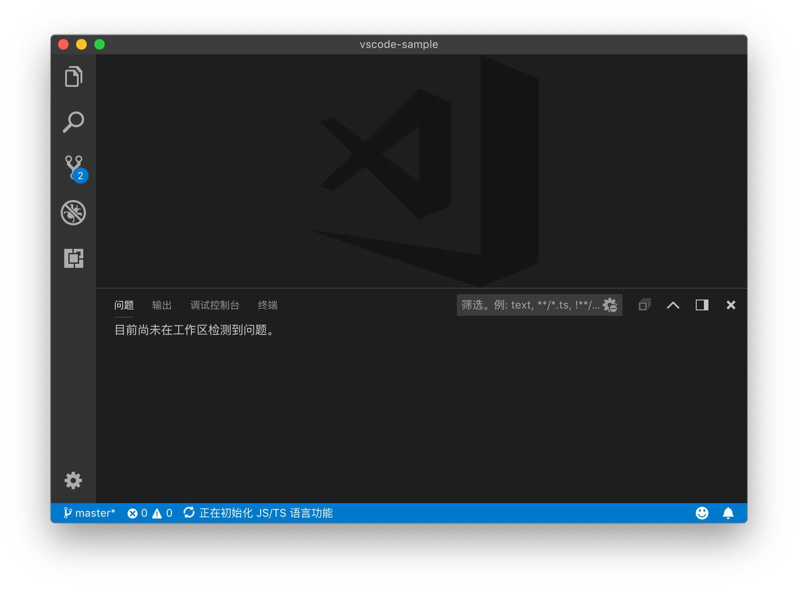
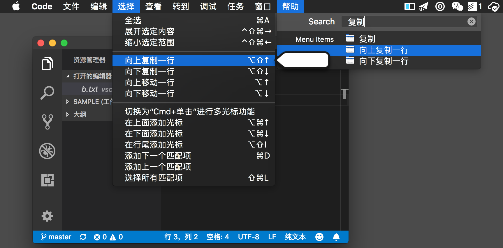
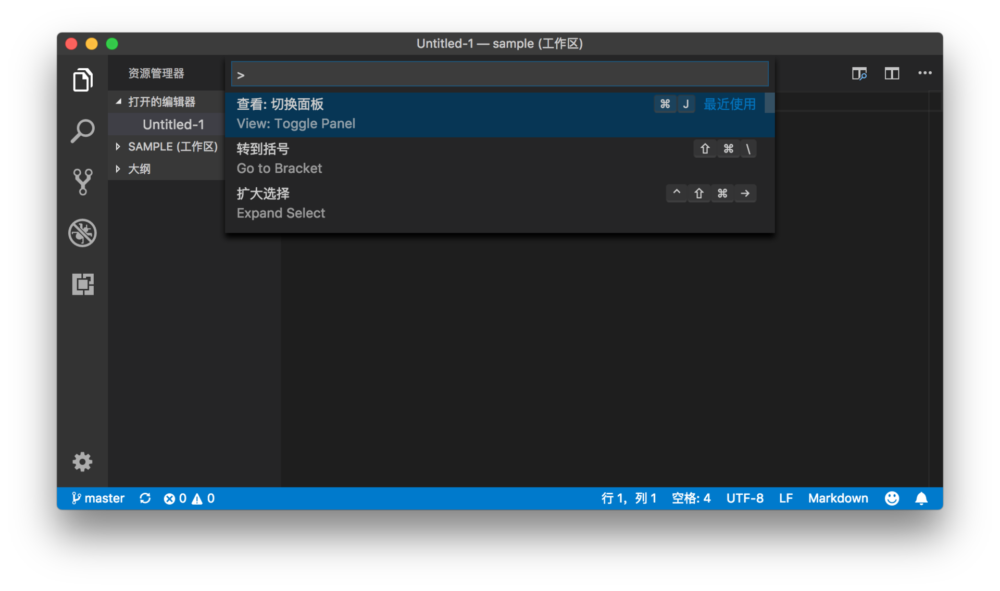
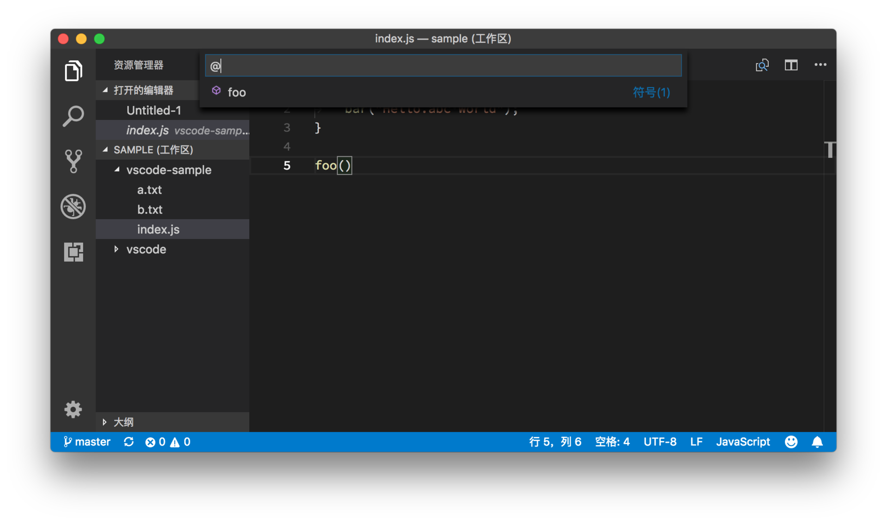
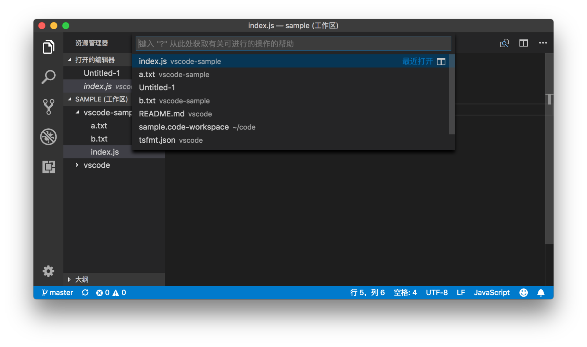
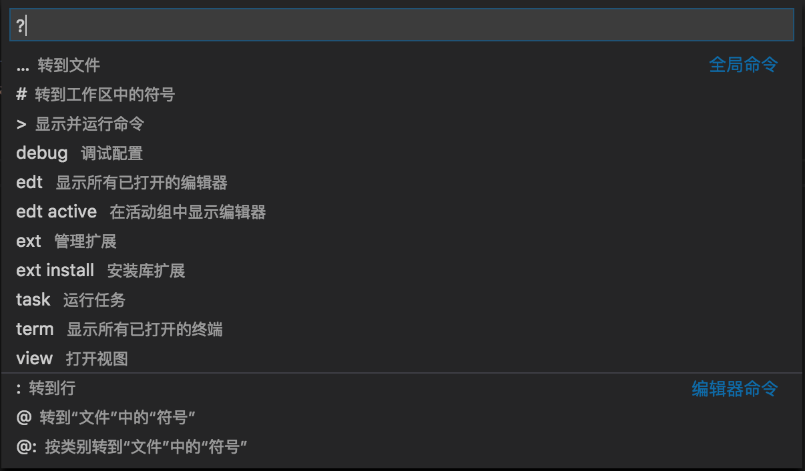

# 14 | 什么是工作台和命令面板？

mp3: https://res001.geekbang.org/resource/audio/2c/4f/2c3a58901b03d9a8e15531cedcad0b4f.mp3

在专栏的第一部分，我已经简单地介绍了 VS Code 有哪些核心组件，比如欢迎界面、命令面板的基础使用，紧接着我们就一起深入研究了 VS Code 核心编辑器的使用和拓展。但是相信在你的日常工作中，可能早就在使用 VS Code 的其他组件了。

那么今天，我们就一起从头开始，全面而系统地梳理一下 VS Code 的界面上都有哪些功能，以及它们都是怎么被组织起来的。

工作台
---

我们把 VS Code 的整个界面统称为**工作台（Workbench）**，它就像是木匠的工作桌，上面摆放着做木工活时需要的各式工具。一个好的匠人一定会精心摆置自己的工作台，把最需要的、频繁使用的工具放在最顺手的地方，并充分利用桌子的空间，但又不喧宾夺主。

编程也是一样，除了使用核心的编辑器，我们也经常需要快速访问文件目录，使用终端运行一些脚本或者使用版本管理工具等等，因此我们就需要了解 VS Code 的工作台上都有哪些工具，它们是干什么的，以及工作时需要使用哪些才有可能事半功倍。

所以，从今天开始，我将和你一起探索 VS Code 工作区里的各个组件。

首先，你打开欢迎界面，并且点击界面右侧的“界面概览”。

打开“界面概览”

这时你能够看到，在默认设置下 VS Code 的左侧侧边栏有五个组件，它们分别是：

1.  文件资源管理器，主要用于浏览和管理文件和文件夹。
2.  跨文件搜索，用于在当前文件夹内进行跨文件的搜索。
3.  源代码管理，用于对当前文件夹下的代码进行版本管理，默认 VS Code 支持的版本管理软件是 Git。
4.  启动和调试，用于对当前文件夹下的项目进行运行和调试。
5.  扩展管理，用于下载和管理 VS Code 里的插件。

如果有哪个功能是你不需要的话，你可以在 VS Code 的最左侧，右键打开上下文菜单，然后将那个组件隐藏。你还可以拖动这几个小图标，然后将这些功能按照你需要的方式排序。

管理视图的顺序和是否隐藏

在侧边栏的最下角还有一个齿轮形状的按钮，它提供了一些 VS Code 系统管理常用的快捷键，点击打开后，你可以看到命令面板、设置、键盘快捷方式、管理扩展等等一系列快速入口。

最左下角的快速入口

界面的最下面一行则是状态栏，顾名思义，这个组件的作用就是将当前文件夹、编辑器状态、代码版本、代码错误等的简略讯息呈现给你。除此之外，很多插件也会选择将信息呈现在状态栏上。

最下面的状态栏讯息

不过“界面概览”并没有覆盖所有的组件，其中一个非常重要的部分就是面板（Panel），你可以在命令面板中执行“切换面板”命令来打开它。

面板

打开后，你会看到面板的四个组件：**问题面板、输出面板、调试控制台**和**终端**。

**问题面板**（Problems Panel）的作用是展示当前文件夹下代码里的所有问题和警告，比如你的代码有语法错误、格式问题、拼写错误等，这些问题和警告都会被收集在这个面板中。你可以通过这个面板浏览这些问题并且访问对应的文件。

**输出面板**（Output Panel）的存在是我特别喜欢 VS Code 的一个原因。GUI 的很大一个作用就是将很多命令行工具以一个更易用的形式呈现给用户，但是当你按下一个按钮后究竟发生了什么，你往往是不清楚的。如果这个按钮所对应的命令执行失败了，你估计更是一头雾水，不知如何是好。

对于这样的问题，VS Code 的答案是避免做一个黑盒，相信用户有能力且有必要了解自己在使用的工具。输出面板的作用就是将核心命令和插件的运行状态和结果输出来，比如你使用 Git 来管理你的代码版本，你的每个 UI 上的版本操作，你都能在输出面板里看到这个操作对应的 Git 命令行以及它的运行结果。这样即使意外发生了， VS Code 无法完成指定的 Git 命令，你依然可以通过阅读输出面板找到问题所在，然后自行修复。

**调试控制台**主要是在调试代码时使用，之后我会有专门的一讲来介绍。

**终端**是开发工作中不可或缺的一个工具，VS Code 则更进一步，把终端直接集成了进来。集成终端的存在，使得 VS Code 保持轻量级成为了可能性。

这里我继续使用 Git 这个例子，Git 的命令行是极其丰富的，但我估计没有人敢声称自己熟练掌握每条命令。VS Code 的版本管理 UI 不可能把所有功能都实现了然后呈现给用户，而且对于绝大多数人而言，大部分时间接触的可能就是几条或者十几条 Git 命令，VS Code 只为这些命令提供 UI。

但如果你对其他功能有需要，那么你可以打开集成终端，使用 Git 命令行进行操作。这里你可能会问，为什么不直接使用系统自带的终端呢？请允许我卖个关子，我会在之后跟你探讨。

剩下还有两个 UI 组件。第一个是菜单栏，这个没有太多可以讲的，VS Code 把常用的命令按功能进行归类放到菜单中，这样你就可以使用操作系统支持的快捷方式进行搜索和访问。

搜索和访问菜单栏

第二个 UI 组件就是我们接下来要讲述的命令面板了。

命令面板
----

命令面板，我们在之前的学习过程中已经多次使用了。命令面板是一个非常特殊的 UI 组件，假如说你从来没有用过 VS Code 或者 Sublime 之类的编辑器，第一次打开 VS Code 后，你可以无障碍地使用资源管理器、搜索等组件，因为它们是直接可见的。

但是没有任何提示的话，你可能很长时间都不会发现命令面板。虽然它的可发现性（discoverability）不太好，但也是 VS Code 最重要的组件之一。在我看来，它是一个基于文本的交互界面。怎么理解这句话呢？你可以先通过快捷键 F1 或者 Cmd + Shift + P 打开命令面板，打开之后，命令面板的输入框里已经有一个字符：>（大于号） 。

F1 或者 Cmd + Shift + P打开命令面板

你可能会好奇，这个大于号是干嘛用的呢？你可以回想一下在前面“编辑器 —> 快速代码跳转”文章里介绍的快速访问文件中的符号 ，当你按下 Cmd + Shift + O （Windows 上是 Ctrl + Shift + O）打开了命令面板，控制面板显示了当前文件里的所有符号，此时输入框里的第一个字符是 @。

Cmd + Shift + O打开命令面板快速访问符号

看到这里你应该猜到了，命令面板是根据输入框里的第一个字符来决定提供什么功能的。你甚至不难猜出 VS Code 是怎么实现命令面板的，VS Code 会先处理输入框里的文本，然后根据第一个字符来选择不同的处理方案。

如果第一个符号是>（大于号），那么就提供所有的命令。当你继续输入字符时，VS Code 就会在所有命令里进行搜索；如果第一个字符是@，那么就扫描当前文件，提供所有的符号。

那么命令面板里一共支持多少不同的功能呢？这里你可以把输入框里的所有字符全部删掉，看看 VS Code 给你的提示。

删除输入框里的所有字符

当输入框里没有任何的字符时，命令面板提供的功能是访问最近使用的文件。同时你会在输入框内看到一段提示文字：键入 “？”从此处获取有关可进行的操作的帮助。接下来，你就依照这个提示，输入问号。

在输入框里输入问号

紧接着你就可以看到十几条选项，分别代表着你能在命令面板里使用的不同的功能。虽然有十几条选项，但是记住它们并不是太难。

首先是几个**符号**：

1.  `>`（大于号） ，用于显示所有的命令。
2.  @ ，用于显示和跳转文件中的“符号”（Symbols），在@符号后添加冒号：则可以把符号们按类别归类。
3.  `#`号，用于显示和跳转工作区中的“符号”（Symbols）。
4.  ：（冒号）， 用于跳转到当前文件中的某一行。

这几个符号所对应的命令我们在之前的文章中已经研究过，比较好记。输入这些符号后，继续输入相应内容就可以对结果进行搜索了。

剩下的都是**英文单词或者缩写**，知道它们的含义后就可以轻松掌握了：

1.  edt 是 edit（编辑）的缩写，输入 edt 和一个空格，命令面板就会显示所有已经打开的文件；而`edt active`则只会显示当前活动组中的文件。
2.  ext 是 extension（插件）的缩写，输入 ext 和一个空格，就可以进行插件的管理；`ext install` 则可以在命令面板中搜索和安装插件。
3.  task和debug 分别对应于任务和调试功能。这两个功能的使用我会在之后的章节中详细讲解。
4.  term 是 terminal（终端）的缩写，你可以用这个命令来创建和管理终端实例。
5.  view 则是用于打开 VS Code 的各个 UI 组件。

跟前面符号不同的是，在输入某个英文缩写的前缀后，你还需要输入一个空格键，然后这个功能就被自动执行了。同时，你能够继续输入字符，在这个功能执行的结果里面进行搜索。

有趣的设置
-----

命令面板本身功能非常强大，你能在里面完成大部分的操作，但命令面板还有两个有趣的设置，现在我将其分享给你。

第一个设置是“workbench.commandPalette.history”。你在命令面板里搜索并执行操作后，这些刚刚执行过的操作就会被记录下来，并且刚刚被执行的命令会出现在命令面板的最上面，这样的话，你能够立刻看到你常用的那几个命令。默认情况下，VS Code 会保存 50 个历史记录，当然你也可以通过这个设置来修改。比如，当你把这个设置的值改成为 0 的时候，这个历史记录的功能就相当于被关闭了。

另一个设置是 “workbench.commandPalette.preserveInput”，它的默认值是 false。如果你把它的值改成 true 的话，那么你在命令面板里搜索了某个命令并执行了，当你下次打开命令面板的时候，之前输入的值还在命令面板的输入框里。这个功能是否有用，那就见仁见智啦。

小结
--

好了，这就是我们今天的全部内容了。

我们一起简单了解了 VS Code 除了编辑器以外的其他 UI 组件，相信很多你都已经在使用了，在后面的章节里，我们还会深入到这些组件中去。同时我们还了解了下命令面板的使用，无论在哪个 UI 组件里，只要按下 Cmd + Shift + P （Windows 上是 Ctrl + Shift + P）或者 F1，总能调出命令面板，然后通过文字输入来操控 VS Code。

如果你在使用命令面板上有什么心得的话，不妨在评论区与我们分享，谢谢！

* * *

