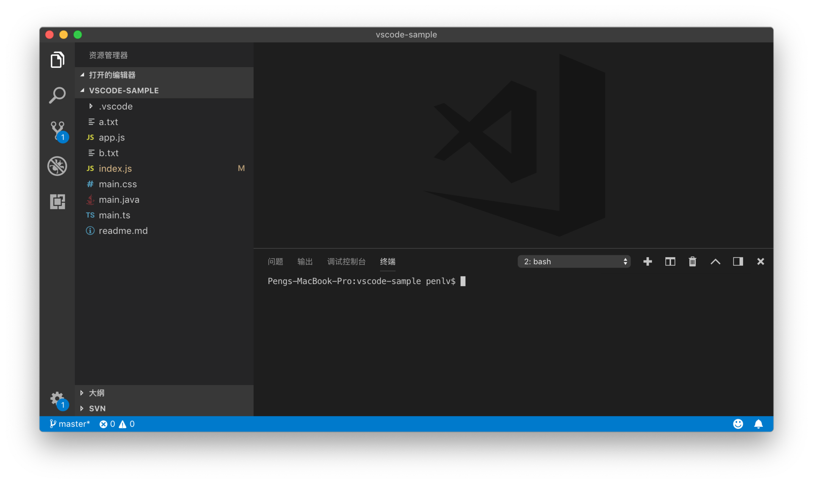
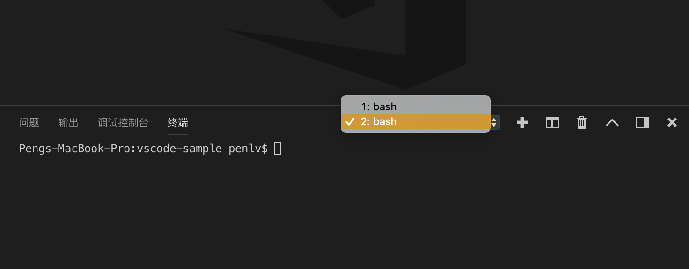
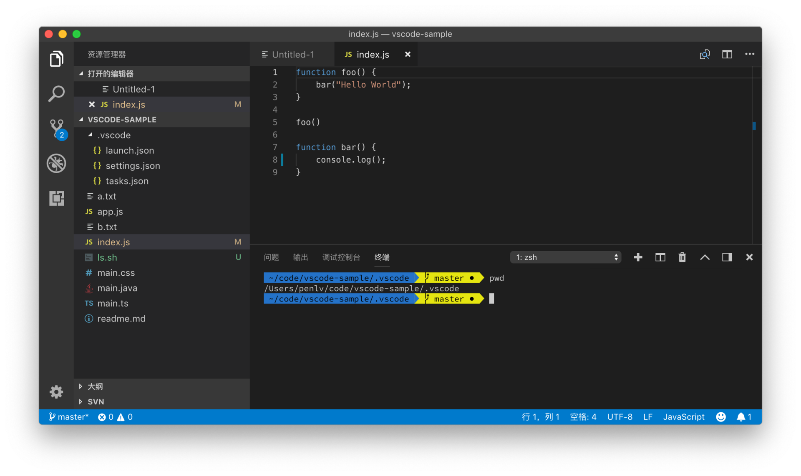

# 17 | 如何配置终端模拟器，告别系统终端

mp3: https://res001.geekbang.org/resource/audio/93/aa/933e326c111a4708bf194e9cfb6ff8aa.mp3

终端是我们日常开发工作中经常需要使用到的工具。我们在软件开发的整个流程中，有非常多的步骤能够通过终端有效地完成，比如进行包管理、代码编译、发布、测试等。虽然这里面的很多工作现在都有非常成熟的图形化界面的工具能够代劳，但很多人依然非常喜爱并且坚持终端进行操作。换一个不恰当的比喻，很多人现在开车都已经习惯了开自动挡，但也有不少人依然执着于手动挡的那种操控感。

好了，我们言归正传。图形化的工具的确能够帮助我们完成很多工作，甚至在有些情况下是绝大部分工作。但是，图形化界面也注定了不可能适合每个人，也不可能替我们完成所有可能的操作。

最简单的例子就是版本管理。它的各种可能的操作方式，可能是上百种，要想把它们以一种合理的方式呈现在界面上，几乎是天方夜谭。与其想方设法用图形化的界面去替代终端，不如把这样的选择权交给用户。换言之，即我们用图形化的工具，只完成最常用的或者 GUI 擅长做的那些操作，而把剩下的那部分操作，重新交还给终端。

基于这样的理念，VS Code 在设计之初，就一直在思考如何让 VS Code 和终端能够更紧密联系在一起。其第一种方式就是我们在专栏最开开始介绍的，从终端中以命令行的形式打开 VS Code。第二种方式，就是允许用户从资源管理器里调出系统终端。

这两种操作方式在 VS Code 上线开始就已经存在了。不过，VS Code 在它一岁生日的时候，推出了一种更直接的方式，就是把这个终端做进 VS Code 的工作台，这样用户就不需要在编辑器和系统终端之间来回地切换了。

由于把终端做到了工作台当中，所以我们能够更好地把终端的输入输出和我们经常熟悉的快捷键，以及资源管理器、版本管理、代码跳转等各个部件有机地组合到一起。这种效率上的提升是指数级的，因为它给 VS Code 的各个组件都增添了新的玩法。

下面我们来一起看一下如何在 VS Code 当中去创建和管理终端。对了，顺便说一句，这个**内置的终端**又叫**集成终端**，我在下文中都会使用这个名字。

创建终端
----

首先，我们要做的第一件事情就是，打开和创建一个集成终端。最简单的方式就是按一下 Ctrl + \` 键，一个新的终端就被创建出来了。

Ctrl + \` 键，创建新的终端

在这个终端被创建出来后，我们还可以通过再次按下 Ctrl + \` 键将其隐藏。如果查看一下快捷键绑定，或者使用命令面板的话，我们会发现这个命令其实是 “切换集成终端”（Toggle Integrated Terminal）。它的作用是：如果还没有任何集成终端存在，那么它将创建一个新的，然后显示出来；如果已经有几个集成终端了，那么就把终端面板调出来；而如果我们的光标就在集成终端里，那么这个命令会将终端面板隐藏。

当然，若我们希望创建出一个新的终端来，而不是上面描述的切换命令，那就需要按下 Ctrl + Shift + \`，或者在命令面板里搜索 “新建集成终端”（Create New Intergrated Terminal）并运行。

新建集成终端

正如我们在上面的动图里看到的，当我们的光标在一个集成终端里，按下“新建集成终端”的命令时，我们会在终端面板里看到一个崭新的终端。

一个崭新的终端

在这个面板的最上方，我们能够看到一个下拉框。下拉框里现在显示的是 “2：bash”，它的意思是，我们现在正在使用的是第二个集成终端，而它里面运行的是 bash。

如果我们点击这个下拉框，就能够看到所有的集成终端。

下拉框中所有的集成终端

我们除了可以使用这一个下拉列表来实现在不同的集成终端之间切换，还可以从命令面板里运行 “聚焦于下一终端” （Focus Next Terminal）或者 “聚焦于上一终端” （Focus Previous Terminal）进行切换。从下面的动图中我们可以看到，这两个命令并没有绑定快捷键，但是我推荐大家给它们绑定上顺手的快捷键，比如 Ctrl + Tab，来进行一键切换。

在命令面板里切换不同的集成终端

当然，如果我们的电脑屏幕足够大，或者我们希望在同一界面上看到多个运行的脚本，我们也可以把一个终端面板进行切分。我们只需按下 Cmd + \\ 或者运行 “拆分终端”（Split Terminal），就能够将当前的终端一分为二；如果再次按下这个快捷键，就能够将当前的面板平均分为三份……

切分终端面板

在这三个拆分终端之间切换的快捷方式，与上面集成终端之间的切换也是非常类似的，它们是 命令面板里的“聚焦于下一个窗格” (Focus Next Pane)、“聚焦于上一个窗格” (Focus Previous Pane)。如此一来，在多个终端和窗格之间切换就一共有四个命令了，要给它们搭配好快捷键，可就需要下一番功夫了。

切换终端面板

终端内操作
-----

接下来，我们再一起了解一下集成终端里的快捷键操作。

我们能够在终端里使用 Shell 自身支持的那些快捷键操作。比如在 Bash 里，我们可以按下 “Ctrl + A” 或者 “Home” 键把光标移动到一行的开头，也可以按下 “Option + 左方向键” （Windows 上是 Alt + 左方向键）把光标向前移动一个单词；如果我们在集成终端里使用的也是 Bash，那么这些操作依然生效。

终端面板里移动鼠标到行末行尾

但同时，VS Code 也为几个常用的操作提供了接近于编辑器命令的快捷键。比如，我们知道在编辑器里，按下 “Cmd + 左右方向键” 能够把光标移动到这行的开头或者结尾，其实我们也可以在集成终端里这么做。再比如，在编辑器里可以使用“Cmd + C”“Cmd + V”来复制粘贴，同样，在集成终端里也可以完成一样的操作。

终端面板里按单词移动光标

除了快捷键，集成终端里另外一个大家都熟悉的部件就是搜索框了，我们可以按下“Cmd + F”调出搜索框。

终端面板里进行搜索

这个搜索框和编辑器里的搜索框，使用的是同一套代码。相信在上图中你也看到了，搜索输入框的右侧也有三个小按钮，这说明大小写敏感、全单词匹配和正则表达式都可以在这个搜索框里使用。

假如你想了解集成终端里可以使用的全部命令，可以打开命令面板，搜索“终端”或者“Terminal”进行查看，这里我就不一一介绍了。但是要注意的是，如果你想给这些命令绑定快捷键的时候，要注意它会不会跟 Shell 原有的快捷键发生冲突。

终端设置
----

上面我介绍的是集成终端操作的一些技巧。下面我们再来一起看一下如何设置集成终端，让它能够符合我们平时的终端使用习惯。

第一个可以设置的，当然就是我们在终端里使用什么样的 Shell。默认情况下，在 Windows 10 上我们会使用 PowerShell，而如果是 Win 10 以下的版本那么默认的 Shell 则会是 Cmd。macOS 和 Linux 下 VS Code 会检测你的默认 Shell 是什么，比如在我的系统上，我就是使用 Zsh，而如果没有找到的话，终端则会使用 Bash 或者 sh 作为启动时的 Shell 环境。

如果 VS Code 挑选的 Shell 不是你想要的，那么你可以修改 terminal.integrated.shell.windows、terminal.integrated.shell.osx 或者 terminal.integrated.shell.linux，这个设置的值就是你想要使用的 Shell 在系统上的路径。

第二个，集成终端在创建的时候，同时还允许我们给 Shell 脚本传入参数。比如说我们想在 Linux 环境下创建 Bash 的时候，使用登陆 Shell （login shell），那我们就可以把 terminal.integrated.shellArgs.linux 修改为 -l 来实现。

第三个非常常用的集成终端设置就是环境变量了，我们既可以把环境变量写到脚本里去，也可以使用 terminal.integrated.env.osx、terminal.integrated.env.linux 或者 terminal.integrated.env.windows 来控制集成终端创建 Shell 时，该使用哪些特殊的环境变量。如果你希望在 VS Code 和系统终端里使用不同的环境变量，那么这个设置就能帮助到你。

此外，集成终端还从各种终端模拟器那里学习到不少有用的设置，比如 terminal.integrated.cwd 用于控制 Shell 启动时的初始目录；terminal.integrated.rightClickBehavior 控制鼠标右键点击时的行为；terminal.integrated.enableBell 可以控制当脚本出错时是否要发出响声。

最后介绍一个我觉得最有必要修改调的设置是terminal.integrated.scrollback 。终端在运行脚本时，只会保存最近输出的 1000 行结果。有的时候，当我们跑一些测试，1000 行根本不够用，测试跑完了，想往上翻页看看前面的结果，却发现只有 1000 行，没法看到全部的结果。那这时我们就可以把这个设置修改为一个较高的值，比如我就把这个值改成了 5000。集成终端的代码实现还是很不错的，所以我一点也不担心把这个值调大后会影响 VS Code的整体性能。当然，如果我们觉得集成终端里的输出结果已经不需要了，也可以按下快捷键 “Cmd + K”来清除所有的输出结果。

功能整合
----

在今天文章的开始，我提到，把终端做到 VS Code 里面，是能够提升 VS Code 各个部件的使用效率的。下面我们一起来看看，集成终端是如何和其他功能合作的。

首先是我们可以从集成终端中非常轻松地打开一个文件。我们经常在终端中运行测试脚本，在某些测试失败后，我们能够从错误警告中得到，某一个文件的某行代码有问题。这个时候，如果我们按下 Cmd 键，然后把鼠标移动到这个文件名的上面，我们就能看到这个文件名下出现了一个下划线，这说明集成终端成功检测出了这个文件的位置，此时只需按下鼠标左键就能将这个文件在当前编辑器中打开。

终端面板里文件跳转

在上面的动图中，我通过“Cmd + 鼠标左键”，将“./index.js”在编辑器中打开了。

集成终端和资源管理器也有互动。比如我们打开了一个脚本文件，希望直接执行这个脚本文件，就可以打开命令面板，运行 “在活动终端中运行活动文件”（Run Active File In Active Terminal），这样这个脚本就会在当前打开的集成终端中运行了。

在终端面板运行文件

我们也可以选中编辑器中的某段代码，然后打开命令面板，运行“在活动终端中运行所选文本”（Run Selected Text In Active Terminal），这段代码就会在终端中执行。

终端面板里运行选中的文本

对了，我们在使用命令行的时候，一个经常做的操作就是 cd 进入某个文件夹，或者 cd … 回退到上一层文件夹，甚至有的时候需要多次运行这个命令才能调整到我们期望的某个文件夹下然后再进行操作。有个资源管理器，这个场景就简单多了，我们只需在目标文件夹上按下右键调出上下文菜单，然后选择 “在终端中打开”。

终端面板里打开文件夹

除了资源管理器，任务系统、调试器都可以配置使用集成终端来进行交互，这些我会在后面的章节里介绍。

小结
--

以上就是我们今天的全部内容了，我们一起学习了如何创建管理终端，如何配置终端中 Shell 的使用，以及如何将终端和其他 VS Code 组件搭配使用。但我介绍的内容，并不是集成终端的全部内容，还有很多的命令和配置我们没有覆盖，你可以自己研究研究。不过在文章的最后，还是给大家介绍两个通用的终端的优化，你可以在任何的终端里都能使用。

第一个就是优化终端的样貌了。每次我在社交媒体上分享了 VS Code 的截图，很多人都会问我，我的终端是怎么配置的。比如在下图中，我们能够轻松的看出，我的 Shell 现在是在 vscode-sample 这个文件夹下，同时这个项目是使用 Git 进行版本管理的，当前的分支是 master，你还能够看到特殊的符号。这里我使用的是 zsh 和 oh-my-zsh 插件，你也可以试试。对了，我在 Windows 上会使用 Posh-Git 来完成类似的效果。

终端面板里的主题定制

第二个则是关于终端的持久化，现在 VS Code 的集成终端还不支持。当你在集成终端或者系统终端里运行了一个长时间运行的脚本，然后你不小心重启了这个应用，之前的脚本就丢失了。如果这个很影响你的工作的话，我推荐你试一试 Tmux 。

好了，看到这里，相信你早已摩拳擦掌，想要自己动手试一试了，有什么问题我们讨论区见：)

* * *

