# 20 | 聊debugger时，我们在聊什么

mp3: https://res001.geekbang.org/resource/audio/8a/7d/8aa5b0e994e94630ab85f33a0d4a867d.mp3

今天让我们一起来了解一下代码调试器debugger。

相信你对调试器是什么、怎么用、长什么样早就有了充足的了解。无论你是使用 IDE （集成开发环境），或者说使用浏览器的开发工具，亦或是使用命令行工具，相信你的工作中都离不开调试。

**和语言功能一样，VS Code 是把调试功能的最终实现交给插件来完成的**。VS Code 提供了一套通用的图形界面和交互方式，比如怎么创建断点、如何添加条件断点、如何查看当前调试状态下参数的值，等等。无论你使用哪个编程语言或者调试器，这一套交互流程都是相似的。

而对于插件作者而言，他们需要完成的是如何把真正的调试工作跟 VS Code 的界面和交互结合起来，为此 VS Code 为插件作者提供了一套统一的接口，叫做**Debug Adapter Protocol（DAP）**。当用户在界面上完成一系列调试相关的操作时，VS Code 则通过 DAP 唤起调试插件，由插件完成最终的操作。

讲到这里，你可能想到了，如果你在使用的语言已经有一个命令行的调试工具，那你也可以通过写一个调试插件，把这个命令行的调试器通过 DAP 连接到 VS Code 中，然后就能够借助 VS Code 这套 UI 来进行图形化的调试了。没错，调试插件很大程度上就是在进行这样的 “翻译” 工作。下面这张 VS Code DAP 的流程图也很好地做出了解释：

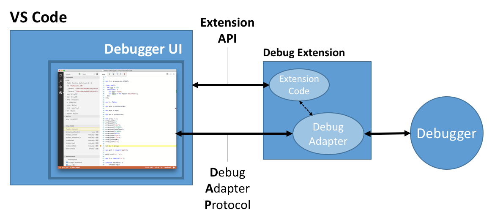

VS Code Debug Adapter Protocol

当然，尽管我们在编辑器中提供了各种调试的界面和功能，但这并不意味着每一个调试插件把它们全都实现了。这可能是因为插件还没有足够成熟，也有可能是受限于底层的调试器。

首先，让我们一起来看下 VS Code 的通用调试界面。今天我会以 Node.js 为主要的语言来介绍，对于任何编程背景的同学来说，这都没有什么难度。

在进入调试知识之前，我们可以先做一些准备，在当前目录下创建一个文件 index.js ，内容如下：

    function foo() {
        bar("Hello World");
    }
    
    foo()
    
    function bar(str) {
        console.log(str);
    }
    

调试窗口
----

VS Code 中有一个专门的用于管理调试功能的视图。我们可以点击界面左侧“昆虫”（也就是 bug 啦）形状的按钮，或者按下 “Cmd + Shift + D” （Windows 上是 Ctrl + Shift + D）来唤出调试视图。

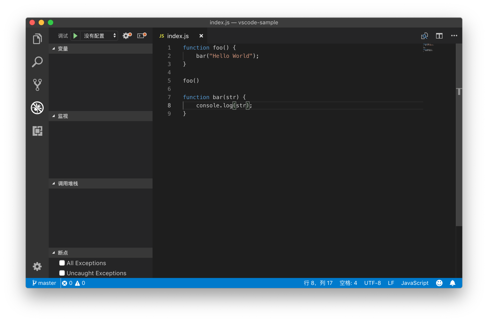

唤出调试视图

在视图的最上侧，有个绿色的箭头按钮。这个按钮是用于启动调试器的。但是在上面的截图里，你可以看到在绿色箭头的右侧写着 “没有配置”。这说明现在 VS Code 还不知道该使用什么调试器来调试当前的代码。此时点击这个按钮或者按下 F5，我们能够看到一个列表。

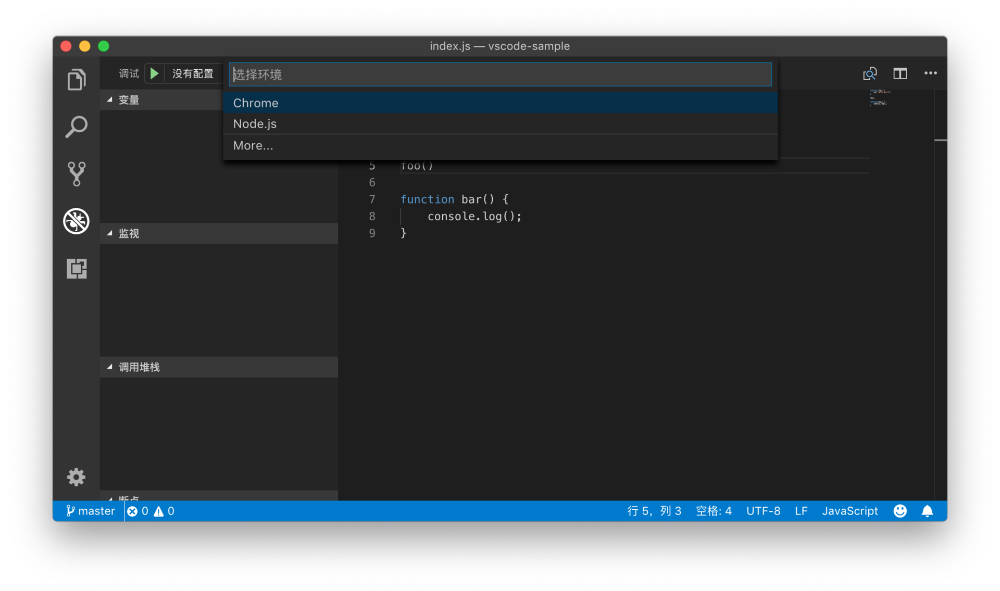

选择环境列表

这个列表有两个选项，一个是 Chrome，另一个则是 Node.js。其中，Node.js 的调试器是 VS Code 默认就支持的，而 Chrome 这个选项则是因为我安装了 Chrome 调试相关的插件 [Debugger for Chrome - Visual Studio Marketplace](https://marketplace.visualstudio.com/items?itemName=msjsdiag.debugger-for-chrome) 。 为了便于理解，这里我会选择 Node.js 。

选择完 Node.js 后，我们可以看到 VS Code 的 UI 发生了变化，但是一闪而过，然后又恢复了正常。这是因为 VS Code 的 Node.js 调试器发现本地有 index.js 文件，于是直接执行了这个文件；index.js 文件内容非常简单，很快结束了。

下面，让我们放慢速度再来一次。

首先，我们将鼠标移动到第五行代码的行号前面，点击鼠标左键，我们能够看到一个红色的圆点被创建了出来，这就是断点。当然，我们也可以把光标移动到第五行，然后按下 F9，同样可以在第五行创建断点。

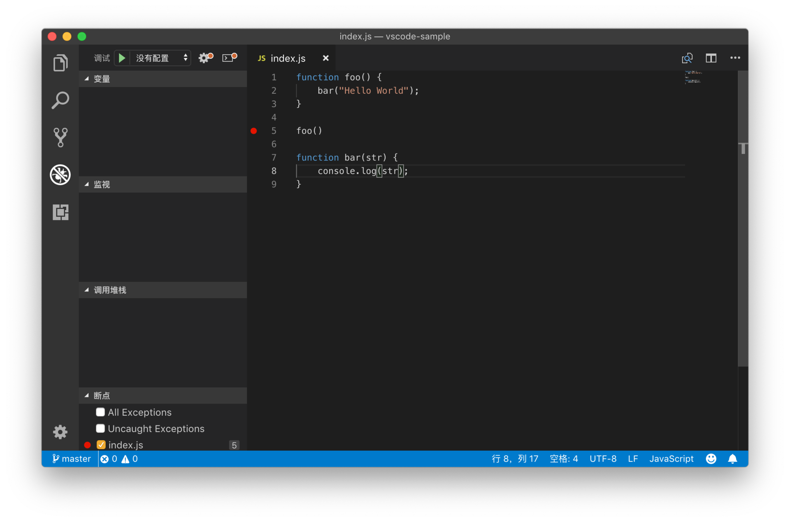

添加断点

此时，当我们再次点击调试视图上面的绿色箭头按钮，或者按下 F5，启动调试器，并且选择 Node.js ，VS Code 就会进入调试模式。

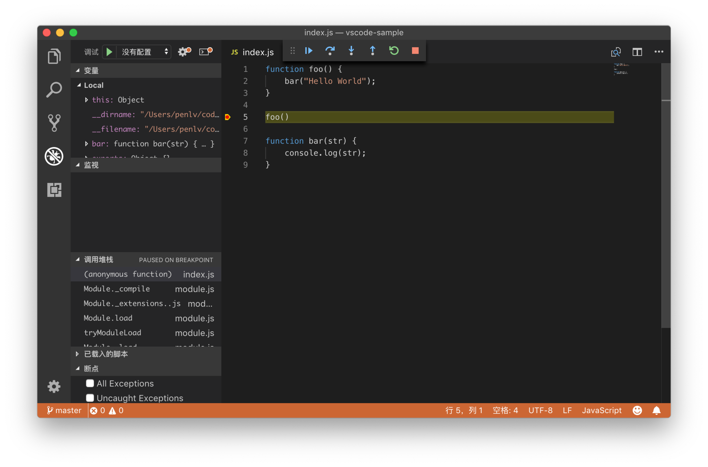

代码中断

我们能够看到界面中间出现了一个工具栏，用于控制代码的执行；左侧的调试视图，现在也展示了当前上下文里的变量、调用堆栈和所有创建的断点等。相信这些你早就已经非常熟悉了，这里我就不多加赘述。

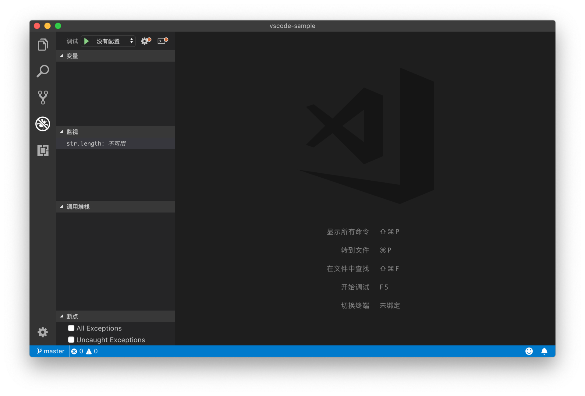

关闭全部编辑器

但是，如果工作区并没有任何打开的文件，那当我们再次按下 F5 进行调试，然后选择 Node.js 时，VS Code 会告诉我们 “找不到要调试的程序”。这句话什么意思呢？

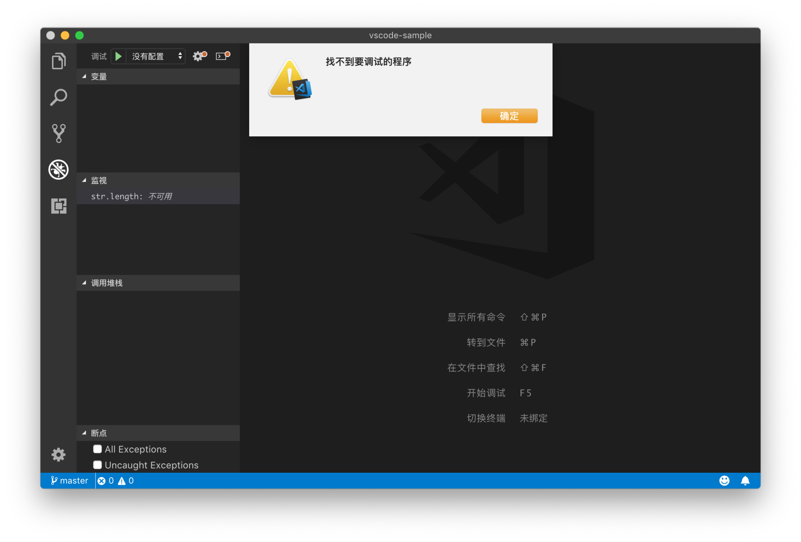

没有编辑器被打开，找不到调试的程序

在没有任何配置的情况下，VS Code 的 Node.js 调试器，会尝试着去调试当前打开的文件，而如果当前没有任何的文件被打开的话，Node.js 调试器就不知道该调试哪个代码文件了。而且很多时候，我们的项目相对比较复杂，单个文件的调试还是相对太理想化了。为了解决这个问题，我们需要给 VS Code 提供一个配置文件，告诉调试器如何加载和调试代码。

相信你对 VS Code 的各种配置文件早就不陌生了，VS Code 用于配置代码调试的文件跟其他的很类似，是一个 JSON 文件，叫做 launch.json 。我们可以把它放在 .vscode 文件夹下，也能够将它的内容放在个人或者工作区的配置文件里。

下面我们一起来看下如何创建这个文件。

调试配置 launch.json
----------------

在调试视图的最上方，我们能够看到一个齿轮形状的按钮，它可以用于创建和修改 launch.json 文件。由于当前文件夹下没有 launch.json 文件，所以这个按钮的右上角有个红色的点，它告诉我们当前的调试配置有一点问题，让我们点击这个按钮。

创建调试配置

当我们按下按钮后，VS Code 询问我们想要创建什么项目的调试配置，这里我们再次选择 Node.js。然后我们就能够看到 .vscode 文件夹下 launch.json 文件被创建出来了，它的内容如下：

    {
     // 使用 IntelliSense 了解相关属性。 
     // 悬停以查看现有属性的描述。
     // 欲了解更多信息，请访问: https://go.microsoft.com/fwlink/?linkid=830387
     "version": "0.2.0",
     "configurations": [
      {
       "type": "node",
       "request": "launch",
       "name": "启动程序",
       "program": "${file}"
      }
     ]
    }
    

这个 JSON 文件里的 configurations 的值就是当前文件夹下所有的配置了。现在我们只有一个调试配置，它有四个属性：

第一个是 type，代表着调试器的类型。它决定了 VS Code 会使用哪个调试插件来调试代码。

第二个是 request，代表着该如何启动调试器。如果我们的代码已经运行起来了，则可以将它的值设为 attach，那么我们则是使用调试器来调试这个已有的代码进程；而如果它的值是 launch，则意味着我们会使用调试器直接启动代码并且调试。

第三个属性 name，就是这个配置的名字了。

第四个属性 program，就是告诉 Node.js 调试器，我们想要调试哪个文件。这个值支持预定义参数，比如在上面的例子里，我们使用了`${file}`，也就是当前编辑器里打开的文件。

不过使用这个配置，并没有解决刚才上面我提的问题，如果所有文件都被关闭了，那么`${file}` 就是空的了，这个调试配置并不能正确运行。

下面我们把 `program` 的值改为 `${workspaceFolder}/index.js`，其中`${workspaceFolder}` 是代表当前工作区文件夹地址的预定义参数，使用它就能够准确地定位当前工作区里 index.js 文件了。（关于在配置文件里可以使用的预定义参数，请参考[Visual Studio Code Variables Reference](https://code.visualstudio.com/docs/editor/variables-reference)。 ）

到这一步，即使我们关闭掉编辑器里全部的文件，当我们按下 F5 ，也能够将 Node.js 代码调试起来了。

使用调试配置调试代码

launch.json 该怎么写
----------------

看到这里，你可能会说，“上面讲的我都会，快赶紧告诉我该怎么掌握 launch.json 吧，它实在是太难写了。”没错，VS Code 的调试交互方式，跟其他工具并没有太大的出入，但是配置起来可就麻烦了，我也深受其扰。究其原因，不同调试器在调试代码或者工程时，需要的信息各不相同，VS Code 并没有办法为它们统一所有的配置项。

举个例子，在上面的 Node.js 调试配置里，有个属性叫做 `request`，它控制着我们运行调试器时是 launch 还是该 attach 。对于绝大部分调试器，这个属性都是有用的，所以 VS Code 预先定义好了 request 这个属性，然后要求每个调试配置都必须包含 request 这个属性，而且它的值必须是 launch 或者 attach 之一。

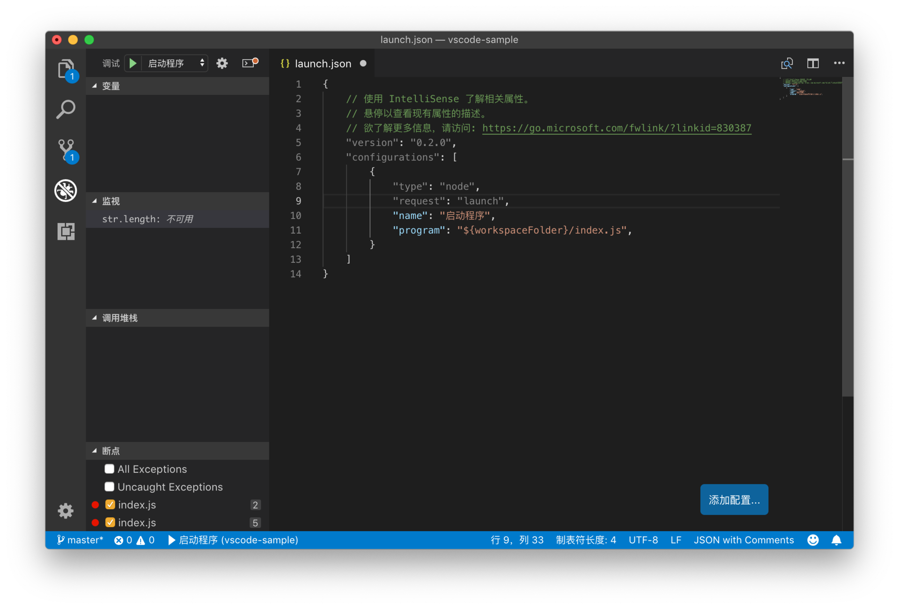

调试配置模板

我们在编辑器里打开 launch.json 这个文件时，能够看到`request` 这个属性的颜色是灰色的，这说明它是 VS Code 预先定义好的属性，每个调试器插件都会按照一样的方式去阅读和理解它的值。

而 name 和 program 这两个属性，它们的颜色是蓝色的，这意味着它们的定义和最终解释，都是由调试插件控制的，而 VS Code 并不会对它们做任何的约束和处理。

相信到这里，你已经明白了 launch.json 的本质，以及它的书写难度来自于哪里。VS Code 提供了调试界面，但是并没有将调试配置统一起来，而是将它的自由度完全交给调试器本身，我们在 launch.json 里书写的调试配置，其实就是调试器的配置或者参数，只不过它的格式是 JSON。

但是别怕，我们有办法降低书写它的难度。我们可以**借助VS Code的调试器插件提供的模板，以及自动补全功能**。

### 模板

下面我们打开 launch.json ，在第十二行最后按下“Ctrl + Space”或者执行 “触发建议”这个命令，VS Code 立刻就会为我们唤出了建议列表。

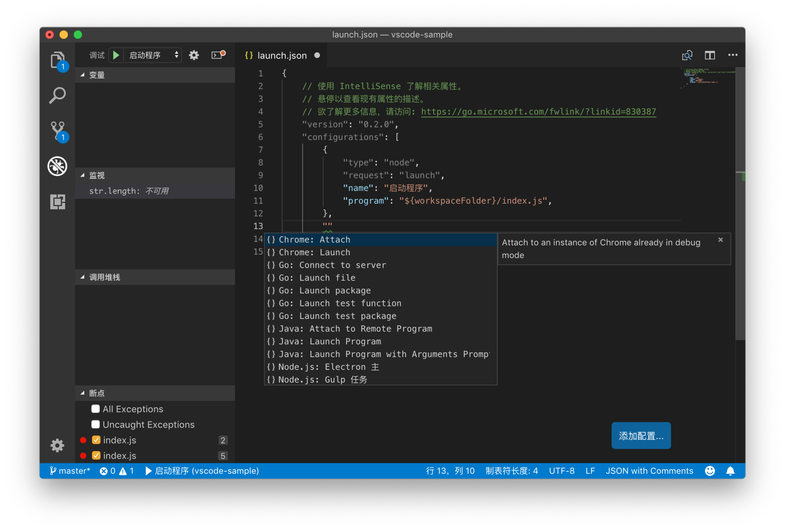

调试模板的自动补全

建议列表里的，就是调试插件们给我们提供的调试配置的模板了。模板的前缀就是它所属的语言或者插件名称，后面则是这个模板的类型。它们一般都有一段说明，介绍它大概是完成什么调试工作的。

比如我已经安装了 Java 的插件，当我选择了 “Java Attach to Remote Program” 这一项时，我们能够看到它的描述是：

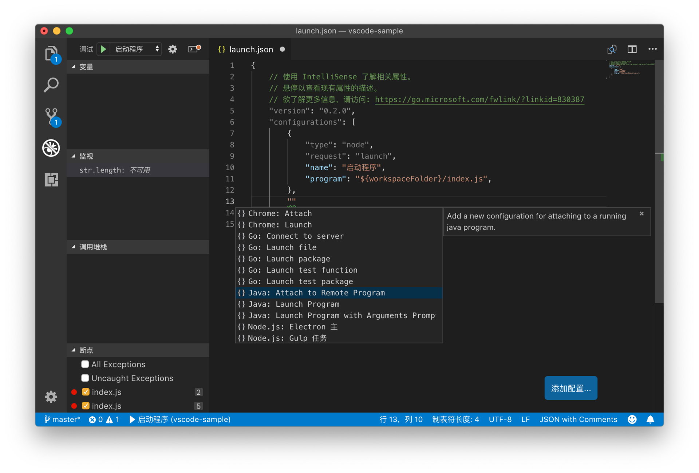

调试模板自动补全中的描述界面

“Add a new configuration for attaching to a running java program” ，它的意思是这个配置是用于将调试器 attach 到正在运行的 Java 程序上的。

再或者我选择了 “Node.js: Gulp 任务“，它的作用是调试 Gulp 任务（Gulp 是 Node.js 的一个任务脚本工具），同时它还提示了我要确保项目里已安装本地 Gulp 脚本。

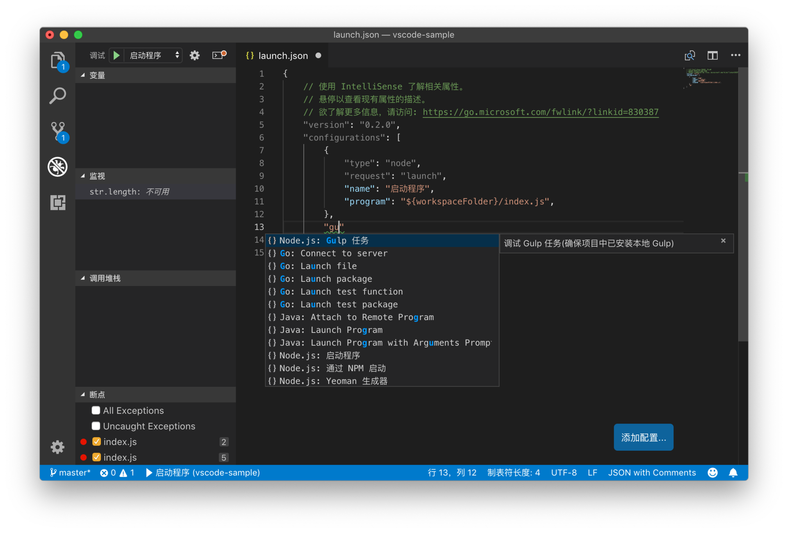

Node.js 调试 Gulp 的模板

就是这样，很多时候，模板可以帮助我们完成大部分的工作，然后我们只需要稍作修改就可以了。

### 参数智能提示

另一个能够帮助到我们的，就是在书写配置属性的时候使用自动补全功能。当我们在书写新的属性时，按下 Ctrl + Space，就能够唤出建议列表，建议列表里提供了当前调试配置里可以使用的所有属性，然后我们就可以按需选用了。

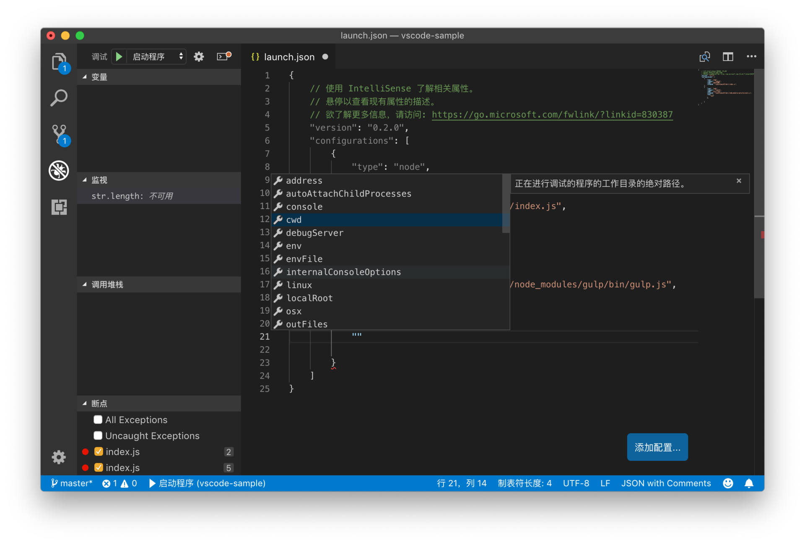

书写调试配置属性时的自动补全

### 通用属性

虽然每个调试器各自控制着用户可以使用哪些属性，但是调试器之间还是有很多相同的地方，调试插件在很多时候都会使用相同的属性名来代表同样的功能。比如，我自己就是 Ruby 插件的作者，我在实现 Ruby 调试插件的时候，参考了很多 Node.js 和 PHP 调试插件对于属性的命名和使用。我在书写不同语言的调试配置时，经常使用的有下面这些：

*   program 一般用于指定将要调试的文件。
*   stopOnEntry，当调试器启动后，是否在第一行代码处暂停代码的执行。这个属性非常方便，如果没有设置断点而代码执行非常快的话，我们就会像文章的最开头那样，代码调试一闪而过，而没有办法在代码执行的过程中暂停了。而设置了 stopOnEntry 后，代码会自动在第一行停下来，然后我们就可以继续我们的代码调试了。
*   args 参数。相信你应该记得在前面任务系统配置的文章里，我已经说明了可以使用 args 来控制传入任务脚本的参数，同样的，我们也可以通过 args 来把参数传给将要被调试的代码。
*   env 环境变量。大部分调试器都使用它来控制调试进程的特殊环境变量。
*   cwd 控制调试程序的工作目录。
*   port 是调试时使用的端口。

### 多系统支持

在任务系统配置里，我们介绍过如何为不同的操作系统指定不同的配置，调试配置也支持这样的语法。比如 program 这个属性，我们可以默认使用 macOS 或者 Linux 的书写方式 ：

    "program": "path/app.js"
    

然后我们也可以为 Windows 平台指定特定的书写方式：

    "windows": {
      "program": "path\\app.js"
    }
    

试着理解调试器
-------

上面我建议的书写调试配置 launch.json 的方法，总结来说就是：第一，借助模板和智能提示，尽可能利用调试插件给我们的提示和文档；第二，试着记住和学习通用的配置属性和技巧，有些知识我们在学习任务系统时也已经涉猎过了。

但在我自己学习配置 launch.json 的过程中，我自己体悟的最重要的一条方法，就是去试着理解调试器本身，或者讲的更宽泛一些，理解自己正在执行的操作究竟干了什么。

尤其是当我们已经熟悉了通用的那些属性的配置，如果配置完它们都还不能工作，那么很有可能是我们使用的这个调试器有一些特殊的要求。这里我举两个例子。

第一个是我在调试 Gulp 时遇到的。Gulp 是一个自动化脚本工具，基于 Node.js ，可以通过 NPM 进行安装使用 （npm install gulp）。它的配置文件也是一个 JavaScript 文件，我可以在文件夹下创建 gulpfile.js ，然后在这个文件里创建多个不同的任务，之后就可以在命令行里使用 `gulp task`直接运行任务了。

我最开始只知道如何为普通的 JavaScript 文件创建调试配置，也就是我们在文章开头提到的方法，为 Node.js 这个调试器指定一个文件，比如 `${workspaceFolder}/index.js`，Node.js 调试器就回去调试这个文件了。但是如果我要调试我写在 gulpfile.js 文件里的某个任务，该怎么做呢？直接调试 `${workspaceFolder}/gulpfile.js` 代码并不奏效，因为我希望调试的其实是 `gulp task`这个命令。

但是我退过来想一下，Gulp 是使用 Node.js 实现的工具，它的执行文件其实也是一个 JavaScript 代码（也就是 `node_modules/gulp/bin/gulp.js`）。`gulp task`运行的时候，其实是在 Node.js 下运行 `node_modules/gulp/bin/gulp.js`这个文件，然后传入了 `task`这个参数。

理解了这层关系，那么调试配置就好写了。我要使用的调试器是 node，调试的是 gulp.js 这个文件，它存在当前目录下的 node\_modules 文件夹下，那么我需要使用 `${workspaceFolder}`这个预定义的变量，同时给 `args`传入 `task`这个参数。最终的调试配置如下：

    {
     "type": "node",
     "request": "launch",
     "name": "Gulp task",
     "program": "${workspaceFolder}/node_modules/gulp/bin/gulp.js",
     "args": [
      "task"
     ]
    }
    

第二个例子则是我在调试 JavaScript 代码遇到的。前端项目为了保证加载和运行速度，很多都会对 JavaScript 代码进行打包和压缩。经压缩的代码几乎是不可读的，为了便于调试，打包工具都还会生成一个特殊的 sourcemap 文件，这个文件里记录的是原始代码和压缩代码之间的对应关系。有了这个文件，我就能够像调试原始代码一样调试经压缩的代码了。在自动补全的提示下，我可以添加一个属性 “sourceMaps” ，这样 JavaScript 的调试器就知道去阅读 sourcemap 文件了。

但问题来了，当我使用 webpack 打包代码然后进行调试时，断点停下的位置总是错得离谱。很显然，调试器没有能够正确地通过 sourcemap 文件定位断点。不过寻找解决方案的方式还算很简单，我到对应的调试器的 GitHub 代码仓库 issues 里搜索 “webpack sourcemap” 就找到一摸一样的问题了，原因是 webpack 自己的特殊的 sourcemap 生成方式跟 VS Code 不兼容。要解决这个问题，我们既可以通过配置 webpack，也可以通过 “sourceMapPathOverrides”这个属性来修复。

小结
--

总体来讲，VS Code 提供的是一套调试的 UI，是将界面上的调试操作，转换成 API 调用，最终调用真正的调试器 debugger 去完成调试的任务。而调试器配置 launch.json，虽然格式是 JSON，但是每个调试器需要的参数却不完全相同。相比较而言，IDE 则要好很多，它们往往把所有的调试配置都替你创建好了，你只需一键即可调试代码。而要想完全掌握 launch.json 的书写，就需要真正了解调试器本身了。

最后，还是跟以往一样，如果你在修改调试配置时遇到什么问题，或者你有什么心得，欢迎在留言区分享。

而文章的最后，我再多分享一则**小Tip：如何在 VS Code 中同时调试多个代码**。

跟任务系统一样，调试配置也允许你将多个调试项进行组合，这样就可以同时运行多个调试进程。比如说你的代码里同时包含了前端和后端的代码，此时你已经创建了名叫 “frontend“ 和 “backend” 的调试配置。那么你可以在调试配置 JSON 文件的根对象下，添加如下配置：

    "compounds": [
        {
            "name": “All”,
            "configurations": [“frontend”, “backend”]
        }
    ]
    

这样，当你在调试时，只需选择 “All” 这个选项，就可以同时把前端和后端的代码都调试起来了。

* * *

