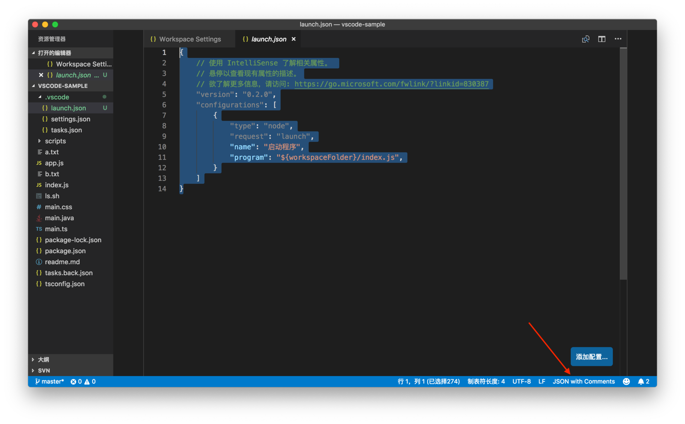
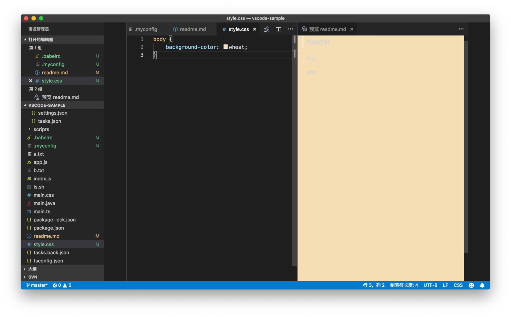
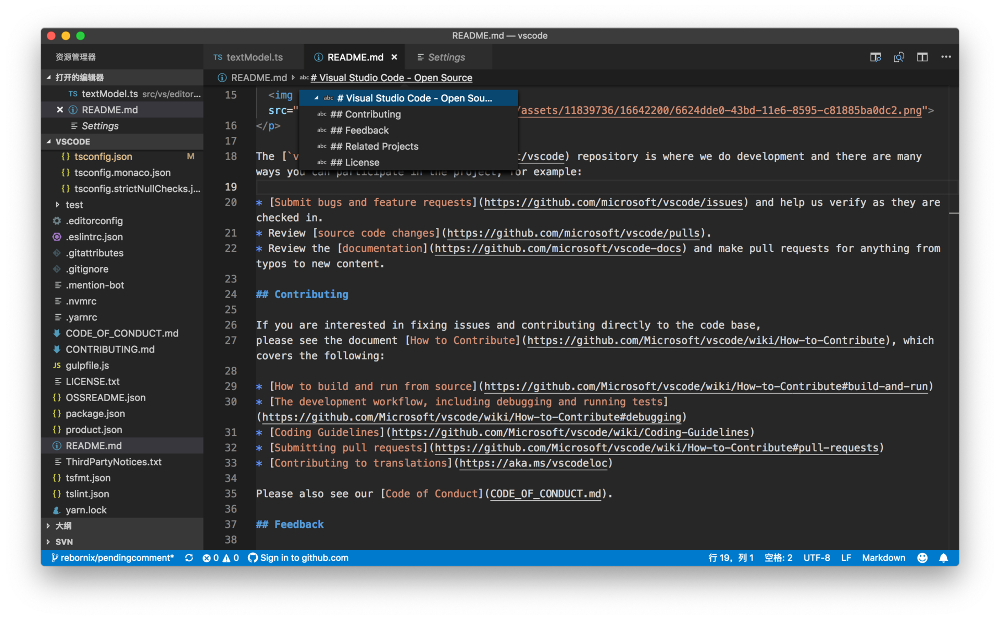

# 23 | 基础语言支持：JSON、Markdown

mp3: https://res001.geekbang.org/resource/audio/01/2c/01e8a954d3967e6f493fa851f4df8a2c.mp3

今天我们一起进入到专栏的第三部分：**语言支持**。我们将在这一部分一起了解 VS Code 对主流编程语言的支持情况，看看VS Code有哪些特别的语言支持以及目前的局限所在。

VS Code 想要做到开箱即用，一个很重要的要素，就是要尽可能多地对更多的语言有良好的支持，但同时 VS Code 希望自己保持轻量，把很多功能“代理”给了插件。哪些语言的支持放在 VS Code 核心代码里面，哪些交由社区来做，保持好这个平衡就很重要了。

VS Code 现在的选择是，像 C#、Java、Go 这类的语言，要提供一个好的语言支持，是需要一个专门的团队来维护的，工作量不小，相对更重量级一点，那么就做成专门的插件好了，由用户自由选择。而对于我们日常经常接触到的一些脚本、配置、文档类语言，则尽可能地提供原生的支持，以保证用户的首次体验。

今天我们一起来看下，VS Code 中的 JSON 和 Markdown 相关的功能。

JSON
----

JSON 文件你肯定已经非常熟悉了，VS Code 的配置文件、任务系统、代码片段等都是使用的 JSON 语法。比如下面的这段调试配置：

    {
        // 使用 IntelliSense 了解相关属性。 
        // 悬停以查看现有属性的描述。
        // 欲了解更多信息，请访问: https://go.microsoft.com/fwlink/?linkid=830387
        "version": "0.2.0",
        "configurations": [
            {
                "type": "node",
                "request": "launch",
                "name": "启动程序",
                "program": "${workspaceFolder}/index.js",
            }
        ]
    }
    

你可能会疑惑，“JSON 按理说是不允许写注释的呀，为什么 VS Code 里的配置文件都可以写类似 `// comment` 的内容呢？”

这是因为 VS Code 为配置文件们都指定了一个特殊的 JSON 文件类型，称为**JSON with Comments**。你可以在状态栏的最右侧看到 VS Code 的这个特殊的语言类型。

JSON with Comments

### 如何

与此同时，JSON 的语言服务支持 [JSON Schema](http://json-schema.org/)。你可以通过 JSON Schema 规范 JSON 内容的格式，并且做一定程度的语法检查。我们可以先来看看如何给一个 JSON 文件指定 Schema。

**第一种就是在 JSON 文件中直接指定**，这种写法的好处很明显，你能够立刻知道自己在使用的是哪个 schema。比如：

    {
       "$schema": "http://json.schemastore.org/babelrc"
    }
    

但是，有的时候你不希望把这个 schema 设置放到代码版本管理中去，为了满足这种需求，你可以采取**第二种方法：将 schema 的配置放在个人设置，或者工作区设置中**。语法如下：

    "json.schemas": [
         {
            "fileMatch": [
                "/.babelrc"
            ],
            "url": "http://json.schemastore.org/babelrc"
        }
    ]
    

在上面的代码示例中，你可以看到 json.schemas 是一个数组，现在数组里只有一个值。这个值就是 schema 的配置，它有两个属性：

1.  fileMatch。顾名思义，这个值指定了哪些文件将会使用这个 schema。比如在上面的示例里，fileMatch 的值中有一个 `/.babelrc`，它意味着根目录下的 .balelrc 文件将会使用这个 schema。
    
2.  url，指定了 schema 的存储地址。在这个示例中，我们会从http://json.schemastore.org/babelrc 下载 schema。
    

通过这两个示例，当我们在项目中使用 .babelrc 文件来书写 babel （一个 JavaScript 编译器）的配置时，就能获得正确的自动补全和警告了。

.babelrc 自动补全

### 为何

到这里你可能会好奇，这个 schema 里的内容到底是什么呢？为什么它能够提供智能提示和检查呢？我们这个专栏的任务虽然不是教你如何掌握 JSON schema，但是我们还是可以来看看如何在 VS Code 里书写 JSON schema。我们先来看如下这个简单的例子：

    "json.schemas": [
        {
            "fileMatch": [
                "/.myconfig"
            ],
            "schema": {
                "type": "object",
                "properties": {
                    "name" : {
                        "type": "string",
                        "description": "The name of the entry"
                    }
                }
            }
        }
    ]
    

这个例子跟之前 .babelrc 的例子非常接近，fileMatch 现在指定的是 .myconfig 这个文件，不过第二个属性不再是 url 了，而是 schema。这个 schema 的值，就是 JSON schema 。这个代码示例应该非常好理解，它指定了 .myconfig 里的 JSON 根对象是个 Object 对象，它有个属性叫做 name，name 的类型必须是字符串 string。

添加了这个设置后，你可以在当前打开的文件夹根目录下创建 .myconfig 文件，然后在编辑器中打开。这之后你需要点击状态栏最右侧的语言设置，默认情况下，VS Code 并不认识 .myconfig 文件，你需要点击这个语言设置，然后选择 JSON。

为 .myconfig 设置为 JSON

然后你在 .myconfig 里书写 JSON 时，VS Code 就会给你提示 name 这个属性了。

.myconfig 智能提示

但如果你设置 name 的值时没有使用字符串，而是使用了数字，VS Code 则会提出警告。

.myconfig 警告 name 必须是字符串

这就是一个最简单的 JSON schema 样例了。如果你正在工作的项目，有自己特殊的配置文件，而且这个配置的格式是 JSON，那你就不妨试试使用 JSON schema 来给这个文件添加规范；而如果你的同事们同样适用这个 JSON schema 的话，就能避免很多错误配置了。关于更多 JSON schema 的书写，还请阅读[官方文档](http://json-schema.org/) 。

Markdown
--------

说完 JSON，我们再来看看另一个 VS Code 支持的非常好的语言——Markdown。Markdown 在近些年已经成为了主流的文档书写语言，比如GitHub 上的项目 readme 默认就是 Markdown，微软在13年也把 MSDN 的文档从 XML 逐步地转为 Markdown 了。

你在 VS Code 中书写 Markdown 的时候，VS Code 会提供语法高亮。

Markdown 语法高亮（ \*abc\* 为斜体）

VS Code 的定位是一个文本编辑器，而不是富文本编辑器，所以你并不能像一些 Markdown 编辑器一样，获得所见即所得的体验。但是 VS Code 提供了一个 Markdown 预览的效果。

### 侧边预览

当你在编辑器中打开一个 Markdown 文件后，你可以通过命令面板执行 “**Markdown: 打开侧边预览**”（Markdown：Open Preview to the Side）来打开预览窗口。

Markdown 侧边预览

这样无论你在左侧的编辑器还是在右侧的预览窗口滚动时，另一个编辑器都会相对地滚动，以保证你能同时看到对应的 Markdown 内容和预览。

当你修改这个 Markdown 文件时，右侧的预览会自动更新，而且也会跟随你的光标实时地滚动。

Markdown 实时更新

另外，在侧边预览打开后，如果你打开另一个 Markdown 文件，侧边预览也会实时地更新成新 Markdown 文件的预览。

Markdown 更新成新文件内容

但有的时候，你可能会希望这个预览窗口永远只显示“某个” Markdown 文件的预览，而不是根据编辑器内文件而变化，那这时你可以执行 “**Markdown: 在侧边打开锁定的预览**” （Markdown: Open Locked Preview to the Side）命令，这样预览窗口就会一直显示你想要的这个Markdown文件的预览内容了。

Markdown 锁定预览

### 同编辑器内预览

在侧边打开预览的好处是，你可以直接编辑内容并且看到实时的更新。但是有的时候你只是希望阅览 Markdown 的最终预览，这时候，你就可以使用 “**Markdown: 打开预览**”（Markdown: Open Preview） 命令，在当前编辑器组内打开预览。

Markdown 同编辑器组内打开预览

### 修改 Markdown 预览格式

我们知道，Markdown 文件最终会被转换成 HTML，然后在指定的网站上呈现出来。这些网站都有自己的一套样式，为了能够让 VS Code 的 Markdown 预览更接近 Markdown 文件发布后的效果，你可以为 Markdown 的预览提供一套自定义的 CSS 样式。比如说你可以把最终网站上使用的 CSS 套用在 VS Code 的 Markdown 的本地预览中。

要达到这个目的，配置也很简单。你可以在设置里，添加如下配置：

    {
        "markdown.styles": [
            "Style.css"
        ]
    }
    

通过给 markdown.styles 属性指定 CSS 样式的地址，你就能控制 Markdown 的预览效果了。

Markdown 自定义样式

除了 CSS 样式，你也可以通过书写插件，给 VS Code 添加新的 Markdown 语法和预览，这个内容我会在专栏的插件部分介绍。

### Markdown 内跳转

相信你还记得，在专栏的编辑器部分，我们介绍过如何在符号（Symbols）中快速跳转。这个功能在 Markdown 中显得更加方便了。你可以通过符号，快速地在不同的章节直接进行跳转。

Markdown 跳转

如果你打开了面包屑功能的话，你也可以通过面包屑工具栏来跳转。

Markdown 面包屑跳转

### Markdown 代码折叠

在介绍代码折叠功能（Folding）时，我们探讨过VS Code支持插件来动态地计算哪些代码可以折叠，而不是简单地检测花括号或者代码缩进。Markdown 就是一个特别好的例子，你可以在编辑 Markdown 时，根据章节来对内容进行折叠。

Markdown 代码折叠

小结
--

以上就是今天的全部内容了。我们一起学习了如何在 VS Code 中通过 JSON Schema 来为 JSON 文件的书写提供智能提示和错误检查，你可以试着在自己的项目中进行实践；同时我们还一起学习了 Markdown 预览和样式定制相关的知识。但我个人认为在今天的内容里，最值得注意的还是 Markdown 的符号、面包屑跳转以及折叠功能，它们都是我们在之前的章节里学习过的内容，不知道你自己是不是已经注意到了它们并且已经在使用了呢？那你自己有没有什么使用的心得和技巧，是这篇文章没有涉及的呢？欢迎留言分享给我们，让我们一起共同学习和进步！

* * *

