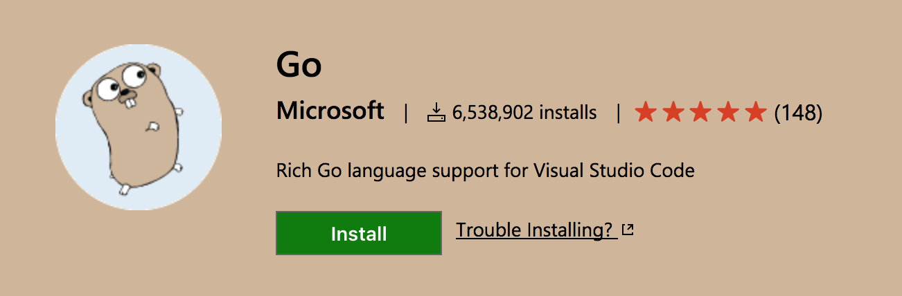
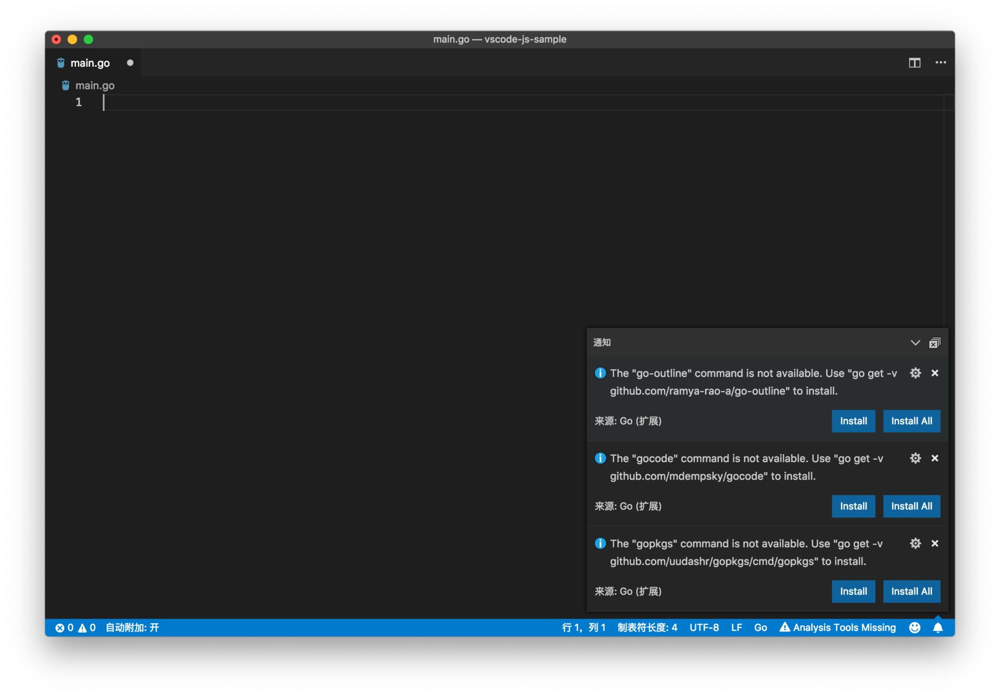
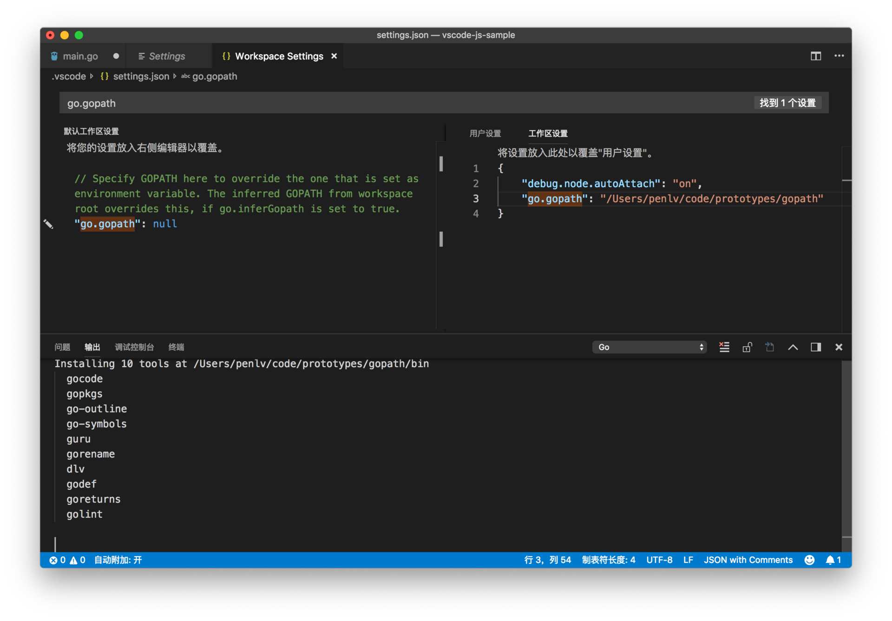
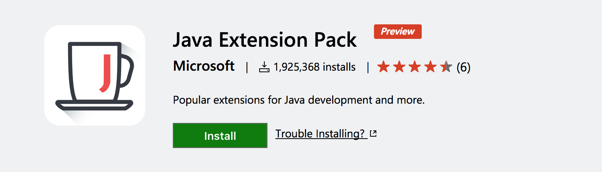
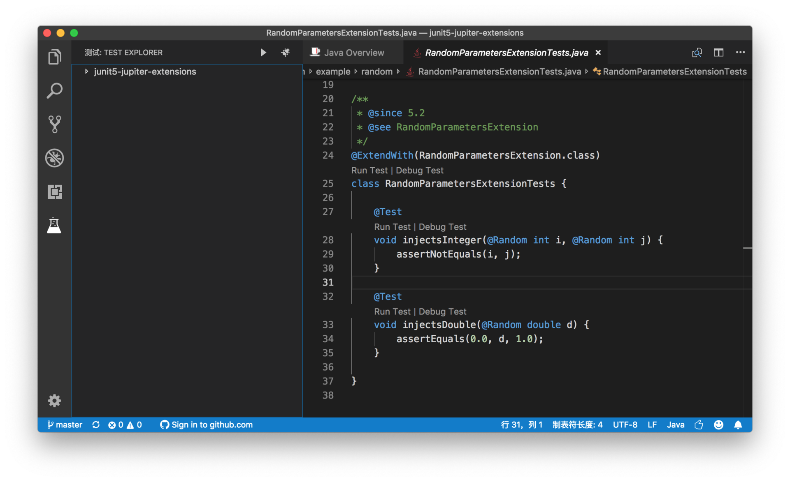
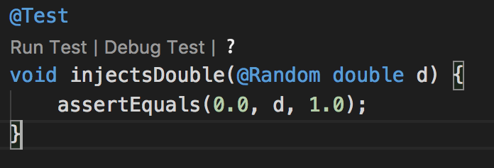

# 25 | 后端语言支持（一）：Go、Java

mp3: https://res001.geekbang.org/resource/audio/b5/ac/b5f1a6d3b1b45e9b0076d684af9831ac.mp3

上一讲中，我们介绍了VS Code里的 JavaScript 和 Node.js 支持。JavaScript 和 Node.js 是VS Code团队自己就在使用的语言，用微软的话来说就是：VS Code团队在吃自己的狗粮。不过，VS Code对后端语言也有不错的支持。所以接下来，我们就来介绍一下，VS Code中的 Go、Python、Java、C# 的支持。

这篇文章的目的，并不是要充当VS Code某个语言支持的中文文档或者问答，这些工作还是由插件开发者自己来做更好。我们在这篇文章中，会主要专注于以下几个主题：

*   为了获得最好的语言支持，你需要使用的插件。这个插件在哪里维护？你如何找到它的文档、Wiki 和反馈渠道？
*   这些插件支持了哪些VS Code的语言功能（智能提示，代码跳转，调试，测试等等）？它们是借助哪些工具和库（library）来实现这个语言功能的？
*   第一次使用这些插件来编程的注意点。
*   这些插件的已知问题和 Roadmap。

如果你还在使用别的开发工具进行 Go、Java、Python、C# 的开发，并且在犹豫是否可以使用VS Code进行这些语言的开发或它是否适合你的项目，那么通过这篇文章，你可以得出答案。

首先，今天会先介绍 Go 和 Java 这两门语言。

一、Go
====

VS Code上的 Go 语言插件，是由微软官方推出的。Go 语言插件，是VS Code推出插件 API 时的首批插件，直到现在，也依然由VS Code团队成员进行维护开发，项目地址是 [https://github.com/microsoft/vscode-go。](https://github.com/microsoft/vscode-go%E3%80%82) 作为 VS Code 团队维护的项目，GitHub issues 是它唯一的反馈渠道。要安装这个插件，你可以在VS Code的插件视图里搜索 Go，也可以通过[插件市场](https://marketplace.visualstudio.com/items?itemName=ms-vscode.Go)进行下载。

Go 插件

VS Code也是 Go 团队官方推荐的开发工具。

（一）安装使用
-------

当你从插件市场安装了 Go 插件后，重启VS Code，Go 插件就会在你第一次打开 Go 文件的时候被启动。

启动后，如果你还没有设置过 GOPATH 的话，VS Code会提示你，你既可以在自己的系统环境变量里添加 GOPATH，也可以在当前项目的配置文件里配置 GOPATH。

设置 GOPATH

设置正确的 GOPATH 后，VS Code就知道安装 Go 的 package 保存到哪个文件夹内了。

紧接着VS Code又跳出多个提示。这些提示是告诉你，如果想要在VS Code中使用自动补全、代码跳转等功能，你需要安装额外的 Go 的 package。所以，这里我建议选择 Install All，之后如果你对某个 package 的效果不满意，也可以通过设置再进行修改的。

安装 Package 提示

比如，在我的系统上，我将 GOPATH 设置为 /Users/penlv/code/prototypes/gopath。然后选择 Install All 后，我就能在输出面板里，看到 Go 插件将要安装的 packages。

安装 Package

不过值得注意的是，如果上面的安装失败了，输出窗口中会提供错误信息。因为，这一步操作，底层运行的命令行其实就是：

    go get -u -v github.com/...
    

像我就曾遇到了 Go 的版本太老，导致更新失败的问题。如果你遇到了自己无法解决的问题，也可以到插件的 GitHub repository 留言，请注意要提供完整的信息，比如VS Code版本、插件版本以及 Go 的版本，以便更好地 toubleshoot。

（二）语言支持
-------

### 1、IntelliSense

首先，你可以在 Go 代码中，进行代码跳转（Go To Definition）、自动补全（Auto Complete）以及获取悬浮信息（Hover）。

Go: 代码跳转和悬浮窗口

Go: 自动补全

Go 插件默认是借助 [gocode](https://github.com/mdempsky/gocode)、[gogetdoc](https://github.com/zmb3/gogetdoc)和 [godef](https://github.com/rogpeppe/godef) 分析代码，然后提供这些信息的。

### 2、构建（build）、检测（vet, lint）和格式化（Format）

在编写 Go 代码时，经常会用到`go build`、`go tool vet`、`golint`等脚本去构建代码，或者是对代码进行检测。Go 插件已经将这些功能集成到插件中了，你可以：

*   打开 go.buildOnSave ，当代码保存时，go build 将会自动执行。同时，你可以使用 go.buildFlags 来指定 build 的参数。
*   打开 go.vetOnSave 并且使用 go.vetFlags 来指定 vet 参数。
*   打开 go.lintOnSave 并且使用 go.lintFlags 来指定 lint 参数。并且，你可以通过 go.lintTool 来选择你想要的 lint 工具。
*   打开 go.testOnSave 在代码保存时测试代码。

当你使用这些参数来自动触发脚本时，Go 插件会将这些脚本的输出结果进行分析，然后将错误和警告放入到问题面板中。

保存代码时检测代码错误

默认情况下，当保存代码时，VS Code会自动给 Go 代码进行格式化。如果你不喜欢这个功能，也可以通过 go.formatOnSave 来取消。

保存代码时自动格式化

### 3、调试

Go 插件同样支持调试 Go 的代码，而其底层的 debugger 则是 delve。如果你第一次使用 Go 插件时选择了 Install All 安装所有的 package，那么就无需再安装任何的 package了。而如果你没有全部安装，那么你可能需要手动安装 dlv 这个 package。

和之前我们介绍的 Node.js 调试一样，如果没有 launch.json 的话，VS Code会默认调试当前文件。

自动调试 Go 代码

同样，Go 插件也提供了多个调试的模板

添加 Go launch.json 调试模板

### 4、Language Server（experimental）

VS Code的 Go 插件，默认是使用 gocode、godef 等 package 来提供智能语言服务的。不过 GO 插件中还有一个正在处于试验阶段的 Language Server （也就是 LSP 的实现），你可以通过设置 go.useLanguageServer 将其打开。但是这个 Language Server 并不支持 Windows，且处于试验阶段，关于更多的信息，请查看[文档](https://github.com/Microsoft/vscode-go#go-language-server-experimental)。

（三）问题和前瞻
--------

综合我个人使用 Go 插件时候的体验，以及 Go 插件维护者的分享，下面这些问题是新用户经常会遇到的：

*   GOPATH 的设置。如果你从来没有写过 Go 的话，一开始可能会对 GOPATH 摸不着头脑，那你可以通过 [Go 的官方文档](https://github.com/golang/go/wiki/GOPATH)了解它的用途。
    
*   如果你在设置中添加了 GOPATH，而不是系统的环境变量的话，要注意 Go 插件最终使用的 GOPATH 跟你在集成终端中使用命令行脚本时会不一样。
    
*   Go 插件默认使用的格式化工具是 SourceGraph 正在使用的 goreturns，如果你发现默认的格式化效果并不是你想要的，那你可以通过修改 go.formatTool 将其替换，比如使用官方的 gofmt。
    

根据每年Go相关的 Survey 和官方数据，Go 社区的新晋用户更倾向于使用VS Code来进行 Go 的编程。于是 Go 团队决定亲自书写一套 Go 的 Language Server，以提升VS Code上 Go 的书写体验。上面我提到的 Language Server 是 SourceGraph 团队实现的，Go 团队可能不会基于它们的代码进行修改，而是重起炉灶。对于官方团队的投入，让我对 Go 在VS Code里前景非常有信心。

二、Java
======

VS Code上的 Java 语言支持，可以说是多家大企业通力合作了。最早成熟的 Java 插件，是由 Red Hat 公司实现的，叫做 Language Support for Java™ by Red Hat。 它背后使用的技术则是 Java Language Server，也就是 Language Server Protocol 的 Java 实现。除了VS Code的这个 Java 插件在使用以外，Eclipse Che 现在也在使用 Java Language Server。而说到 Java Language Server ，又不得不提它的底层一个非常重要的库 Eclipse JDT （Eclipse Java development tools ），VS Code的项目领导 Erich Gamma，在加入微软之前，就是在 IBM 负责 Eclipse JDT 这个项目的。

好了，扯完了八卦，继续回到 Java 插件上。Language Support for Java™ by Red Hat 这个插件，能够提供代码跳转、自动补全、重构等智能语言功能。不过，它并不支持 Java 代码的调试。如果要对 Java 代码进行调试，则需要安装另一个插件 Debugger for Java ，这个插件则是由微软 Visual Studio 中国团队开发和维护的。而现在 Red Hat 和 Visual Studio 中国团队正在一起合作，共同为 Java 用户在VS Code上提供更好的编程体验。

（一）安装使用
-------

为了保证你能有比较完整的 Java 开发体验，你可以下载插件包 [Java Extension Pack](https://marketplace.visualstudio.com/items?itemName=vscjava.vscode-java-pack)。

这个插件包，包含了四个插件：

*   Language Support for Java™ by Red Hat，提供智能语言服务，项目地址是 [https://github.com/redhat-developer/vscode-java；](https://github.com/redhat-developer/vscode-java%EF%BC%9B)
    
*   Debugger for Java，提供调试功能，项目地址是 [https://github.com/Microsoft/vscode-java-debug；](https://github.com/Microsoft/vscode-java-debug%EF%BC%9B)
    
*   Java Test Runner，在VS Code中运行和调试 JUint 测试，项目地址是 [https://github.com/Microsoft/vscode-java-test；](https://github.com/Microsoft/vscode-java-test%EF%BC%9B)
    
*   Maven for Java，提供更丰富的 Maven 支持，[https://github.com/Microsoft/vscode-maven。](https://github.com/Microsoft/vscode-maven%E3%80%82)
    

不过，要注意的是，要想这些插件能够正常工作，你需要安装好 JDK 。如果你的环境变量里设置好了 JDK\_HOME 或者 JAVA\_HOME，那么插件就可以正常启动了。而如果插件无法找到 JDK，你也可以通过在个人或者项目设置中添加 java.home 指定 JDK 的位置。

（二）语言支持
-------

在安装完上面的插件后，你可以在VS Code中使用 Maven、Eclipse 和 Gradle 项目。上面我提到了 Java 语言服务的最底层是 Eclipse JDT，无论是代码提示，还是重构、代码跳转等，Eclipse 里能够完成的，VS Code中都能有接近的体验。而关于相关操作，在前面的章节中我们也已经有所介绍，如果你不太清楚，可以阅读第7篇文章[《如何快速在文件、符号、代码之间跳转？》](https://time.geekbang.org/column/article/40555)和第9篇[《代码自动补全、快速修复和重构的二三事》](https://time.geekbang.org/column/article/40847)。

### 1、调试

当你打开一个 Java 项目后，你可以点击调试视图里的齿轮按钮，创建 launch.json 。选择了 Java 这个环境后，Java 插件会为我们创建两个调试的模板。

Java 插件创建两个调试模板

第一个模板，就是调试本地的项目，要注意的是，你需要填写设置 mainClass，这个设置的值则是你想要调试的 Java Main Class，而且这个地址必须是这个类的完整地址，类似于 com.example.Main 。而第二个模板，则是将调试器 attach 到已经在调试中的 Java 代码，你则需要提供正在运行的调试器的地址（hostName）和端口（port）。

Java 调试配置支持的属性，可以参考[官方文档](https://github.com/Microsoft/vscode-java-debug#options)。不过，这里有三个功能值得特别提一下。

第一个功能是跟用户输入有关。VS Code内置的调试面板，并不支持用户输入。也就是说，如果你写的 Java 程序，依赖于用户从命令行中输入代码，Java 程序会打开一个系统终端，然后你需要在这个系统终端中输入内容。而如果你希望使用VS Code的集成终端来进行输入的话，就可以使用调试配置属性 “console: integratedTerminal” 。

第二个功能是Step filtering。它是什么意思呢? 当你在使用跳转入函数（Step in），或者继续执行函数（Step through）等方法时，有的时候，你会跳入到 Java 语言本身的代码中，或者进入到某些第三方库的代码中。但是你可能只是要调试自己的代码，那么你就可以通过 stepFilters 这个属性，对类的名字进行过滤，所有匹配了这个列表的类，在调试时都可以被直接跳过。你甚至还可以指定你是否要跳过构造函数、静态函数等等。

下面就是一段 stepFilters 属性的例子。

    "stepFilters": {
        "classNameFilters": [
            "java.*",
            "javax.*",
            "com.sun.*",
            "sun.*",
            "sunw.*",
            "org.omg.*"
        ],
        "skipSynthetics": false,
        "skipStaticInitializers": false,
        "skipConstructors": false
    }
    

第三个功能是Hot Code replacement，即“热代码替换”。相信对前端有经验的朋友已经比较熟悉这个功能了。这个功能的作用是，当你在调试代码的时候，如果发现代码哪里写错了，可以立即修改。然后调试器就会默默地在底层将整个代码执行切换到一个新的 JVM instance 上，而你无需重启整个调试进程，就能够继续调试最新的代码了。

### 2、JUnit 测试

接下来，我们看看 Java 的插件对 JUnit 测试的支持情况如何。当你打开一个 JUnit 测试时，Java Test Runner 这个插件就会被激活了。此时，在界面最左侧活动栏的最下面，多了一个按钮，点击这个按钮，你就能看到一个测试视图，这个视图里展示的就是当前项目中的所有测试。

测试视图

在这个视图中，你可以在测试项目上进行右击，调出上下文菜单，然后执行单个，或者多个测试。

执行测试

与此同时，在编辑器中，你可以看到每个测试的上方，都有 “Run Test” 和 “Debug Test” 等字样。通过点击它们，同样可以执行和调试测试。

运行和调试测试快捷方式

另外，在上图中，你还能够看到一个问号，它说明测试没有被正确执行。你可以点击它，这之后，VS Code则会打开一个新的编辑器，详细介绍这个测试相关的情况。

查看测试运行结果

当然，如果你觉得左侧的测试视图已经足够好用了，不希望在编辑器中再看到 “Run Test” 等字样，那你也可以通过 “editor.codelens” 将其关闭。

（三）问题和前瞻
--------

虽然VS Code上的 Java 支持，无论是代码积淀还是团队阵容，都是非常强大的，但是还是有一些不尽如人意的地方：

*   首先，就是配置还是相对繁琐，在开发 Java 项目时，还是 IDE 那样开箱即用更省力一些。
*   其次，支持还没有完整，比如还不支持 ant ，对 Android 支持也不够好。
*   最后，也是我心目中比较重要的，性能相比较于其他重型的 IDE ，并没有太大的优势。

我以前在上海时，就隶属于微软 Visual Studio 中国团队。当我得知他们要和 Red Hat 合作一起进行 Java 的支持时，我是非常高兴的，因为团队实力非常强，也推出过非常多不错的产品，执行力不错。像 Java Test Runner、Java Debugger，都是他们最近的产品。基于此，我对于 Java 在VS Code里的前景，依然是比较看好的。而且 Red Hat 即将被 IBM 收购，相信对于 Java 的支持和跨公司团队之间的合作都有积极的影响。

小结
==

今天我介绍的两门语言，它们源自其他公司，但是微软官方都有专门的团队或者专人在进行开发维护。总体而言，它们都属于质量非常高的语言插件。尤其是 Go 插件，它甚至帮助VS Code成为了 Go 社区最流行的开发工具，这是很让人喜出望外的。如果你还在犹豫和观望的话，不知道今天的文章有没有打消你的顾虑？欢迎留言分享给我们，让我们一起共同学习和进步！

* * *

