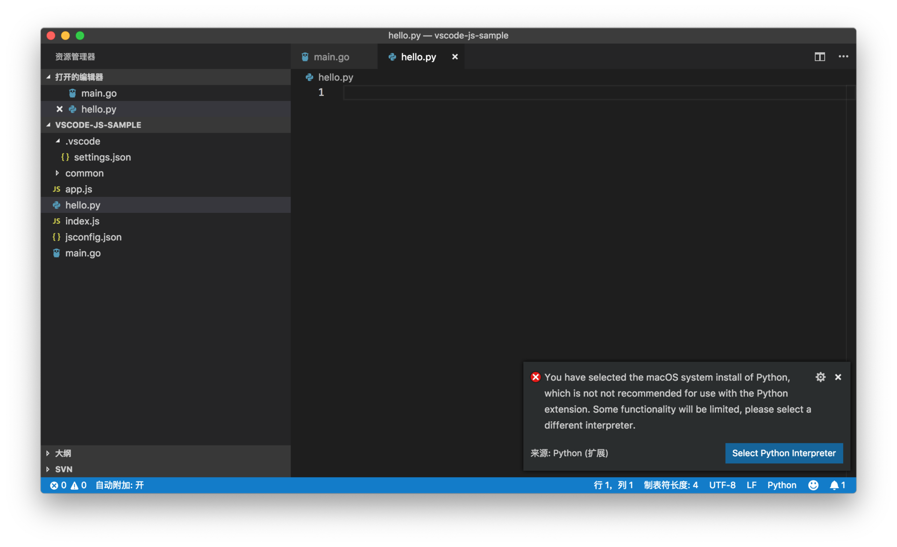
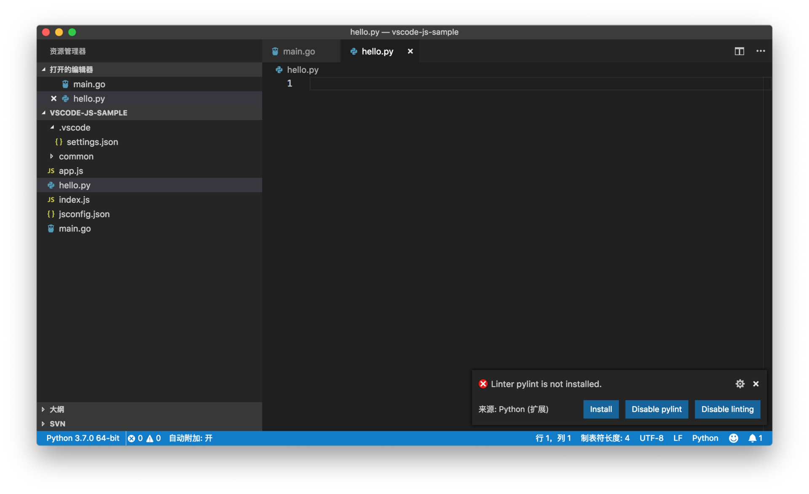
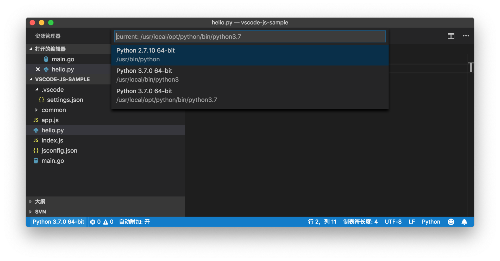
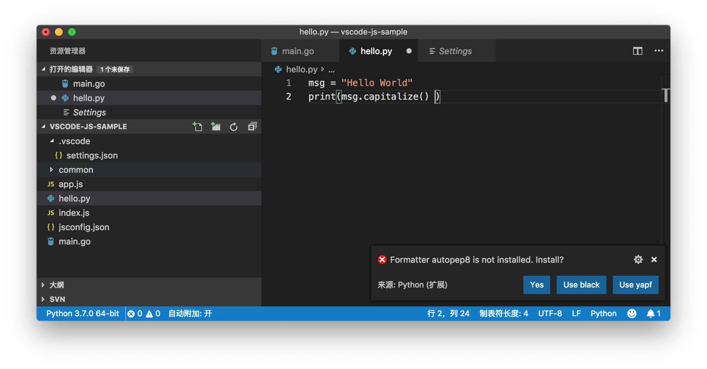
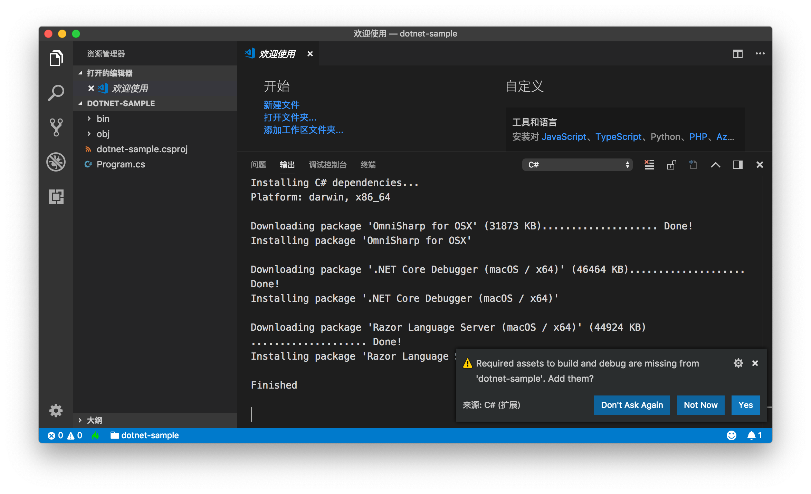
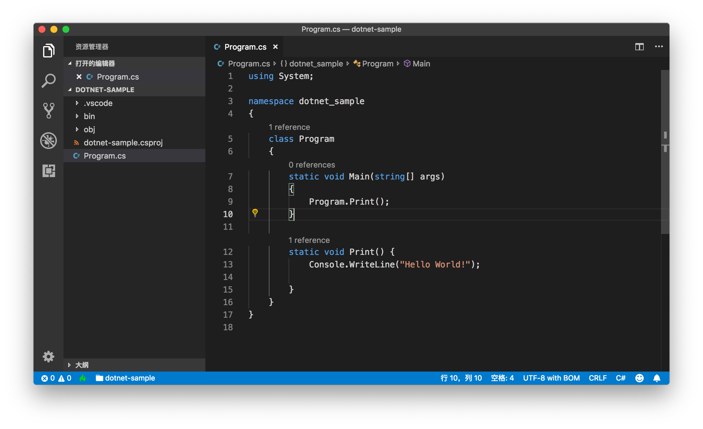

# 26 | 后端语言支持（二）：Python、C#

mp3: https://res001.geekbang.org/resource/audio/27/5c/271f95e2644726c406a7c2fbf8682a5c.mp3

上一讲中，我们介绍了VS Code里的 Go 和 Java 的支持。而今天这一讲我们要介绍 Python 和 C#这两门语言，前者微软有自己的 .NET 上的语言实现，后者则是微软非常核心的编程语言。

一、Python
========

VS Code上的 Python 语言插件，是VS Code插件市场中下载量最大的一个插件。它最初是一个社区项目，在开发了两年后，作者 Don Jayamanne 加入了微软，从而将这个项目正式升级为微软的官方维护项目。它的下载地址如下：[https://marketplace.visualstudio.com/items?itemName=ms-vscode.Go。](https://marketplace.visualstudio.com/items?itemName=ms-vscode.Go%E3%80%82)

Python 插件

Python 插件现在的维护地址是 [https://github.com/Microsoft/vscode-python](https://github.com/Microsoft/vscode-python) ，你可以看到这个项目是从 [https://github.com/DonJayamanne/pythonVSCode](https://github.com/DonJayamanne/pythonVSCode) fork过来的。现在所有的反馈和支持都是在微软的这个 fork repository 上，希望大家不要搞混了。

（一）安装使用
-------

Python 插件支持绝大多数主流的 Python 版本，但是 macOS 用户要注意一点，系统自带的 Python 并不在支持之列，你可以使用 homebrew 重新安装一个版本。

同时，在安装了 Python 之后，你需要将 Python 的地址添加到环境变量 PATH 中。这里你可以参考文档查询[更多的关于 Python 安装的指导](https://code.visualstudio.com/docs/python/python-tutorial#_prerequisites)。

安装完 Python 和这个插件后，当你第一次打开 Python 文件时，VS Code就会在本地系统查找 Python 解释器。如果没有安装合适的 Python 的话，VS Code就会给出错误提示。比如在 macOS 上，如果没有额外安装 Python，你就会看到下面的错误提示。

Python 解释器错误警告

然后你可以通过点击 “Select Python Interpreter” 来选择合适的 Python 解释器。当你选择完正确的 Python 解释器后，Python 插件则会提示你安装它需要的 packages。

安装 pylint Linter

你按需安装或者禁用这个功能即可。

切换 Python 解释器

在状态栏的最左侧，就能够看到当前使用的 Python 解释器，你可以通过点击这个按钮进行切换。

（二）语言支持
-------

### 1、IntelliSense

说到 Python 插件的语言支持，就不得不提 Visual Studio 和 IronPython。IronPython 是 Python 的一个开源实现，它能够运行在 .NET 环境之上。Visual Studio 对 IronPython 就有很好的智能语言支持，而它的语言支持的代码是开源的。这也是VS Code上的 Python 插件在使用的语言服务。

无论是自动补全，还是参数提醒、代码跳转等，都可以进行，可以说这个语言服务还是很成熟的。

Python 的语言支持

Python 插件会自动读取本地的各种 Python packages，然后为你提供智能提醒。而这里特别值得一提的是，如果你有一些第三方的 Python 脚本，但是它们并没有被VS Code的 Python 插件所识别，而你又希望能够获得它们的智能提示，那你可以通过添加如下的配置来实现：

    "python.autoComplete.extraPaths": [
    ]
    

Python 插件就会分析 python.autoComplete.extraPaths 下的所有文件夹，然后分析这些代码，并且提供 IntelliSense。

### 2、代码格式化

Python 插件默认是使用 autopep8 来进行代码的格式化，同时也支持 black 和 yapf，你可以通过 python.formatting.provider 来进行格式化工具的选择。

格式化工具缺失警告

当你第一次使用格式化文件（Format Document）时，如果你本地并没有安装对应的格式化工具的话，VS Code会提出警告。

我建议你打开 editor.formatOnSave 或者 editor.formatOnType ，对代码进行及时的格式化。因为代码格式不对而无法运行 Python 脚本可是十分头疼的。

保存时自动格式化 Python 脚本

此外，你还可以通过 python.formatting.autopep8Args、python.formatting.yapfArgs或者 python.formatting.blackArgs 来调整格式化参数。

### 3、代码检测 Linting

默认情况下，VS Code会在你保存 Python 文件时进行代码检测，然后将错误显示在问题面板中。

进行代码检测，显示错误信息

默认使用的代码检测工具是 Pylint。如果你希望使用其他的 Linter，最佳的方法是，打开命令面板，搜索 “**Python: Select Linter**” 执行，然后选择你想要的 Linter。

选择Linter插件

你也可以直接修改设置来进行选择，不过要相对复杂一些，具体则可以参考[相关文档](https://code.visualstudio.com/docs/python/linting#_specific-linters)。

### 4、运行脚本

Python 是解释型语言，无需编译即可运行。你可以在编辑器内右击打开上下文菜单，然后选择 “在终端中运行 Python 文件” 来执行脚本，VS Code就会使用你指定的 Python 解释器来执行这个文件。

"在终端中运行 Python 文件"

你也可以选择部分文本，然后将它们在集成终端中运行。

### 5、调试

Python 代码的调试，并不需要安装其他的脚本或者工具，只要你选择了合适的 Python 解释器即可。和前面专栏介绍的 Node.js 调试一样，如果没有 launch.json 的话，VS Code会默认调试当前文件。

调试当前 Python 文件

当你为 Python 工程创建 launch.json 时，Python 插件会自动提供多种不同的模板，比如在集成终端中调试当前文件，Attach 到某个正在运行的 Python 脚本上，调试 Python 模块，调试 Django 等等。

自动生成 launch.json 文件

相信你还记得，在介绍调试器 launch.json 的书写时，我提到过，各个调试器的配置选项都不完全相同，如果 Python 调试的模板不能满足你的需求，你可以通过[相关文档](https://code.visualstudio.com/docs/python/debugging#_standard-configuration-and-options)来了解 Python 插件都支持哪些调试参数。

（三）Unit Test
------------

Python 插件既支持 Python 自带的 unittest，同时也支持 pytest 和 Nose。在安装了对应的 Python package 后，你可以从命令面板里执行 “**Python: Discover Unit Tests**” 命令，Python 插件就会依次问以下问题：

*   Enable/Configure Test Framework，选择测试框架，在下面的动图里，我选择了unittest；
*   选择在哪个文件夹下搜索测试文件，我选择了根目录；
*   选择测试文件名字的模式 glob，Python 插件会根据这个模式来寻找测试文件。

寻找测试

在测试被成功找到后，你能够看到测试文件里，每个测试的上面都有两个快捷操作 **Run Test** 和 **Debug Test**，你可以点击它们进行测试的执行。

你也可以在状态栏上找到一个按钮“Run Tests”，点击选择运行所有测试。

运行测试

测试执行完后，你能在状态栏上看到测试的结果。

测试结果

当然，真正发挥VS Code威力，还是通过 “Debug Test” 来调试某个单独的测试。你只需设置断点，点击 Debug Test 即可进入调试状态。

运行测试

（四）已知问题和前瞻
----------

虽然 Python 插件在维护了接近三年后，已经非常成熟了，但是我觉得还有一个问题很值得一提的。

Windows 10 现在支持了 Linux Subsystem，你可以在这个 Linux 系统中使用 Python 和各种只能在 Linux 上使用的 package。但是受限于VS Code的支持，Python 插件还不能很好地识别和加载 WSL 里的 Python 环境，如此一来，你就没法使用VS Code和 Python 插件的各种功能了。不过好在VS Code团队已经在研究解决方案了。

另外，Python 插件最振奋人心的消息就是微软加大了对它的投资，从最开始的一个个人项目，到微软的官方项目，再到微软请来了 Python 的核心开发者Brett Cannon担任 Python 语言支持的领导工作，所以可以预见：无论是在VS Code上，还是 Visual Studio 上，Python都会有不错的前景。

二、C#
====

最后，我们一起来聊聊微软的 “亲儿子”——C#。

不过跟前面介绍的三门语言相比，VS Code上的 C# 支持并不是十分完整。为什么这么说呢？这个 C# 插件，并不是要完成 Visual Studio 的 C# 支持的所有功能，而只是立足于 .NET Core 和 Mono。也就是说，即使你是在 Windows 上使用VS Code并且使用这个插件，也不能很好地支持完整的 .NET framework。

看到这里，如果你的目的是使用VS Code和 C# 插件来替代 Visual Studio 完成你日常的 .NET 开发（非 .NET Core），那么相信你已经知道答案了，你还是应该使用 Visual Studio。

而如果你本身对 .NET Core 很感兴趣，或者你就是在 macOS 和 Linux 上，想尝试 C#，那么下面的介绍就值得一看了。

（一）安装使用
-------

首先，你需要到插件市场[安装 C# 插件](https://marketplace.visualstudio.com/items?itemName=ms-vscode.csharp)。

C# 插件

通过[这个项目地址](https://github.com/OmniSharp/omnisharp-vscode)，你可能也发现了，它的底层支持是依赖 OmniSharp 的，而OmniSharp 本身就是为了解决跨平台的 .NET 开发问题的。

这个插件主要支持的项目类型有：

*   .NET Core
*   MSBuild
*   C# scripts

要正常使用这个插件，你就需要安装 C# 环境。在 macOS 和 Linux，你要安装的则是[.NET Core](https://www.microsoft.com/net/learn/dotnet/hello-world-tutorial)。

而当你打开一个 .NET 项目时，C# 插件则会自动地去下载所需要的 package，你可以从输出面板中看到相关的下载信息。

下载安装包

（二）语言支持
-------

当所有的 package 都安装完成后，打开 C# 文件时，VS Code已经开始提供语言服务了。比如在下图中，你能够看到函数被引用的情况。

函数引用

至于自动补全、参数提示等，都跟 Visual Studio 上的体验基本一致，因为其底层使用的是同一个 C# 编译器[Roslyn](https://github.com/dotnet/roslyn)。

自动补全和函数跳转

当然你也可以在 C# 项目中进行符号跳转。

符号跳转

C# 插件也自带了一个代码格式化工具。

代码格式化

### 1、任务

VS Code已经支持了 .NET Core 的构建脚本，所以你可以直接通过任务系统构建代码。默认情况下，VS Code会把构建脚本运行在集成终端中。

运行 build 任务

### 2、调试

如果你是使用 dotnet 脚本来创建的项目，那么项目已经自带了 launch.json ，而无需你再进行配置。如果你的项目没有 C# 相关的调试配置，你也可以借助自动补全来生成。

C# 调试配置

有了书写完整的 launch.json，你就能够无缝地调试 .NET Core 代码了。

调试 .NET Core 代码

（三）已知问题和前瞻
----------

相信跟前面介绍的其他几门语言相比，C# 插件的已知问题，应该比功能介绍可能还要多。比如 ：

*   Razor 里不支持 Intellisense；
*   调试时不支持编辑代码并热更新；
*   不支持 VB；
*   csproject 的编辑体验也很有限；
*   …

不过，我们在最上面已经提过了，它有这些问题，最主要的还是因为它的立足点是 .NET Core。

对于VS Code上的 C# 支持，我自己的感觉是它依然会以 .NET Core 为主要核心，这和VS Code跨平台的特性也非常吻合。而全尺寸的 C# 开发体验，Visual Studio 依然是不二之选。

小结
==

好了，到这里我们就将VS Code里的几个主要后端语言的支持情况做了介绍。如果还有什么语言是你感兴趣的，你也可以查看[VS Code的官方文档](https://code.visualstudio.com/docs/languages/overview)了解支持情况。

* * *

