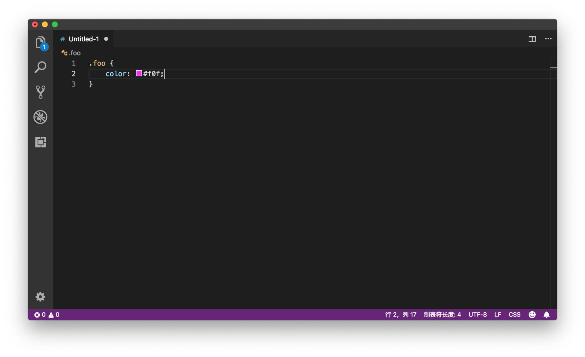
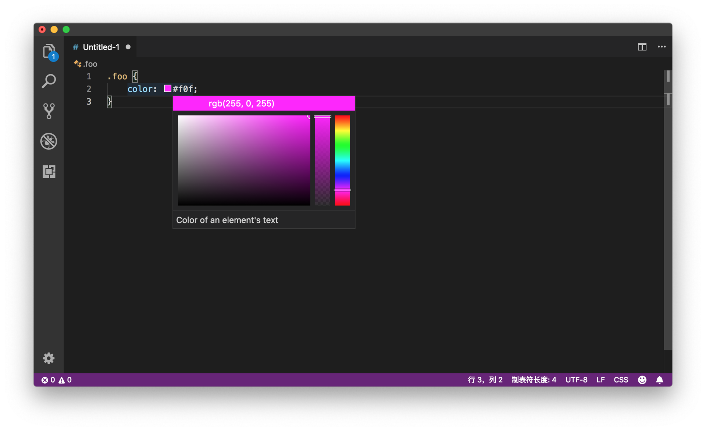

# 27 | HTML、CSS以及前端开发神器Emmet介绍与支持

mp3: https://res001.geekbang.org/resource/audio/ce/1e/cea67dc7e730a54077c5d3b099540d1e.mp3

今天，我们一起来学习一下 VS Code 中的 HTML、CSS 和前端开发神器 Emmet 的支持。

之所以把这三个放在一起讲，是因为 HTML 和 CSS 的支持，很多内容在前面已经介绍过了，比如自动补全、代码格式化、代码片段（Code Snippet）等等。而今天，我们要介绍 VS Code 里 HTML、CSS 支持里一些不一样的地方。

一、HTML、CSS
----------

这里我主要介绍两个比较实用的功能。

### 1、取色器 Color Picker

首先，你可以在书写 HTML 和 CSS 时使用取色器。

在书写 HTML 和 CSS 的时候，你可能经常需要修改元素的颜色。VS Code 为修改颜色，提供了一个图形化的界面，其中包含了颜色相关的属性。

当你打开一段 HTML 或者 CSS 代码时，你可以看到，VS Code 在颜色的前面画了一个方块（我们称作**颜色装饰器 Color Decorator**），用于展示这段颜色属性所对应的最终效果。

颜色装饰器

同时，当你把鼠标移动到这段代码上时，一个**颜色选择器窗口**就显示出来了。

颜色选择器窗口

这个窗口包括了**五个主要的部件**。首先，就是左下角最大的那个长方体，你可以通过在其中移动光标来调整颜色的饱和度（Saturation）。

其次，在窗口的右侧，还有两个竖条，对应两个部件。左边的竖条是用于调整透明度（opacity），

右边的那个则是用于调整色相（hue）。

最后，在取色器的最上方，也有两个部件。

左侧的部件上，显示了当前颜色对应的代码。当你点击这个部件时，你可以选择不同的书写这个颜色的方式。比如对于颜色 RGB(0,0,0) ，在 CSS 里你也可以写成 #000，这样你就可以通过点击这个部件进行切换。

右侧的部件，则是用于在取色器里修改颜色时，回退到之前的值。

除了在 HTML 和 CSS 中使用取色器以外，你还可以在任何需要书写颜色的代码里使用，只要这个语言插件实现了相应的 API。

### 2、预览

第二个非常实用的功能是CSS 选择器的预览。

比如，当你书写了一段 CSS 选择器后，有的时候会发现这段 CSS 没有生效。这可能是因为你的 HTML 结构有问题，从而导致这个 CSS 选择器不能生效。

为了解决这个问题，VS Code 的 CSS 预览（Hover）里提供了一段 HTML 代码片段，这个代码片段则可以让这个 CSS 选择器生效。

虽然上面这两个技巧非常实用，但是它们还是不够强大。要说到 VS Code 里书写 HTML 和 CSS最厉害的地方，那就属于 Emmet 支持了。那什么是 Emmet 呢？

二、Emmet
-------

在专栏前面的章节里，我们介绍过代码片段（Code Snippet），你可以通过预定义代码的模板来省去重复代码的输入。但是有的时候，预定义好的模板也还是有局限性。尤其是在书写 HTML 的时候，你输入的代码，并不是 if 条件语句、for 循环语句这种常见的定式，而是根据你想要在网站上展示的效果而临时决定的 HTML 结构。换句话说，**你书写的 HTML 其实反映的是业务逻辑，而这往往是无法通过代码片段来提前预测的**。

Emmet 就是要解决这样的问题，为你的 HTML、CSS 书写提供类似于代码片段的输入方式，你只需输入一小段缩写，然后将其展开成最终的代码。Emmet 的语法类似于 CSS 选择器，你通过写一段接近于 CSS 选择器的代码缩写，然后使用 Emmet 引擎将它展开成复杂但完整的 HTML 或者 CSS 代码。举个最简单的例子，比如说你在 HTML 中写了 ul，然后 Emmet 就能够把它展开成下面的 HTML：

    <ul></ul>
    

这样，你就不需要重复地输入 <> 尖括号，匹配开关节点等。不过这个例子还是太简单了，下面我们来看看，如何使用 CSS 选择器的语法来创造更复杂的 Emmet 缩写。

### 1、Child: > 子节点操作符

首先是子节点操作符，通过 > 符号来指明节点之间的层级关系。你可以将

    ul>li
    

展开为：

    <ui>
      <li></li>
    </ui>
    

### 2、兄弟节点操作符 Sibling: +

而如果你希望创建兄弟节点的话，则需要 + 操作符。比如，

    div+p+bq
    

会被展开成：

    

    

    <blockquote></blockquote>
    

### 3、乘法操作 Multiplication: \*

除了创建单个节点以外，你还可以通过 \* 和数字，来创建多个节点。比如，

    ul>li*3
    

会被展开成：

    <ui>
      <li></li>
      <li></li>
      <li></li>
    </ui>
    

### 4、Class Name, ID

另外，在书写 HTML 的时候，你不可避免地需要给节点添加属性，比如 id 和类。在 Emmet 中，它们的书写也很方便。

比如，

    ul#list>li*3
    

你就可以通过 #list 来指定 ul 这个节点的 id 名。那么这个表达式会被展开为：

    <ul id="list">
      <li></li>
      <li></li>
      <li></li>
    </ul>
    

相信通过上面的例子，你已经看出了 Emmet 的强大之处。本质上，**你可以通过类似于 CSS 选择器的语法来组织最终 HTML 文档的结构，并利用乘法、组合等操作符来执行重复的操作**。

这就是 HTML、CSS 这两门语言的一个进阶版的代码片段。最后我们看下官方文档里提供的第一个例子：

     #page>div.logo+ul#navigation>li*5>a{Item $}
    

这段代码里，# 指定了 id，.logo 指定了类的名字，\*5 是重复创建节点，而 {Item

$$

所以，这段代码最终会被展开成：

    

        

        <ul id="navigation">
            <li><a href="">Item 1</a></li>
            <li><a href="">Item 2</a></li>
            <li><a href="">Item 3</a></li>
            <li><a href="">Item 4</a></li>
            <li><a href="">Item 5</a></li>
        </ul>
    

    

看完上面的这些示例，你是不是十分心动，想要试一试 Emmet 这个工具呢？关于更多 Emmet 的知识，推荐你阅读官方的文档。虽然是英文的，但是还是非常好理解的。

三、Emmet in VS Code
------------------

接下来，就到了我们专栏的核心内容。我们一起看看， 在VS Code 中Emmet 有哪些调用方式。

### 1、展开缩写

首先，在各个编辑器里，最通用的展开 Emmet 缩写的方式，就是按下 Tab 键。不过由于 VS Code 中对 Tab 键的使用非常频繁，默认并没有打开这个功能。所以，如果你要用这个功能，就需要通过 emmet.triggerExpansionOnTab 将这个设置打开。

修改完配置后，当你在 CSS 文件里输入 p10， 然后按下 Tab 键时，p10 就会被替换成 padding: 10px;

Tab 键展开

其次，你也可以在命令面板中搜索 “展开缩写”（Expand Abbreviation）并执行。

命令面板展开缩写

### 2、建议列表

如果你刚学习 Emmet，对 Emmet 的语法还不熟悉，那么你一定希望知道自己写的缩写，最终被展开时是什么效果。VS Code 的建议列表已经做到了这一点，当你在编辑器里书写缩写时，你能够实时地看到 Emmet 给的展开建议。

Emmet 建议

如果你不希望在建议列表中使用 Emmet 的话，也可以通过配置"emmet.showExpandedAbbreviation": "never"来禁用。

### 3、使用缩写包围

缩写展开已经非常强大了，但是 Emmet 里还有一个 “使用缩写包围” 命令，它是干什么用的呢？比如说，你已经写好了一段 HTML：

    Hello
    

然后你希望把它放到一个列表中。你当然可以先写一个 li，展开缩写，接着把上面的 HMTL 片段剪切到列表中。你也可以选中这段 HTML 片段，在命令面板中执行 “使用缩写包围”（Wrap with Abbreviation） 命令。接着，VS Code 就会显示一个输入框，你可以在这个输入框内填入 Emmet 缩写，这个缩写展开后，会自动把我们选中的 HTML 放在其中。

命令面板使用缩写包围

在上面的动图中，相信你还发现了，当你在输入框中填入 Emmet 缩写时，编辑器里会自动根据最新的缩写进行更新，这样你就能够实时地预览 Emmet 缩写被展开后的效果了。

预览缩写展开

### 4、多光标

Emmet 操作同样也支持多光标，如果你创建了多个光标，你可以同时在它们上面执行 “使用缩写包围” 命令。

Emmet 中使用多光标

### 5、其他操作

除了能够展开 Emmet 缩写，Emmet 工具还提供了几个 HTML 的快捷命令。

第一个就是在 open 节点和 close 节点之间进行跳转，命令是 “Emmet: 转制匹配对”。

第二个就是删除节点。在 HTML 中删除 HTML 节点最麻烦的就是你需要把开、关两个节点都删除掉，否则 HTML 结构就不完整了。通过命令 “Emmet：移除标签”，你就可以同时将开、关两个节点都删除掉。

你还可以通过 “Emmet：更新标签“来同时更新一对开关节点（open/close tag）。

这些命令是不是在 HTML 编辑器时非常实用呢？

### 6、如何在某个语言中打开 Emmet 支持

默认情况下，你可以直接在 html、haml、jade、slim、jsx、xml、xsl、css、scss、sass、less、stylus、handlebars、php 和 javascriptreact 中使用 Emmet 。但对于其他语言，你也可以通过如下的设置来将其打开。

    "emmet.includeLanguages": {
        "javascript": "javascriptreact",
        "vue-html": "html",
        "razor": "html",
        "plaintext": "jade"
    }
    

这段设置的要点就是，将某个 Emmet 默认不支持的语言，映射到一个 Emmet 支持的语言上。比如上面的设置里，我们把 vue-html 映射成了 html，那么当你在 vue-html 使用 Emmet 时，Emmet 就会把它当作 html 来处理了。

小结
--

好了，以上就是我们今天内容的全部。我们介绍了 HTML、CSS 的一些实用的命令和功能，同时还介绍了 Emmet 这个前端开发神器。关于Emmet，我们简单介绍了 Emmet 的语法，以及 VS Code 中如何使用 Emmet 这些命令。如果你觉得 Emmet 非常有用，并且希望更进一步，你还需阅读 Emmet 的文档进一步学习。比如 Emmet 允许你修改它的语法，修改方式有点类似于代码片段，是非常不错的进阶技巧了 [https://docs.emmet.io/customization/](https://docs.emmet.io/customization/)(如果打不开，请参考 [https://github.com/emmetio/emmet-docs/tree/master/src/documents/customization](https://github.com/emmetio/emmet-docs/tree/master/src/documents/customization))。

如果你也有 HTML、CSS 或者 Emmet 相关的经验和感悟，欢迎你跟我们分享！

* * *

