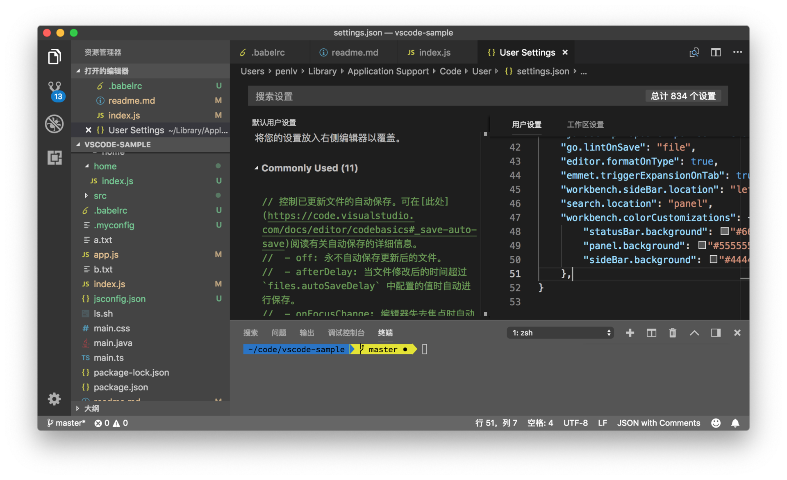
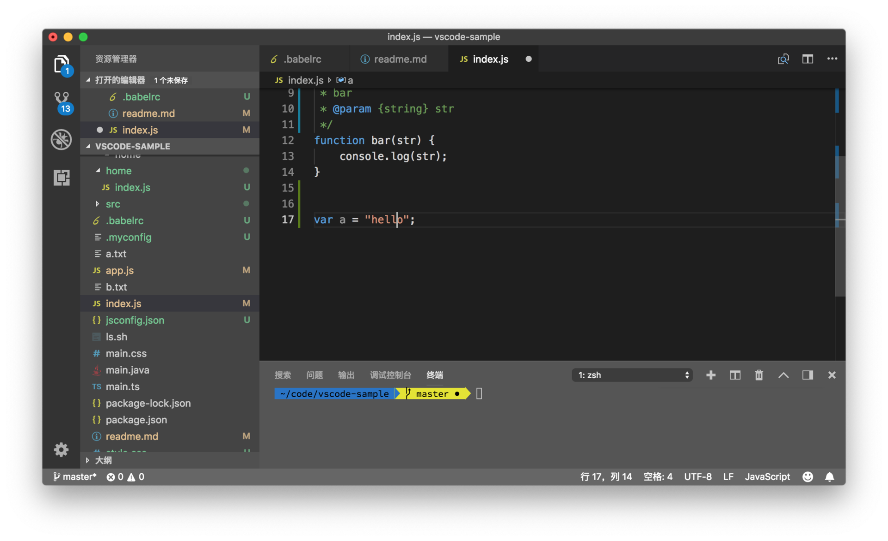
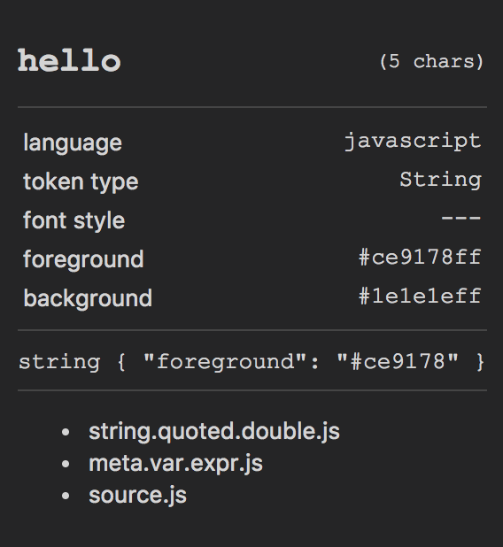
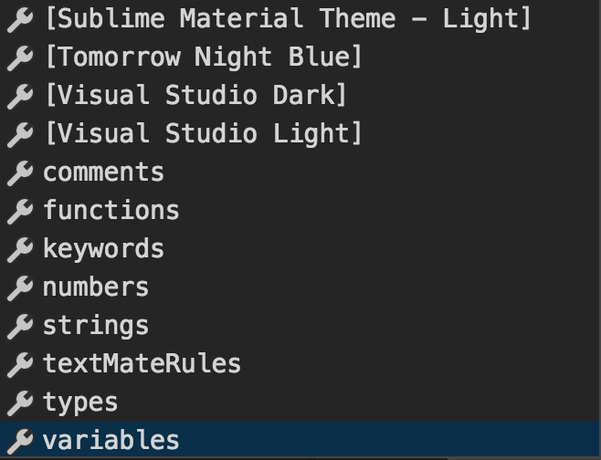
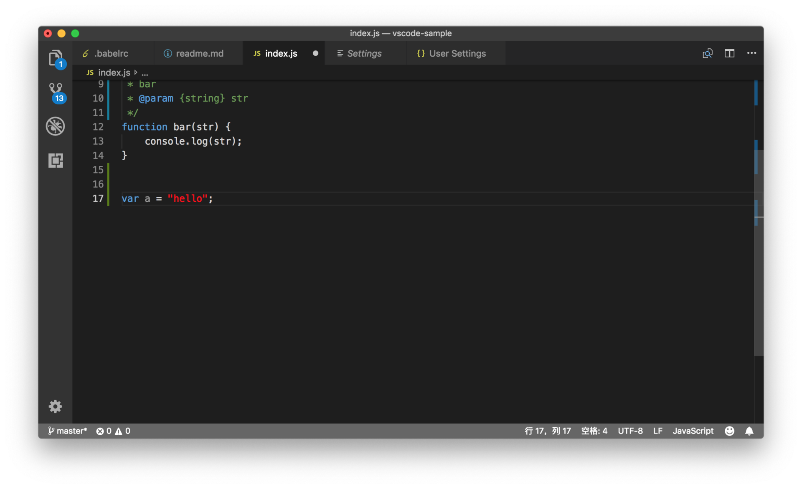
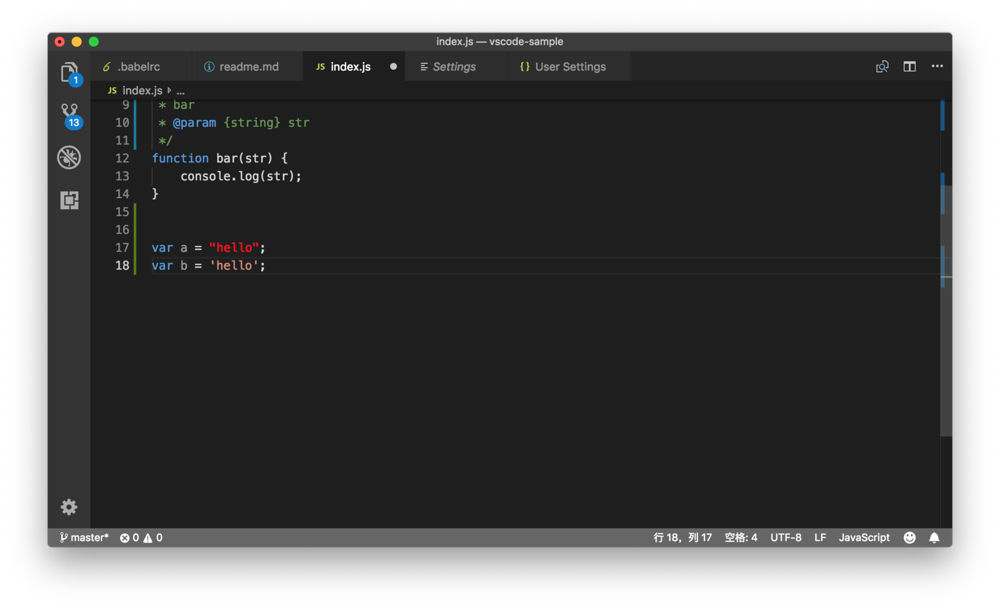

# 28 | 如何深度定制自己的主题？

mp3: https://res001.geekbang.org/resource/audio/79/d2/79df20bf494ae7e0b08602fb8f4ed6d2.mp3

前面我们在“工作区”模块中介绍过，如何通过快捷键快速地隐藏和显示 VS Code 的某个 UI 组件，比如隐藏状态栏、活动栏、侧边栏等等。但是如何固定住某个 UI 组件，以及如何修改各个 UI 组件的颜色、边框等等，我们都还没有涉及，今天我们将逐一介绍。

固定 UI 视图
--------

首先我们可以做的，就是持久化 UI 视图，这句话是什么意思呢？VS Code 的各种 “切换 xyz 视图可见性” 的命令，它**最终都是将这个配置写到了你的个人设置中**。比如说，我们运行 “切换状态栏可见性”（Toggle Status Bar Visibility），然后再打开个人设置 （JSON），我们可以在设置中找到这样一条：

    "workbench.statusBar.visible": false,
    

这个配置也非常好理解，它是表达：statusBar（状态栏）并不是 visibile （可见）的。

再比如，你可以将侧边栏显示在右侧，像 Visual Studio 里那样，你可以运行 “切换边栏位置”（Toggle Side Bar Position）。

切换侧边栏位置

完成这样的命令后，个人设置里就会多出下面这条设置：

    "workbench.sideBar.location": "right"
    

还有就是搜索视图的位置，你可以运行“切换搜索视图位置”命令。

切换搜索视图位置

VS Code 就会在设置里添加如下代码：

    "search.location": "panel"
    

相信通过这三个例子，你就可以了解如何在你的不同设备之间共享 UI 设置了。通过设置来控制 UI 最棒的地方在于，你**可以为不同的项目指定不同的设置**。比如你可以在自己的个人设置里，将状态栏、侧边栏等都隐藏，这样当你打开一个新窗口时，或者只是编辑单个文件时，你不需要用到它们，自然也就不需要显示它们。而当你打开了某个项目时，可以由这个项目的情况来决定是否要将它们打开。比如说这个项目用了 Git，那么将侧边栏展示出来可能会更方便一些。

修改工作区配色
-------

持久化 UI 视图设置是 VS Code 定制的第一步，而第二步就是修改工作区里各个视图的配色了。相信你早就在插件市场下载过各种主题然后使用了，但其实自己修改主题颜色也非常简单，甚至不要求你有任何的编程知识。

首先，运行命令 “打开设置（JSON）”去打开个人设置。

然后你在编辑器里输入 “workbench.colorCustomizations"，这时候，VS Code 的自动补全就会给你两个提示项了，第一个是：

    {
            "statusBar.background": "#666666",
            "panel.background": "#555555",
            "sideBar.background": "#444444"
    }
    

第二个是 {} 。当你选择第一个提示项，此时这个配置是这样的：

    "workbench.colorCustomizations": {
            "statusBar.background": "#666666",
            "panel.background": "#555555",
            "sideBar.background": "#444444"
    }
    

workbench.colorCustomizations 有很多属性，它们的键（key）就是代表着各个组件的属性，在示例里，它们是：

*   statusBar.background，状态栏背景色
*   panel.background，面板背景色
*   sideBar.background，侧边栏背景色

而它们的值则是颜色的 HEX 值。此时当你保存文件后，你会发现 VS Code 发生了变化。

修改工作区颜色

没错，上面提到的这三个组件的背景色都立刻发生了变化。而你在设置里添加的这三组键值（key-value pair），跟主题插件里的书写方式一模一样。

已经知道了去哪里书写这些颜色配置，下面就是要知道有哪些可以修改的值了。最简单的方式当然是通过自动补全。

颜色修改自动补全

VS Code 自动补全列表提供了所有可以修改的颜色，而如果你希望对此有个全的了解再进行书写，你也可以阅读[官方文档](https://code.visualstudio.com/docs/getstarted/theme-color-reference)。

修改编辑器配色
-------

除了工作区的配色，你也可以修改编辑器内代码的颜色。这个就真的强大了，因为为代码书写语法文件和配色文件，都是非常复杂的，但是在 VS Code 中，你依然有非常简单的方式去完成部分修改。

### 1、基本类型颜色修改

首先，你要做的，就是知道你想要修改的代码，是属于什么基本类型。你可以将光标移动到某段你想要修改颜色的代码上，比如将光标移动到一段字符串上，

然后，在命令面板里运行 “检查TM作用域”（Inspect TM Scopes）命令。

Inspect TM Scopes

此时，编辑器中出现一个新的悬浮窗。这个窗口里呈现的，就是当前这个代码片段所对应的语言、语法类型以及当前的颜色和背景色等。

语法信息

比如在上图里，这个窗口呈现了以下信息：

*   当前的 token 是 hello，它的类型是 String；
*   它的颜色是 #ce9178ff ，背景色是 #1e1e1eff；
*   它所属的语法作用域由内而外分别是 string.quoted.double.js，meta.var.expr.js，source.js。

如果你想要将所有字符串都变成红色，那么就需要修改String这个作用域的颜色。下面，你可以再次打开个人设置（JSON），输入 editor.tokenColorCustomizations；

修改编辑器内代码颜色

然后把光标放入这个 JSON 对象中，按下 “Ctrl + Space” 触发建议列表，就能够看到如下的建议。

编辑器颜色修改自动补全

建议列表中首先出现的，就是你可以在 VS Code 中使用的所有的主题的名字。通过选择它们，你可以只覆盖某个主题中的某个颜色。这里你可以滚动这个列表，看看下面还有别的什么建议。

你可以看到如下几个选项：

*   comments 代表着注释的颜色；
*   functions 代表着函数的寒色；
*   keywords 代表着关键字的颜色；
*   numbers 代表着数字的颜色；
*   strings 代表着字符串的颜色；
*   types 代表着类型的颜色；
*   variables 代表着变量的颜色；
*   textMateRules 我下面会再介绍。

为了修改字符串的颜色，你只需选择 strings 即可，然后将其修改为红色，也就是：

        "editor.tokenColorCustomizations": {
            "strings": "#FF0000",
        }
    

保存设置后，你再回到刚才的 JavaScript 文件时，就可以看到字符串颜色都变了。

字符串颜色修改为红色

### 2、TextMate 规则修改

在上面的建议列表里，还有个 textMateRules选项，这个属性是做什么用的呢？让我们再来看下刚才在 JavaScript 文件里运行 “Inspect TM Scopes” 看到的信息。

语法信息

在这个窗口的最下方，就是 TextMate 的语法规则作用域了。hello 这个词所处的 TextMate 语法作用域**由内而外**分别是 string.quoted.double.js，meta.var.expr.js，source.js。VS Code 的主题插件在配置编辑器内代码的颜色时，就是针对这些作用域进行设置的。而你要修改某个作用域所对应的颜色，就是在设置中修改 textMateRules 。

比如说，你只想修改双引号内的字符串的颜色为红色，其他的字符串都不修改，那么就需要修改 string.quoted.double.js 这个作用域的颜色。

textMateRules 模板

在上面的动图里， 你可以看到：输入引号，然后自动补全填入了 TextMate 语法设置的模板，这之后，再将 scope 的值修改成了 string.quoted.double.js 。保存设置后，当你再次打开之前的 JavaScript 文件，

双引号内字符串为红色

“hello” 是红色的，但是如果你输入

    var b = 'hello'
    

单引号内的 hello 依然是原来的颜色。

基于某个主题修改配色
----------

上面我们提到了，当你自定义编辑器内配色时，自动补全给你提示了所有已经安装的主题。

编辑器颜色修改自动补全

通过选择这些主题，你可以只针对它们做颜色修改，而不影响其他的主题的颜色。工作区的颜色修改也是如此。比如说，你想修改 Monokai 的某个颜色定义，那么你可以这么写：

     "workbench.colorCustomizations": {
            "[Monokai]": {
                "statusBar.background": "#666666",
                "panel.background": "#555555",
                "sideBar.background": "#444444"
            },
     }
    

而相应的编辑器颜色修改则是：

    "editor.tokenColorCustomizations": {
            "[Monokai]": {
                "strings": "#FF0000"
            }
    }
    

是不是非常方便呢？

取色器 Color Picker
----------------

在前面介绍 HTML、CSS 的功能时，我介绍过可以在 HTML 和 CSS 中使用取色器来修改颜色。同样的，在 JSON 文件中，你也可以使用取色器来修改。

使用取色器修改颜色

在上图中，我因为开启了文件自动保存，设置文件会自动保存然后触发颜色的更新，所以当我使用取色器修改颜色后，稍等片刻，就能看到这个颜色在编辑器中的效果了。

小结
--

好了，以上就是我们今天内容的全部了。要说我最喜欢今天内容的哪个部分，那就是在设置中使用取色器和自动更新了，有了它们，我可以修改大部分 VS Code 组件的颜色，也可以修改编辑器内代码的颜色，同时还能实时地预览，可以说不会编程也能够轻松自定义 VS Code 的主题了。你是不是也想动手试一试了呢？

* * *

