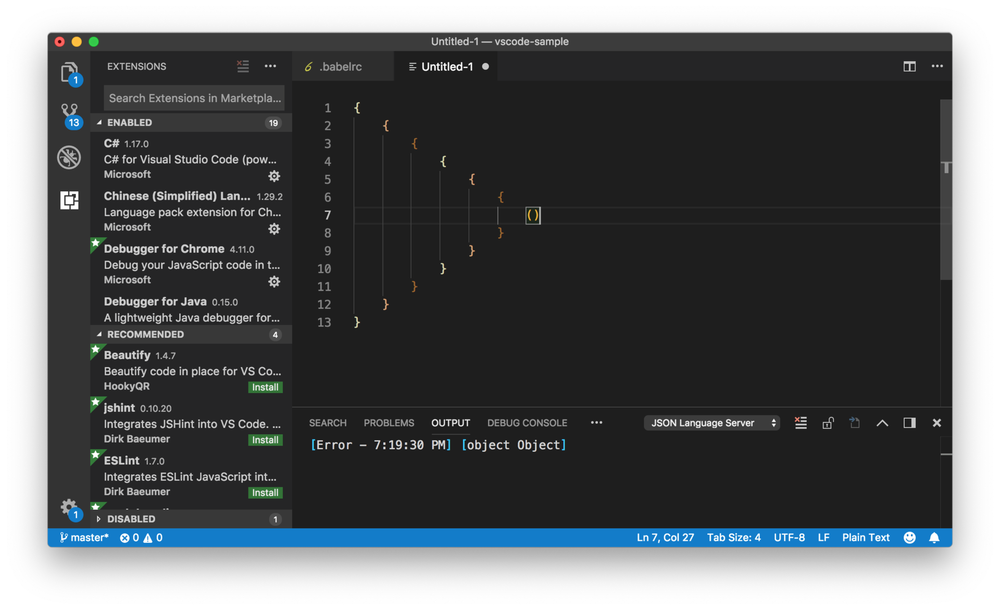
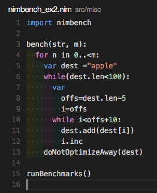
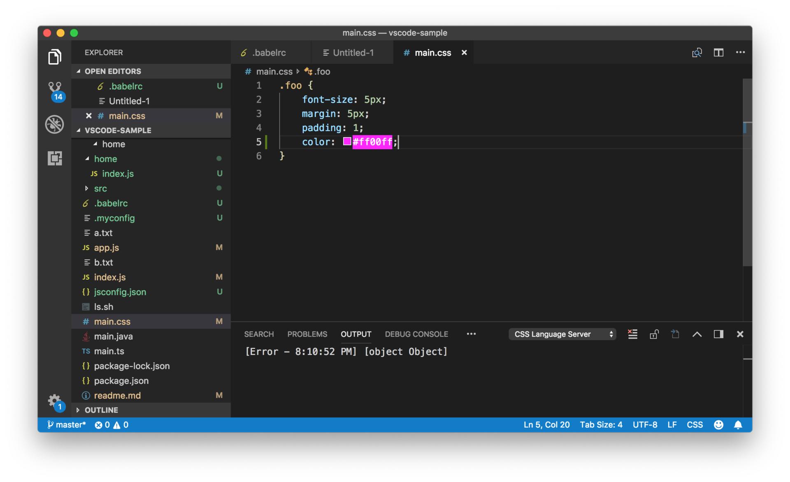
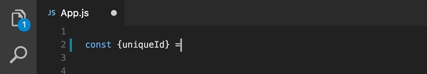
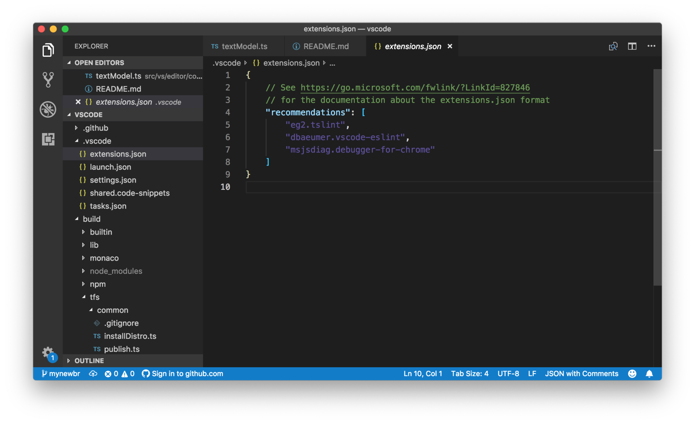

# 29 | 不错的插件推荐

mp3: https://res001.geekbang.org/resource/audio/6e/0f/6e8e36922a2ee422c1e118872648c70f.mp3

专栏到现在已经接近有三十篇文章了，终于“迎来”了一个相对轻松的话题。相信你已经了解，VS Code会把很多事情都交给插件来实现，比如 Git 、Emmet、所有的代码调试、语言支持等，它们都是插件来支持的。不过，今天我们并不是要介绍编程语言相关的插件，比如格式化、代码片段等等，当然也不会介绍主题插件，因为关于这些我相信你可以通过插件市场自行下载，很快就能判断出是不是适合自己。

今天我要介绍的是：

*   能够在某些领域大幅度提高VS Code使用效率和体验的工具。
*   能够取代 VS Code原有功能的工具。
*   对插件 API 的使用别出心裁的工具。

Git 集成
------

跟Git集成相关的插件，有如下三个很值得推荐。

### 1、GitLens

VS Code中的 Git 体验在易用性和完整性之间取得了一个不错的平衡，大部分用户都能够使用它完成工作，同时又不会被太多的功能吓到。但是很多硬核的 Git 用户肯定会觉得功能还不够用。包括但不限于：

*   不能查看某个 commit 中的代码改动；
*   不能比较两个 commit 或者 branch，然后阅览代码改动；
*   不能查看代码历史记录。

不过 [GitLens](https://marketplace.visualstudio.com/items?itemName=eamodio.gitlens) 这个插件，就弥补上了这个空缺，给硬核用户提供了一个选择。同时，这个插件也是我所知的拥有最多配置的插件了。

### 2、RemoteHub

GitLens 作者 Eric Amodio 又出[一款力作](https://marketplace.visualstudio.com/items?itemName=eamodio.remotehub)——RemoteHub。安装这个插件后，当你想在本地看某个 GitHub repository的代码时，你就不需要将代码 clone 下来了，你可以直接打开这个 repository 相关的工作区，所有文件、文件夹都是从 GitHub 按需下载下来。如果你连接 GitHub 的网速不错的话，那么使用体验可是比 GitHub 网站要好得多。

### 3、GitHub Pull Request

除了 Git 支持以外，一个呼声一直非常高的需求，就是在 VS Code中查看和审核 GitHub 上的 Pull Request。好消息是，VS Code团队和 GitHub 的 Editor Tools 团队一起合作，为我们提供了 [GitHub Pull Request](https://marketplace.visualstudio.com/items?itemName=GitHub.vscode-pull-request-github)这个插件。

工作区
---

跟 VS Code工作区相关的插件，Settings Sync和Project Manager这两个特别值得一提。

### 1、Settings Sync

如何在不同设备之间同步个人设置？VS Code自己并没有提供设置的同步，但通过 [Settings Sync](https://marketplace.visualstudio.com/items?itemName=Shan.code-settings-sync)这个插件，你可以将个人设置同步到 Gist 中。

不过值得注意的是，虽然你的设置是同步到自己私人的 Gist 中，但是如果你的设置中有一些隐私信息，像密码、Token 之类的，还是不要使用此插件比较好。

### 2、Project Manager

我们在工作台的部分，介绍过 VS Code支持多文件夹工作区（multi-root workspace），以及如何通过快捷键在不同的项目之间来回切换。如果你不喜欢 VS Code默认的方式，那么你也可以试试 [Project Manager](https://marketplace.visualstudio.com/search?term=project%20manager&target=VSCode&category=All%20categories&sortBy=Relevance)。Project Manager 甚至还有一个专门的视图来展示所有的项目，非常方便。

编辑器
---

跟编辑器相关的插件比较多，以我个人的经验来看，我推荐的如下所述。

### 1、Vim

编辑器相关的插件中最厉害的应该就是 Vim 相关的插件了，VS Code提供了一个 API 保证了 Vim 插件能够被正确地实现。不过 Vim 插件并不只有一个，下载量最大的，也是我参与的就是 [VSCodeVim](https://marketplace.visualstudio.com/items?itemName=vscodevim.vim)，它对 Vim keybings 的覆盖程度非常高。另一个非常受大家欢迎的就是[amVim](https://marketplace.visualstudio.com/items?itemName=auiworks.amvim)，它的性能也非常不错。

### 2、Rainbow Brackets

不管你是不是写函数式语言，当你的代码中有比较多的花括号时，要保证它们对称可以说是非常困难了。[Rainbow Brackets](https://marketplace.visualstudio.com/items?itemName=2gua.rainbow-brackets)这个插件，为同一对花括号指定一个单独的配色，这样你就能够轻松地一眼看出花括号的配对了。

### 3、Indent Rainbow

上面的 Rainbow brackets 是给花括号加上多种颜色，而 [Indent Rainbow](https://marketplace.visualstudio.com/items?itemName=oderwat.indent-rainbow)则是为你的代码缩进提供颜色上的提示：

这两个插件有异曲同工之妙，当然我还是建议写代码的时候，不要有太多的层级。

### 4、Pigment

既然说到颜色，就不得不提[Pigment](https://marketplace.visualstudio.com/items?itemName=jaspernorth.vscode-pigments) 这个插件。在介绍择色器（Color Picker）的时候我介绍过，VS Code会在每个颜色前面加上一个方块，用方块来展示代码所对应的颜色。Pigment 则是将颜色渲染在这段代码的下面，我自己还是蛮喜欢这种方式的。

### 5、Import Cost

JavaScript 经常被吐槽的一个地方，就是大家对 npm 库的使用程度非常高，经常为了一个简单的功能，引入了几兆甚至十几兆的 npm 包。[Import Cost](https://marketplace.visualstudio.com/items?itemName=wix.vscode-import-cost)这个插件，很好地在代码中给我们以提示，告诉我们引入的某个包，它最终会导致整个项目的大小增加多少。

调试：Debugger for Chrome
----------------------

虽然我们并不介绍语言相关的插件，但是还是有一个调试相关的插件值得一提，那就是 [Debugger for Chrome](https://marketplace.visualstudio.com/items?itemName=msjsdiag.debugger-for-chrome)。这个插件，允许在 VS Code中调试前段代码，这样你就不需要再使用 Chrome Dev Tools 了。你可以直接在自己的代码上加上断点，发现错误后直接修改，非常方便。

其他
--

还有一些插件，非常实用，但并没有什么特别的分类，这里我们就一起讲讲。

### 1、Rest Client

我们使用 REST API 的时候，经常需要发送一些样例数据对 API 进行测试，这时我们可以使用 Postman 这类的独立应用，也可以在 VS Code中使用 [Rest Client](https://marketplace.visualstudio.com/items?itemName=humao.rest-client)插件，直接在编辑器里发送 REST 请求。

### 2、Code Runner

macOS 用户对 Code Runner 这个应用一定非常熟悉了，你可以使用 Code Runner 快速地书写代码并且执行，而无需设置环境配置工程之类的。VS Code里也有[这样的插件](https://marketplace.visualstudio.com/items?itemName=formulahendry.code-runner)，如果你有类似的需求，可以试一试。

### 3、Live Share

[Live Share](https://marketplace.visualstudio.com/items?itemName=MS-vsliveshare.vsliveshare)是微软官方出品的非常强大的服务，通过 Live Share service，你可以将你本地的工作区，直接分享给你的同伴，然后你的同伴就可以直接编辑你的代码，与你共享代码调试、集成终端等等，而无需安装任何环境。Atom 也有类似的服务叫做 Teletype。我工作中每次要和同事 Pair Programming 的时候，就会使用 Live Share。

同时 Live Share 服务还支持语音通讯，不过需要安装另一个插件 [Live Share Audio](https://marketplace.visualstudio.com/items?itemName=MS-vsliveshare.vsliveshare-audio)。

如何分享插件
------

以上就是我心目中值得推荐的插件了，虽不算多，但是每个都帮助到我的日常工作。如果你觉得这些插件还不能满足你的日常工作，那你可以试着在插件市场进行找寻。不过，找寻的时候，记得要根据我们学习的知识进行分类搜索：

*   如果你想搜索某个语言的支持，可以查询[语言分类](https://marketplace.visualstudio.com/search?sortBy=Downloads&category=Programming%20Languages&target=VSCode)；
*   如果你想为自己的代码添加代码审查，可以查看[Linters](https://marketplace.visualstudio.com/search?sortBy=Downloads&category=Linters&target=VSCode)；
*   如果你想使用其他人分享的代码片段，则可以查看[Snippets](https://marketplace.visualstudio.com/search?sortBy=Downloads&category=Snippets&target=VSCode)；
*   如果你想安装其他人分享的主题，可以查看[Themes](https://marketplace.visualstudio.com/search?sortBy=Downloads&category=Themes&target=VSCode)。

当你找到了自己心仪的插件后，并且想分享给你的同事，除了把名字告诉他们外，还有什么别的办法没有？

当然有！你可以通过在项目的 .vscode 文件夹下，创建一个文件 extensions.json。你很熟悉了，这又是一个 JSON 文件，在这个 JSON 文件里，你只需提供一个键（key） recommendations，然后将你想要推荐给这个项目的其他工程师的插件的 ID 们，全部放入到这个数组中。当他们打开这个项目，而且并没有安装这些插件时，VS Code就会给他们提示了。

除了在 .vscode/extensions.json 文件推荐插件，如果你在使用多文件夹工作区（multi-root workspace），也可以在多文件夹工作区的配置文件里添加如下的设置：

    {
        "folders": [
            {
                "path": "vscode"
            },
            {
                "path": "vscode-docs"
            }
        ],
        "extensions": {
            "recommendations": [
                "eg2.tslint",
                "dbaeumer.vscode-eslint",
                "msjsdiag.debugger-for-chrome"
            ]
        }
    }
    

小结
--

好了，以上就是今天的全部内容了。你可以尝试下载和使用我推荐的这些插件，希望它们能够大幅度地提升你使用VS Code的效率和体验，进而提高你的工作效率，帮助到你。但如果这些还都不是你心仪的，或者你还需要更多去满足你的工作需求，那你也可以使用我推荐的“分类搜索”的方式去插件市场找寻和下载。

* * *

