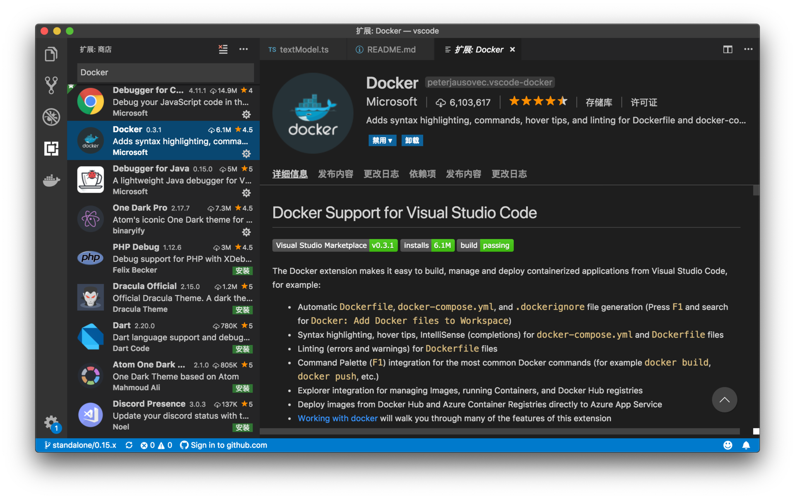
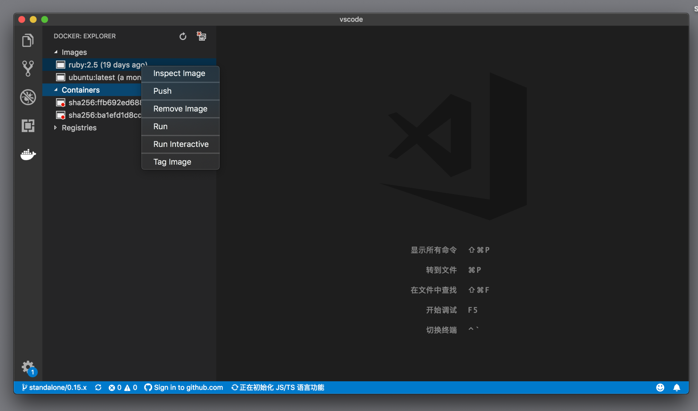
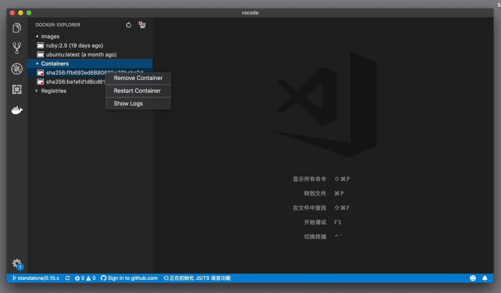
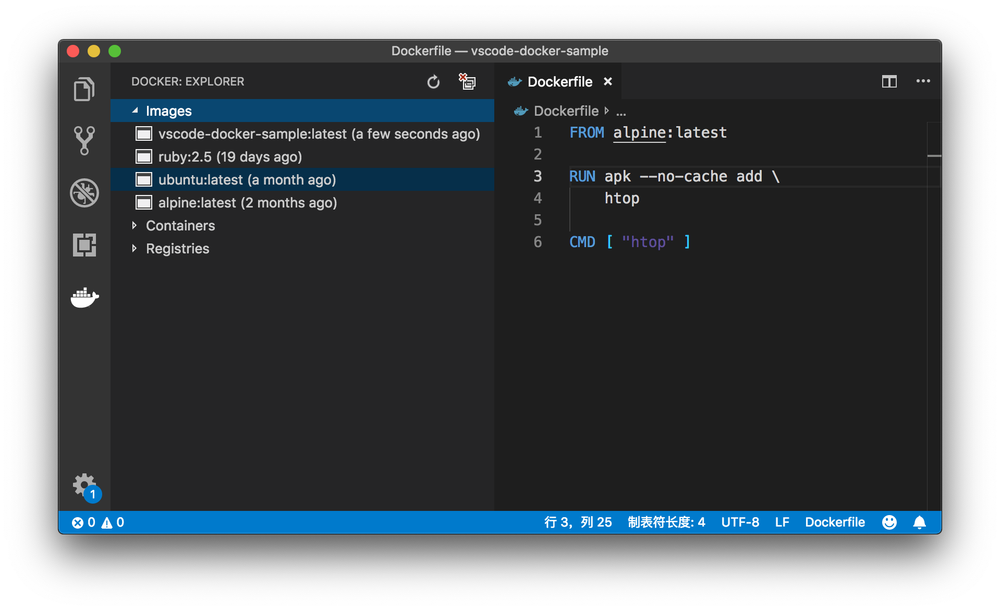
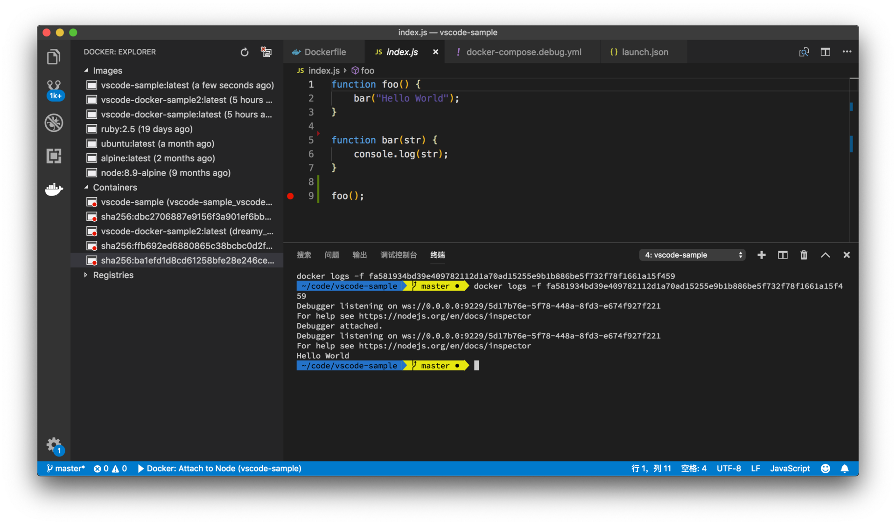

# 30 | 如何在VS Code中配置、部署和调试Docker？

mp3: https://res001.geekbang.org/resource/audio/87/04/87ee011f45fa4934f5039cd71fcc6c04.mp3

今天我们要介绍的内容是，如何在 VS Code 中配置、部署和调试 Docker。

在阅读本文之前，首先你需要对 Docker 容器化的知识有所了解，我推荐阅读[阿里中间件团队博客对 Docker 的介绍](http://jm.taobao.org/2016/05/12/introduction-to-docker/)。其次，Docker 的操作，都可以通过命令行来实现。所以今天我要着重介绍的就是：VS Code里如何使用 UI 和命令来简化命令行操作，以及如何对 Docker 容器里的代码进行调试，这里我会借助两个简单的例子来讲解。

一、安装
----

VS Code 的 Docker 支持，是由插件来完成的，这个插件是 VS Code 官方团队维护的，所以它的发布者是 Microsoft。你可以在市场上[点击下载](https://marketplace.visualstudio.com/search?term=docker&target=VSCode&category=All%20categories&sortBy=Relevance)，也可以直接在 VS Code 插件视图里搜索 Docker 进行安装。

当然了，这个插件的正确运行，离不开一个正确安装的 Docker 环境。关于 Docker 的安装，还请参考[官方文档](https://www.docker.com/get-started)。

Docker 插件安装

安装完Docker插件后，在活动栏上，我们就能够看到一个集装箱的图标，点击它，我们就能够看到 Docker 相关的信息了。

Docker 视图

在这个视图中，我们能够看到以下信息：

*   当前环境中所有的 image；
*   当前环境中存在的 container；
*   以及 Docker 的仓库列表。

当我们在 image 上右击时，能够看到一系列的操作，比如查看 image 的信息、发布这个 image、运行 image 等。当然，这些操作同样也可以在命令面板中找到。

Images 上下文菜单

我们在 containers 上右击调出的上下文菜单就要简单一些，有三个命令：删除 container、重启 container以及查看这个 container 运行的日志。

Containers 上下文菜单

二、Dockerfile
------------

除了提供了一个视图，Docker 插件还能够对 Dockerfile 文件进行语法高亮。

Dockerfile 语法高亮

而且也支持自动补全，这样我们就可以通过建议列表来输入 Dockerfile 中的命令了。

Dockerfile 建议列表

三、构建和运行
-------

在书写了正确的 Dockerfile 之后，我们就可以通过这个 Dockerfile 来构建 image 了。为了方便理解，下面我们创建一个新的文件夹，在其中创建一个 Dockerfile。内容如下：

    FROM alpine:latest
    
    RUN apk --no-cache add \
        htop
    
    CMD [ "htop" ]
    

这段 Dockerfile 的意思是，**我们希望基于 alpine 系统，安装 htop 这个包，最后运行一个命令 htop，查看当前运行的各种进程**。

### 1\. docker build

接下来，我们就可以打开命令面板，执行 “Docker: Build image” 命令。这个命令会打开集成终端，然后执行 docker build 命令。

Docker build

### 2\. docker run

生成了 image 之后，我们就可以通过这个 image 来创建 container 了。此时，我们可以通过 Docker 视图的上下文菜单来生成“运行 container”，也可以从命令面板中，运行 “Docker: Run” 命令。然后 VS Code 就会询问我们想要使用哪个 image。

Docker Run

### 3\. docker run interactive

除了 Run 这个命令外，另一个非常有用的命令就是 Run Interactive。通过这个命令，**我们可以创建并运行 container，然后进入到这个 container 的 shell 环境汇总**。

Docker run interactive

在上面的例子里，我们在 container 里运行的命令是 htop，也就是实时监控系统运行的情况；当我们执行了 “Run interactive” 命令，运行了 contaienr 并且进入到它的 shell 环境中后，我们就立刻看到了 htop 的运行界面。

看到这里你可能已经发现了：对于命令面板里执行每个命令，VS Code 都会打开集成终端，然后运行相对应 Docker 脚本。在你还在学习 Docker 的过程中，你可以先依赖于 VS Code 提供的命令，然后试着去理解 VS Code 每个命令背后的脚本的含义。

而下面这些就需要我们具备一定的 docker 命令行的知识。

### 4\. 输出 log

首先，我们对 Dockerfile 按如下稍作修改。

    FROM alpine:latest
    RUN apk --no-cache add \
        htop
    CMD [ "pwd" ]
    

我们将Dockerfile中，最后一个配置 CMD 进行了修改。那么，从这个 image 生成的 container 运行起来后，会执行 pwd 命令，而非 htop 命令。

修改完 Dockerfile 之后，第一件要做的事情，就是重新构建 image。在构建这个 image 时，我们可以覆盖之前的那个 image，也可以重新起个名字来创建一个新的 image。比如我就给新的 image 取名为"vscode-docker-sample2:latest"。

有了新的 image 后，接下来就是从 “vscode-docker-sample2:latest” 创建一个新的 container。

输出 log

在运行 docker run 的时候，如果你有留意左侧视图里 “containers” 这个列表的话，你会发现，一个名叫 vscode-docker-sample2 的 container 出现了一下然后又消失了。这是为什么呢？

我们来看一下集成终端，此时集成终端里运行的脚本是：

    docker run --rm -d vscode-docker-sample2:latest
    

这行脚本中有一个参数 ‘–rm’，它的意思是：如果 container 里的命令执行结束的话，那就将这个 container 删除。由于这个 container 中运行的命令是 pwd，这个命令很快就结束了，所以我们来不及在视图中看到并且操作它。如果我们不希望这个 container 被删除该怎么办呢？

我们可以选择手动地运行如下的脚本：

    docker run -d vscode-docker-sample2:latest
    

这一次，我们创建的 container 运行结束后就不会被删除了。也就是此时我们能够在左侧 Containers 列表里，看到 vscode-docker-sample2:latest (dreamy\_…) 这个 container 了。它前面的图标里有一个红色的点，这说明这个 container 已经结束工作了。

我们可以在这个 container 上右击调出上下文菜单，选择 Show logs 命令。接着，我们就能够看到这个 container 中 pwd 命令执行的结果了，就是 ‘/’。

Show logs

四、Docker Compose
----------------

除了 Dockerfile 的支持，Docker 插件还支持 Docker Compose。**Docker Compose 是用于配置多个 container 并且将其同时运行的**。和 Dockerfile 一样，我们一样也可以在 Docker compose file 里获得自动补全和错误检查。

这里，让我们用一个 Node.js 的代码示例，来展示 Docker Compose 以及接下来调试相关的内容。

首先，让我们将上文中创建的 Dockerfile 删除。然后在文件夹下创建一个 JavaScript 文件 index.js，内容如下：

    function foo() {
        bar("Hello World");
    }
    
    function bar(str) {
        console.log(str);
    }
    
    foo();
    

（上面这段 JavaScript 代码，我们在专栏前面的内容里也经常使用，非常简单。）

接着，我们就需要为这个 JavaScript 代码准备 Docker 相关的配置了。不过值得庆幸的是，Docker 插件已经为我们提供了 Docker 配置的快捷生成方式了。

### 1\. 自动创建 Dockerfile 和 compose 配置

我们只需调出命令面板，然后搜索执行命令 “Docker: Add docker files to workspace”。

自动创建 Dockerfile

接着 VS Code 会问我们想要创建什么环境的 Docker image。这里我们选择 Node.js，这样就可以运行上面创建的 index.js 文件了。

命令执行后，工作区内多出了三个文件。

第一个文件是**Dockerfile**。

    FROM node:8.9-alpine
    ENV NODE_ENV production
    WORKDIR /usr/src/app
    COPY ["package.json", "package-lock.json*", "npm-shrinkwrap.json*", "./"]
    RUN npm install --production --silent && mv node_modules ../
    COPY . .
    EXPOSE 3000
    

这个文件里，指定了 Node.js 8.9 作为基础 image，然后将当前工作目录下的 package.json 、package-lock.json 等都拷贝到 container 中去。接着运行 npm install 命令来安装代码运行所需的 dependencies。不过，由于我们只有一个简单的 JavaScript 文件，我们并不需要 npm，所以我们不妨把这个文件修改为：

    FROM node:8.9-alpine
    ENV NODE_ENV production
    WORKDIR /usr/src/app
    COPY . .
    EXPOSE 3000
    

第二个文件是**docker-compose.yml** 。这个文件里指定了当前只有一个 container 需要被创建并运行，而且这个 container 需要使用端口 3000。

    version: '2.1'
    
    services:
      vscode-sample:
        image: vscode-sample
        build: .
        environment:
          NODE_ENV: production
        ports:
          - 3000:3000
    

第三个文件是**docker-compose.debug.yml**。顾名思义，它是用于调试时的 compose 文件，跟上面的 docker-compose.yml 文件相比，它只多了两行代码，也就是：

*   9229:9229，使用 9229 端口；
*   command: node --inspect index.js ，在 container 运行起来后，运行 node 程序，并且调试 index.js 文件。

    version: '2.1'
    
    services:
      vscode-sample:
        image: vscode-sample
        build: .
        environment:
          NODE_ENV: development
        ports:
          - 3000:3000
          - 9229:9229
        ## set your startup file here
        command: node --inspect index.js
    

### 2\. Compose Up

在有了这三个配置文件后，要想构建并且运行 container 就简单了。我们不再需要先执行 “Docker: build image ” 再运行 “Docker: run” 了，而是直接运行单个命令——“Docker: compose up” 即可。

Docker Compose Up

运行 “Docker: compose up” 后，我们需要选择使用哪个 compose 配置文件。只要准备好了 compose 配置文件，那么在 VS Code 中操作就非常简单了，一共只有三个命令：

*   Docker compose up
*   Docker compose down
*   Docker compose start

如果你想看看 VS Code 是不是真的成功运行了 container，你可以从 Docker 的视图里，找到这个新创建出来的 container，查看它的 log。你能够看到以下结果：

查看 container 的日志 log

index.js 在 container 里被成功地运行了，而且输出了 Hello World。

五、调试
----

我们在前面的文章里，做了这么多的准备工作，既创建了 JavaScript 文件，又使用了 Docker compose。不过这些操作，都是为调试内容做的准备。

在专栏[第 20 讲《聊 debugger 时，我们在聊什么》](https://time.geekbang.org/column/article/42775)时，我们介绍过 launch.json 里调试配置中，有一个属性是 request。

> 这个 JSON 文件里的 configurations 的值就是当前文件夹下所有的配置了。现在我们只有一个调试配置，它有四个属性：
> 
> 第一个是 type，代表着调试器的类型。它决定了 VS Code 会使用哪个调试插件来调试代码。
> 
> 第二个是 request，代表着该如何启动调试器。如果我们的代码已经运行起来了，则可以将它的值设为 attach，那么我们则是使用调试器来调试这个已有的代码进程；而如果它的值是 launch，则意味着我们会使用调试器直接启动代码并且调试。
> 
> ……

当 request 的值被设置为 attach 后，我们就可以将调试器附着到已经处于调试状态的代码进程上了，接着我们就能够调试代码了。而调试 Docker 中的代码，就是使用的 attach 这个方法。我们可以在 Docker container 里以命令行的方式调试代码，并且开放调试端口，接着我们让 VS Code 里的调试插件附着到这个端口上即可。这就是在 VS Code 中调试非本地环境运行的代码的理论知识了。下面，我们一起看看怎么做。

首先，我们对 docker-compose.debug.yml 做一点修改，将 command 改成如下的值：

    command: node --inspect-brk=0.0.0.0:9229 index.js
    

这个命令是说，**将调试 index.js 文件，然后在第一行停下来，并且使用 9229 这个端口进行调试**。接着，让我们运行 “Docker: compose up” 将 container 运行起来。

下一步就是调试代码了。关于如何创建 launch.json 以及如何借助自动补全来书写调试配置，还请参考专栏[第 20 讲](https://time.geekbang.org/column/article/42775)。这里，我们使用的 .vscode/launch.json 文件内容如下：

    {
        "version": "0.2.0",
        "configurations": [
            {
                "type": "node",
                "request": "attach",
                "name": "Docker: Attach to Node",
                "port": 9229,
                "address": "localhost",
                "localRoot": "${workspaceFolder}",
                "remoteRoot": "/usr/src/app",
                "protocol": "inspector"
            }
        ]
    }
    

这个调试配置有几个属性值得注意：

*   request 是 attach，也就是附着到已经运行的代码上；
*   port 就是调试的端口；
*   localRoot 是本地代码的根目录；
*   remoteRoot 是指在远程运行的代码的根目录。在我们的例子里，我们已经在Dockerfile里指明了工作目录是 /usr/src/app （不记得的话还请翻上去看一看），所以此处我们输入 /usr/src/app。

有了这个调试配置后，F5 我们就能够调试 Docker container 中的代码了，并且停到了第一行代码上。

调试 Docker container

到这里，我们就成功地将一段 JavaScript 代码运行在 Docker 中，并且从 VS Code 里调试起来了。

小结
--

以上就是今天内容的全部了，如果你对 Docker 还不熟悉，那么今天的内容会让你觉得有些陌生。就我的使用经验来看，Docker 这个插件很好地将一些常用的 docker 命令行，简化成单个命令，而且提供了一个独立的视图，我们就能够快速查看 docker image 和 container 了。而调试 Docker 内的代码，也不是全新的知识，它其实是使用了调试器的 attach 功能，只要你能够在 Docker container 里以命令行的形式调试代码，基本上你也可以在 VS Code 里进行调试。关于使用的语言或者框架是否能够在 Docker 中运行并调试，建议你参考这门语言调试插件的 Remote Debugging 相关的知识。

* * *

