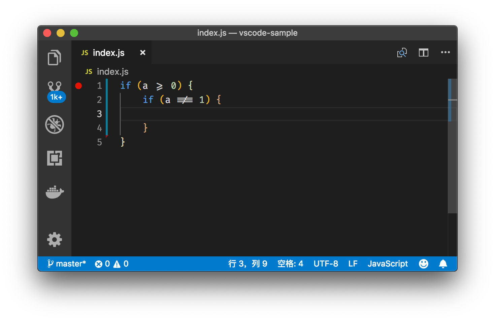
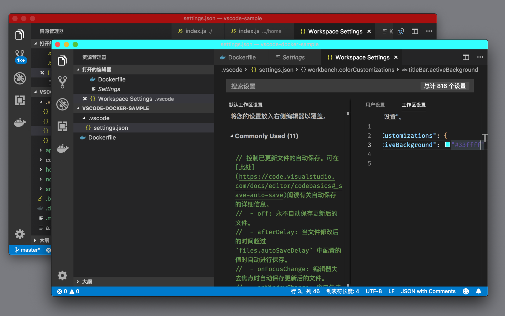
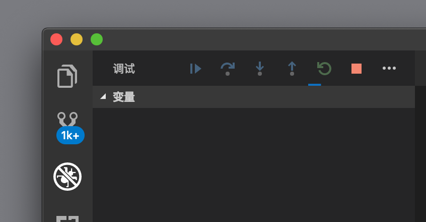

# 31 | 一些你可能不知道的Tips&Tricks

mp3: https://res001.geekbang.org/resource/audio/09/2b/09dc530b9652f4d4b8bb9ef7ba42492b.mp3

今天，我们一起来聊一聊 VS Code 中一些你可能不知道的 **Tips & Tricks**。这篇文章不会太长，因为很多内容，我在专栏前面的内容里，根据每一篇文章的主题已经逐步渗透了。今天我们这篇算是再做一次查漏补缺，看看还有哪些好玩的功能我们没有涉及过。要注意，既然是tips&tricks，那么今天的内容，不一定完全实用哦。

跳转
--

我们在编辑器里，可以通过 F12 跳转到代码的定义处，这个快捷键在阅览代码的时候特别有用，但是问题来了，当你阅读完定义处的代码，想跳转回去怎么办呢？

这时候你可以使用 “Ctrl + -” （Windows 上是 Alt + Left）跳转回上一次光标所在的位置。而如果你按下 “Ctrl + Shift + -” （Windows 上是 Alt + Right）则可以跳到下一次光标所在的位置。有了这两个快捷键，我们就能够在阅读代码时快速来回跳转了。

跳转到上一次光标所在位置

转到上一次编辑位置
---------

VS Code 最近还加了一个命令，就是跳转到上一次代码编辑的位置。比如你在书写代码，然后想要查看某个 API，接着你通过 F12 不断地在不同的代码之间跳转进行阅读，结束后，如果通过 “Ctrl + - ”来回退，实在是太慢了。这时可以通过运行命令 “转到上一编辑位置”来实现。

跳转到上一次编辑位置

复制粘贴
----

复制粘贴是很简单的功能，但是 VS Code 里也有几个小巧的设计。比如说，当你从 VS Code 里复制了代码，然后粘贴到 Outlook、Evernote 等应用中时，默认情况下，这些应用会粘贴富文本。什么意思呢？请看下图：

复制代码高亮

没错，当你按下“Cmd + V”时能把代码高亮也粘贴进去，而你按下“Cmd + Shift + V”则是粘贴纯文本。

如果你不喜欢这个功能，当然也可以通过 editor.copyWithSyntaxHighlighting 来关闭。

复制当前行
-----

除此之外，VS Code 里的复制功能，还有一个大家不太容易注意到的地方。如果你把光标放到某一行，并没有选中任何代码，然后按下“Cmd + C”，这一行的代码就会被复制到粘贴板中了，这比按下“Cmd + i”选中一行代码，然后再按“Cmd + C”方便多了。

移动编辑窗口
------

我们在介绍编辑器的快捷键时，只介绍了如何移动代码或者如何移动光标，其实 VS Code 也有命令来移动窗口。你不妨打开快捷键设置窗口，然后搜索 “scrollLine” ，能看到两个命令 scrollLineDown 和 scrollLineUp，它们的作用就是将窗口向上或者向下移动一行。这两个命令没法在命令面板里找到，你可以给它们绑定上两个快捷键然后使用。

将窗口向上移动一行

你可以发现，使用这两个命令时，光标并不会移动，就跟使用鼠标移动窗口一样。

鼠标打开新编辑器窗口
----------

我们在介绍编辑器里的鼠标操作时，介绍过我们可以通过“Cmd + 鼠标左键”来实现跟 F12 “跳转到到定义处”一样的功能，而如果我们按下“Cmd + Option + 鼠标左键”的话，则可以将定义处的代码，打开在新的编辑器组中。

鼠标打开新编辑器窗口

Font ligatures
--------------

相信你在社交网络上会经常看到下面这样的代码截图，在编辑器里有一些并不常见的符号，但是你又可以一眼看出它们的作用，比如“大于等于”“不等于”。它们的特点是，原本的多个字符现在变成了单个符号。这个功能叫做**字体连字**（font ligatures）。

Font ligatures

要使用这个功能，首先你需要一款支持连字的字体，比如 Fira Code，然后你需要打开 editor.fontLiagures 这个设置，并添加如下配置。

    "editor.fontFamily": "Fira Code",
    "editor.fontLigatures": true
    

更快速的自动补全
--------

VS Code 里的自动补全，会在你输入完了之后等待片刻，然后再给你进行提示，这么做是为了减少不必要的计算。但是如果你的机器性能非常不错，并且你完全不在乎多用一些电的话，可以修改配置 “editor.quickSuggestionsDelay: 0”，不再等待。

文件删除
----

当你在 VS Code 中删除文件时，VS Code 会多次提示你是否一定要删除文件，当你选择“确定”后，VS Code 会把文件放到废纸篓中而非完全删除。这么做的目的是防止你误删除文件。当然如果你觉得 VS Code 太多此一举了，也可以通过设置 `file.trash` 修改，选择每次将其直接完全删除。

创建多层子文件夹和文件
-----------

在 VS Code 的资源管理中，当你需要创建一个文件夹，然后在这个文件夹中创建一个新文件时，你其实可以做到一步完成它们的创建。方法是：点击创建文件的按钮，然后在输入框中输入`folderName/fileName`即可。

创建多层子文件夹

为不同工作区设置标题栏颜色
-------------

如果你同时打开了多个工作区，在这些工作区切换多次后，你可能就搞不明白自己在哪个工作区了。这里就有必要介绍主题修改相关的小技巧了。

你可以在每个工作区的设置里，添加如下配置：

        "workbench.colorCustomizations": {
            "titleBar.activeBackground": "#33ffff"
        }
    

通过修改标题栏的颜色，你可以为每个不同的工作区指定一个特殊的颜色，这样你就可以一眼区分出来了。

不同工作区不同标题栏颜色

复制搜索结果
------

当你使用了多文件搜索后，可以在搜索结果上右击，调出上下文菜单，选择 “全部复制”，这之后你就可以将所有的搜索结果相关的信息粘贴到编辑器中作进一步处理了。

复制粘贴搜索结果

固定调试工具条位置
---------

在最近几个版本里，你可以通过 debug.toolBarLocation 设置，调整工具栏的位置，比如说 debug.toolBarLocation: docked 就可以将工具栏固定到调试窗口中了。

固定调试工具条位置

语言相关的设置
-------

我介绍 VS Code 设置时提到过，工作区的设置会覆盖个人设置。除此之外，VS Code 还允许你为某个语言指定特别的设置。

    "editor.insertSpaces": false,
    "[json]": {
        "editor.insertSpaces": true
    }
    

比如上面的代码示例，你可以指定只在 JSON 文件中时，按下 Tab 会插入空格键而非 Tab 键。

如何挑选键盘
------

最后，就是我个人的一个 tip。VS Code 的默认快捷键设置，对方向键的使用非常多，同时很多功能，可以通过 Function 键一键完成，而如果不使用 Function 键的话，就得使用多个按键了。

所以，最适合 VS Code 的键盘，要属 87 键键盘，也就是常说的 Tenkeyless。Function 和方向键，保证了你不需要太频繁地使用组合键，而小键盘的用处在 VS Code 中不大。

小结
--

好了，上面就是我今天要介绍的 VS Code 里使用的小 tips。不过如果你是跟着专栏一步步学习过来的话，你应该留意到，前面的专栏里，还介绍过非常多有用的小功能。比如说我自己最喜欢的就是 files.defaultLanguage 了，通过将其设置为 markdown，每次我创建了一个新文件时，这个文件的类型就会被自动设置为 markdown，然后我就能快速记录文档了。

你在学习专栏的过程中，是不是也有自己非常喜欢的快捷键或者设置呢？不妨分享给大家，一起学习！

* * *

