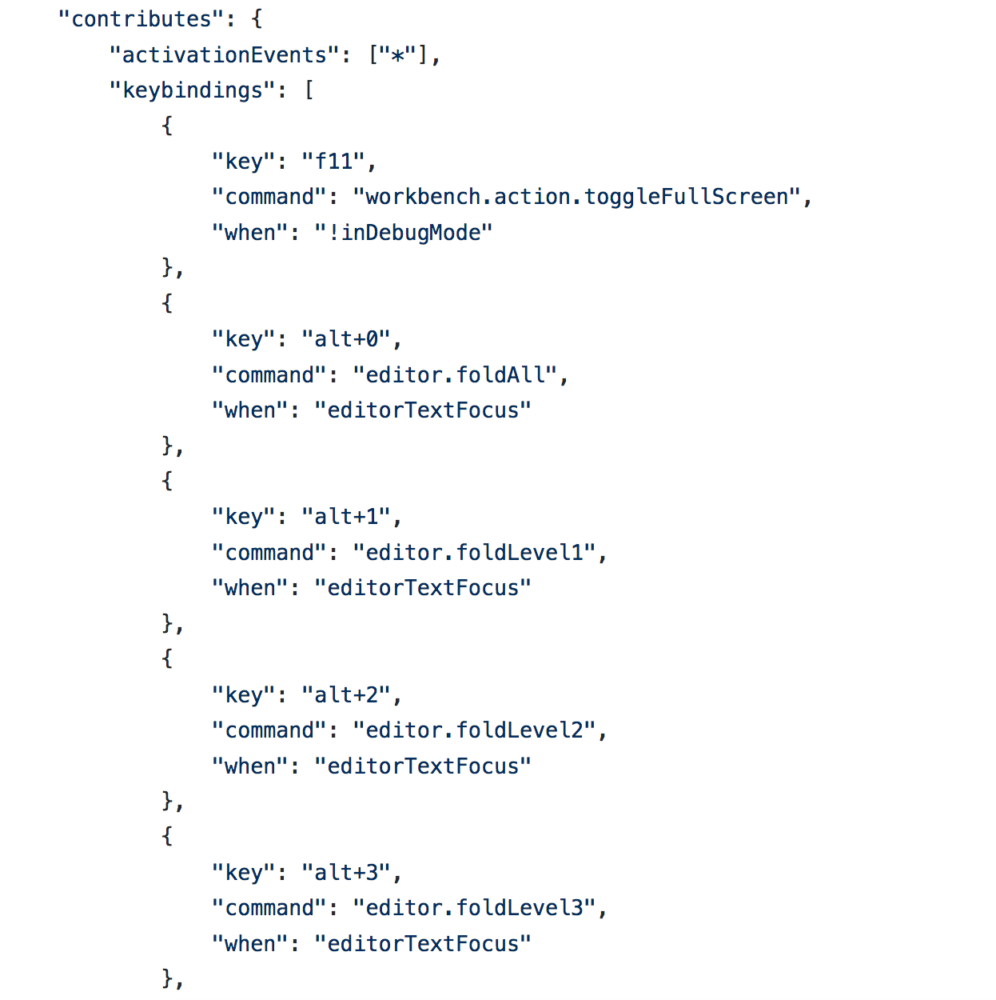
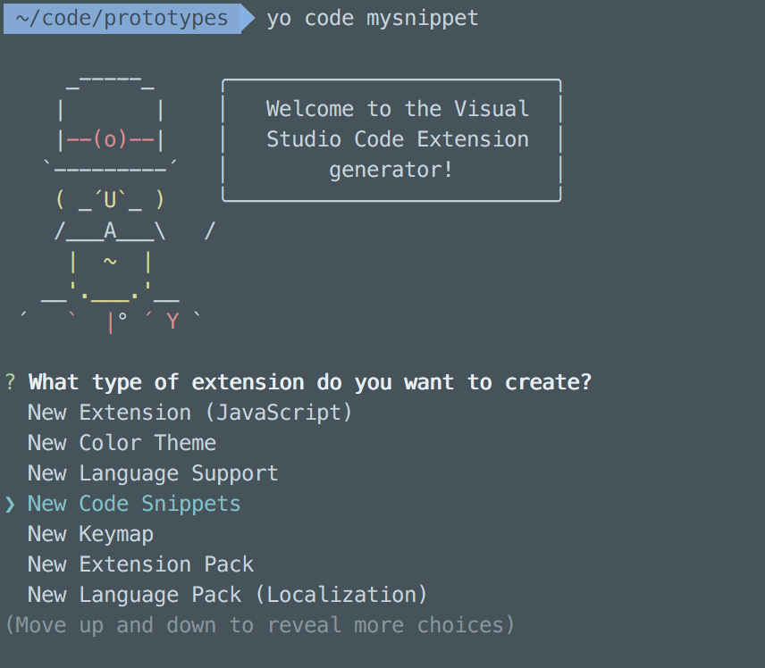
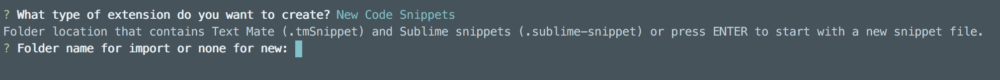
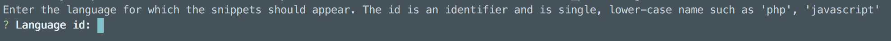
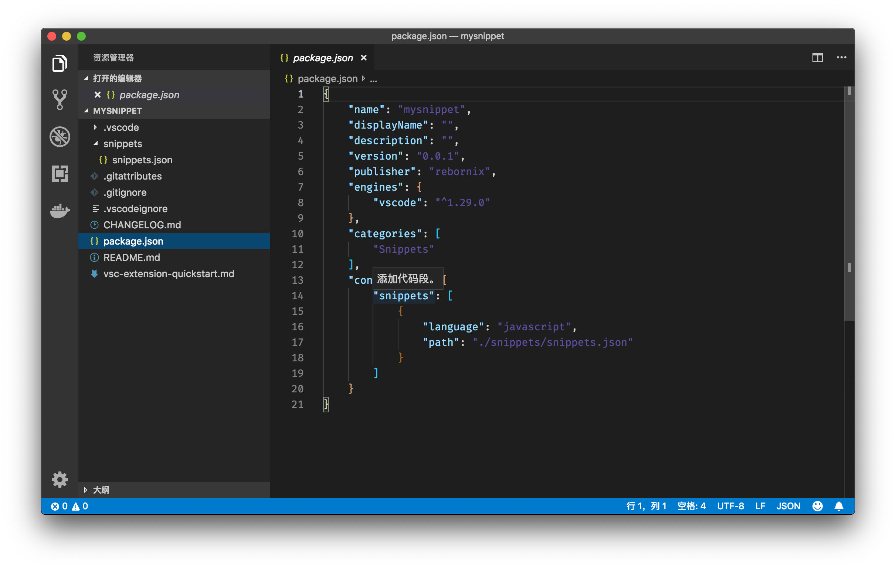
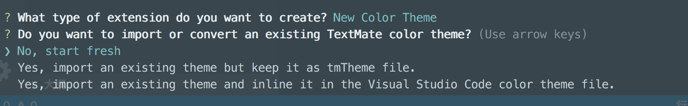
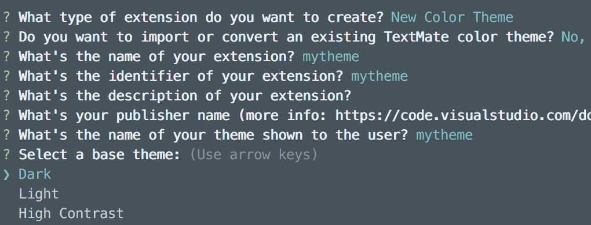
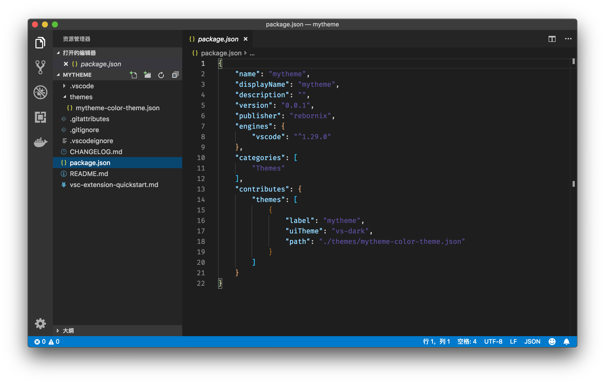
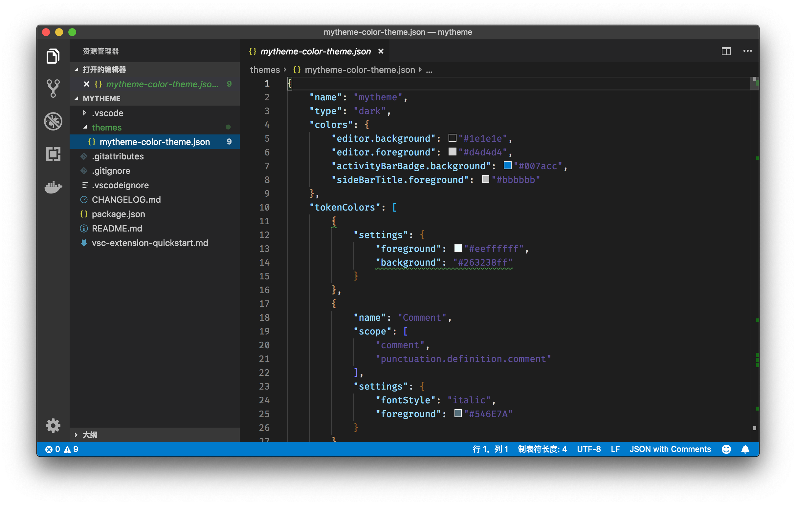

# 33 | 插件开发（二）：编写编辑器快捷键及分享快捷键配置、代码片段、主题等

mp3: https://res001.geekbang.org/resource/audio/47/12/471f0b4f1616bca58b737e7662573b12.mp3

今天的专栏主要分为两个部分：第一部分我会介绍如何编写编辑器快捷键；第二部分则是介绍如何分享快捷键配置、代码片段和颜色主题。

一、编写编辑器命令
---------

在专栏第一部分的编辑器学习中，我们学习了不少命令和快捷键，用于快速地编辑和阅览代码。这些命令可以说是前人的经验总结，有了它们，我们就能够更好地完成编码工作。但是有的时候，我们还是会发现这些操作不够用。这时候，就轮到插件 API 发挥作用了，**我们可以通过插件 API 来编写编辑器内的命令**。下面我们来看看，要实现一个编辑器操作相关的插件，需要使用哪些 API？都有什么步骤？

关于如何创建一个命令，以及给这个命令命名并且注册，在上一讲中我们已经有一个简单的代码示例了。今天我们继续使用这个代码示例。这个代码示例中 extension.js 的内容现在如下：

    const vscode = require('vscode');
    
    function activate(context) {
        console.log('Congratulations, your extension "myextension" is now active!');
        let disposable = vscode.commands.registerCommand('extension.sayHello', function () {
            vscode.window.showInformationMessage('Hello World!');
        });
    
        context.subscriptions.push(disposable);
    }
    exports.activate = activate;
    
    function deactivate() {
    }
    exports.deactivate = deactivate;
    

### 1、访问编辑器

既然是编辑器相关的命令，那么我们肯定需要能够访问到编辑器，以及其中的内容。首先我们要获取的就是：当前工作区内，用户正在使用的编辑器。

    let editor = vscode.window.activeTextEditor;
    

如果你是手动敲入上面的代码，你可以看到 VS Code 提示的插件 API 建议。

有了这个编辑器，我们就能获取非常多的信息了。不过先别急，editor 这个变量并非一定总是有效的值，比如用户现在并没有打开任何文件，编辑器是空的，那么此时 editor 的值就是 undefined。所以， 在正式使用 editor 之前，我们要判断一下，editor 是否为 undefined，是的话就结束命令的运行。

    if (!editor) {
        return;
    }
    

接下来，我们可以输入 `editor.`，自动补全立刻给我们提示了不少的属性。

editor API

这其中几个值得一提的有如下：

*   document，也就是当前编辑器中的文档内容；
*   edit，用于修改编辑器中的内容；
*   revealRange，用于将某段代码滚动到当前窗口中；
*   selection，当前编辑器内的主光标；
*   selections，当前编辑器中的所有光标，第一个光标就是主光标，后面的则是用户创建出来的多光标；
*   setDecorations，设置编辑器装饰器（我会在后面的章节专门介绍这个 API 的使用）。

我们在编辑器快捷键里介绍过 “转置字母”（Transpose Letters）这个命令，这个命令可以将光标左、右两侧的字母位置调换。

反转字母

不过如果你将多个字符选中，然后运行这个命令，该命令并不能将它们反转。下面，我们就来看看**如何实现字符串反转**。

首先，我们要读取的信息就是当前的文档信息和主光标的信息。

    let document = editor.document;
    let selection = editor.selection;
    

有了这两个信息，读取光标选中的内容就简单了。

    let text = document.getText(selection);
    

document 一共哪些 API 这里我就不介绍了，相信你可以自己探索，这里我们使用就是 getText，以获取某段代码。

接下来就是将这段文本进行反转了，我们可以写一个非常简单的版本，将字符串分割成字母数组，然后反转，最后重新组合成字符串。

    let result = text.split('').reverse().join('');
    

最后一步操作就是将原来编辑器内的文本进行替换了。此时我们就要用到 edit 这个 API 了。值得注意的是，这个 API 的第一参数，是一个 callback，callback 的参数是 editBuilder，也就是真正用于修改代码的对象。editBuilder 有以下几个 API：

*   delete
*   insert
*   replace
*   setEndOfLine

这里我们要使用的当然就是 replace 了。

    editBuilder.replace(selection, result);
    

我们只需将原先的 selection 里的内容，替换成新的 result 即可。

好了，这就是这个命令的全部内容。虽然还很简陋，但是我们可以运行看看。

反转字符串

当我们把代码调试运行起来，选中代码 “path”，运行 “Hello World” 命令，“path” 就被替换为了 “htap”。

### 2、注意事项

绝大多数的编辑器命令的工作方式，基本上跟上面的示例如出一辙。下面我来总结一下，一共分为三部分：

*   首先，读取文档中的内容。需要使用的 API 是 selection、selections、getText 等。
*   其次，对这些内容进行二次加工，这部分就是 business logic 了。
*   最后，修改编辑器内的内容。我们可以使用 edit 来修改文本，也可以直接修改 editor.selection 和 editor.selections 来改变光标的位置。

在专栏[第四讲《如何做到双手不离键盘？》](https://time.geekbang.org/column/article/40098)和[第五讲《快捷键进阶攻略》](https://time.geekbang.org/column/article/40238)中，我们介绍的各种命令其实都可以通过上面的步骤，以插件的形式实现。

不过，如果要书写一个没有bug且性能出色的编辑器命令，可就没那么简单了。比如上面的示例里面，我们没有对多光标进行支持，反转字符串也是很暴力的，而这一部分，才是插件真正体现差距的地方。

### 3、快捷键

上面我们介绍了如何去书写一个命令，但是这只是完成了工作的一半，剩下的一半则是为这个命令绑定一个快捷键了。要完成快捷键的绑定，我们需要在 package.json 中的 contributes 片段添加一段新的配置：

    "contributes": {
        "commands": [
            {
                "command": "extension.sayHello",
                "title": "Hello World"
            }
        ],
       "keybindings": [
            {
                "key": "ctrl+t",
                "command": "extension.sayHello",
                "when": "editorTextFocus"
            }
        ]
    },
    

我们在 contributes 添加了新的字段 “keybindings” ，它的值是一个数组，里面就是所有的快捷键设置了。如果你是跟着专栏一步步走来的话，那你对这个设置应该就非常熟悉了，因为 VS Code 的快捷键设置里写法跟这个一模一样。我们给 “extension.sayHello” 这个命令，绑定了 ctrl+t ，同时只有当 “editorTextFocus” 为真时才会激活这个快捷键。

此时如果我们运行这个插件，就可以直接使用 ctrl + t 来反转字符串了。

不过看到这里，你可能会有疑问了。keybindings 这个配置，能不能用来给 VS Code 已经存在的命令重新指定快捷键呢？没问题！

### 4、分享快捷键

VS Code 有这样一套插件，叫做 keymap。你可以在插件市场找到所有的[keymap](https://marketplace.visualstudio.com/search?target=VSCode&category=Keymaps&sortBy=Downloads)。这里面除了 Vim 比较特殊以外，其他的 keymap 基本上都是使用 keybindings 来重新指定快捷键。

如果你查看一下[Notpad++](https://github.com/Microsoft/vscode-notepadplusplus-keybindings)的源代码时， 你会发现这个插件连 javascript 文件都没有，只有[一个长达 258 行的 package.json](https://github.com/Microsoft/vscode-notepadplusplus-keybindings/blob/master/package.json)。

Notepad++ keymap 配置

通过这套 keybindings，你就可以在 VS Code 中使用 Notepad++ 的快捷键了。

相信在上面的截图中，你还发现了一个小小的变化：

    "activationEvents": ["*"]
    

Notepad++ keymap 的 activationEvents 是 \* ，它的意思是：不管什么条件，永远都会激活这个插件。对于 keymap 这样需要覆盖绝大多数命令的插件而言，将其设置为 \* 无伤大雅。不过，如果你的插件被使用的频率并不算高，你还是需要精心设计 activationEvents，关于可以使用的 activationEvents，还请查看[VS Code 文档](https://code.visualstudio.com/docs/extensionAPI/activation-events)，这里不多加赘述。

二、分享代码片段和主题
-----------

既然说到了快捷键是如何通过插件分享的，那我就顺带再聊一聊如何分享代码片段和主题好了。

### 1、代码片段

首先是代码片段，我们可以通过 yeoman 脚手架来创建一个代码片段分享的插件模板，脚本依然是 `yo code`。

选择 New Code Snippets

这一次我们选择 Code Snippet 。

创建新 Snippet

下一个问题很有趣，我们可以提供 TextMate 或者 Sublime 的代码片段文件，VS Code 脚手架工具会自动将它们转成 VS Code 支持的格式。如果我们并不是要从已有的代码片段转换过来也没关系，可以直接按下回车创建新的代码片段文件。

在输入了插件名称、id、发布者名称等之后，脚手架又提问，这个代码片段是为哪个语言准备的。每个语言都会拥有一个自己的代码片段。

为 Snippet 选择语言

在输入语言后， 这个插件模板就被创建出来了。打开新创建出来的文件夹后，你会发现，这个模板比上面的 JavaScript 的插件模板还简单，没有了 extension.js 、eslint 配置等文件，而是多出了一个 snippets/snippets.json 文件。

代码片段插件模板 package.json

这个 snippets.json 文件，跟专栏[第十讲《拒绝重复，你的代码百宝箱：如何书写code snippet？》](https://time.geekbang.org/column/article/40896)中介绍的书写方式是一样的。如果不熟悉的话，可以翻回去再看看。

我在这里要着重介绍的就是：package.json 里 contributes 的变化。

    "contributes": {
        "snippets": [
            {
                "language": "javascript",
                "path": "./snippets/snippets.json"
            }
        ]
    }
    

现在 contributes 中的值不再是 commands，而是 snippets，它里面为 javascript 这个语言指定一个 snippet 文件的相对地址。

你可以将你觉得不错的代码片段放入到 snippets/snippets.json 文件中去，然后就可以通过插件分享给其他人了。

### 2、主题

主题的分享就更简单了，我们依然是通过脚手架来创建模板。首先我们选择的模板类型是 New Color Theme，接着脚手架询问我们是否要倒入已经存在的主题文件。这里我们可以使用 TextMate、Atom 或者 Sublime 的主题文件（tmTheme 文件），因为大家使用的主题引擎都是一样的。

选择创建新主题文件

不过，从零开始创建一个主题文件也非常简单。我们就选择 “No, start fresh” 好了。

选择基础主题颜色

主题创建的最后一个问题则是，想要创建的主题是深色的，浅色的还是高对比度的？选择后，VS Code 会根据基础主题（base theme）默认提供一部分颜色，然后我们可以基于它再进行拓展。

颜色主题 package.json

插件被创建好后，你会发现它跟代码片段的模板很接近，只不过现在多了一个 themes/mytheme-color-theme.json 文件。

颜色主题文件

这个文件里就是对编辑器内代码以及工作区的颜色设置了。我在专栏[《如何深度定制自己的主题？》](https://time.geekbang.org/column/article/68475)里介绍了如何在个人设置里修改主题，当我们基于某个现成的主题修改配色后，可以将添加的配置 workbench.colorCustomizations 和editor.tokenColorCustomizations，拷贝进这个文件中。

不过还有一个更简单的方式：打开命令面板，搜索“使用当前设置生成主题”并执行。

生成主题文件

这个生成出来的文件，就可以当作我们在插件中进行分享的主题文件了。总结来说，要创建一个颜色主题我们可以：

*   在个人设置中修改工作区或者编辑器内的主题；
*   然后使用命令 “使用当前设置生成主题” 生成主题文件，并为这个主题文件添加 name 名字；
*   将这个文件分享成插件。

看到这里，相信你一定想到了，要真正分享这个主题，还差一步，那就是在 package.json 的 contributes 部分注册这个主题文件。

    "contributes": {
        "themes": [
            {
                "label": "mytheme",
                "uiTheme": "vs-dark",
                "path": "./themes/mytheme-color-theme.json"
            }
        ]
    }
    

这个配置里，label 是这个主题的名字，uiTheme 就是基础主题，而 path 就是主题文件的相对地址了。

小结
--

好了，以上就是今天内容的全部了。今天我介绍了如何使用编辑器相关的 API，进行编辑器命令的开发。如果你要想熟悉这套 API，不妨试试将 VS Code 里的一些命令自己重新实现一遍。

此外，我还介绍了如何创建快捷键、代码片段和主题相关的插件。相信你已经发现了，这三种类型的插件，其实就是通过 contributes 中 keybindings、snippets和 themes 进行注册。明白了这一点，你就不需要每次都通过 yeoman 脚手架来专门创建插件模板了，只需修改 package.json 即可。甚至，你还可以将这几种插件类型组合到一起。而至于如何发布插件，我会在后面的章节中介绍。

* * *

