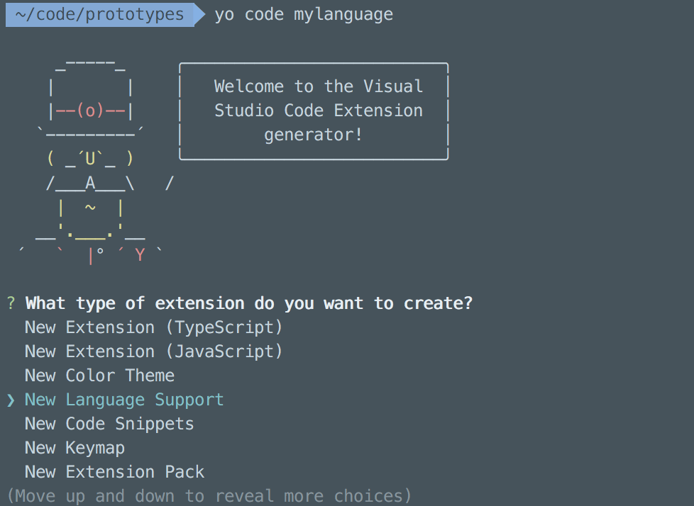
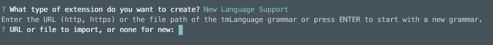
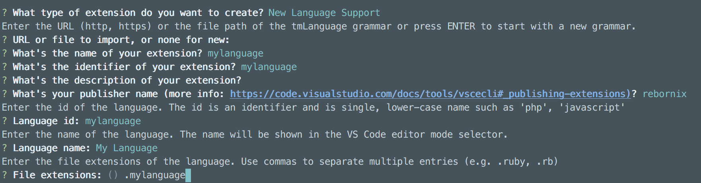
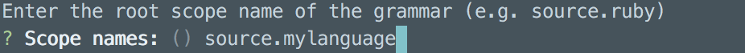
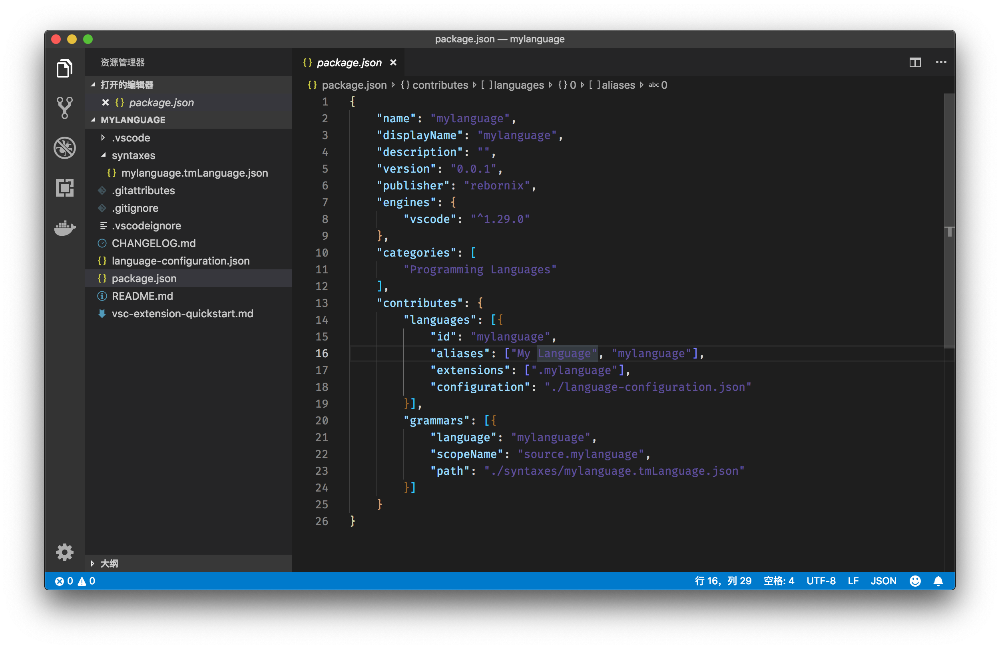
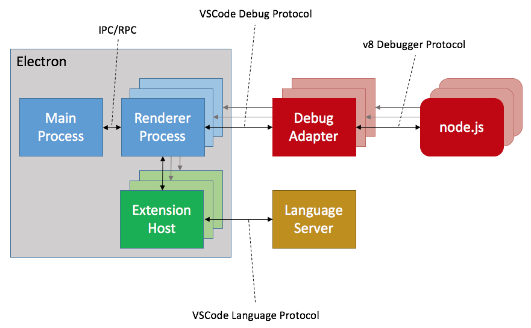
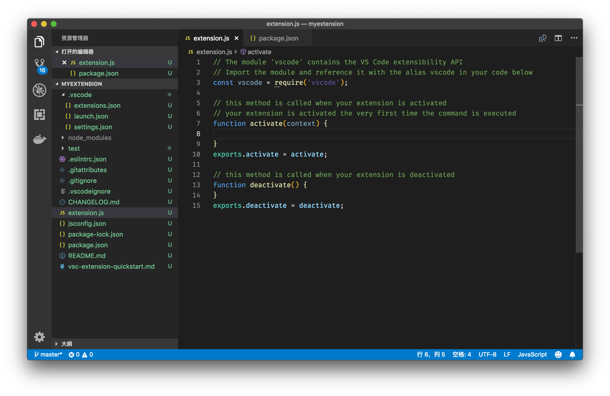
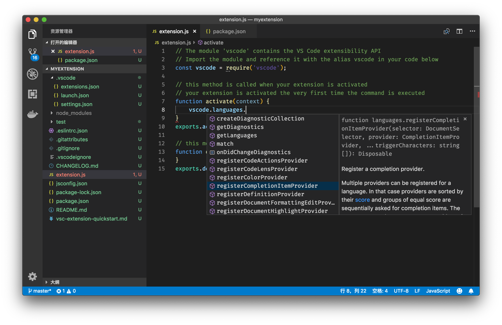
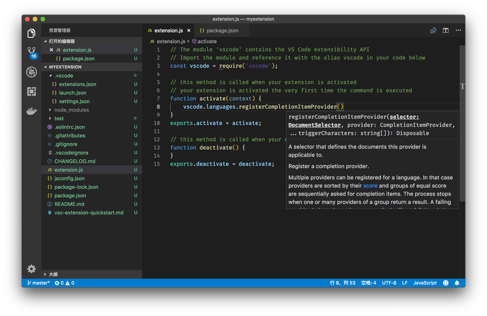

# 34 | 插件开发（三）：自定义语言支持

mp3: https://static001.geekbang.org/resource/audio/22/61/229fbb017b4f457e2368ae65e6248b61.mp3

今天我们的主题是：**自定义语言支持**。在开始今天的内容前，我首先要说的就是 Don’t Panic，别害怕。自定义语言支持听起来可能有点复杂，而且似乎距我们的日常工作有些遥远。

其实不然，我们在工作中可能经常会自定义一些配置文件，甚至要自定义一些 DSL （Domain Specific Language），如果能够为这些特殊的内容和文件，提供必要的语言支持，那么工作效率就能够得到很大的提升。

另外，在 VS Code 中自定义语言支持，并不只是 TypeScript、Rust 等语言开发者的特权，任何人都可以借助 VS Code 的插件定义和 API 实现它们，甚至不需要书写 Language Server，也能达成一样的效果。

好了，闲话少说，让我们开始今天的内容。

一、创建语言支持模板
----------

首先要做的就是创建一个语言支持相关的插件模板。这一次我们要做的选择是 “New Language Support”。

New Language Support

接着，我们就遇到算是棘手的问题：脚手架工具让我们提供 tmLanguage。

选择 Grammar

tmLanguage 就是 TextMate 创造的定义语言语法的文件，Sublime、Atom 以及 VS Code 都是继承自此。如果其他的编辑器已经支持了某个语言，你大可将其直接引入。这也是为什么 VS Code 插件 API 一经发布，很快大部分在 Textmate、Sublime 上支持的语言就在 VS Code 上得到了支持，都拥有不错的语法高亮。

关于如何书写 tmLanguage，TextMate 官方有一个简短但翔实的文档：[Language Grammars — TextMate 1.x Manual](https://macromates.com/manual/en/language_grammars) 。 这里我们不会对其展开，不过在我看来，它的精髓是通过书写正则表达式，对代码进行搜索匹配，最后给每个代码片段标注上类型（token type）。

面对这个问题，我们不妨直接按下回车，暂时不提供 tmLanguage。

在输入完插件名、描述信息和发布者信息后，yeoman 提了三个跟语言相关的问题：

选择语言 id、姓名和文件后缀

第一个是 id ， id 是这门语言的唯一标识，最重要的就是不要和已经存在的主流语言产生冲突。第二个和第三个是语言的名字和后缀，这个就很好理解了。

最后脚手架工具问了一个跟 tmLanguage 有关的问题，就是指定这个语言的 scope name。我们依葫芦画瓢，就叫它 source.mylanguage 好了。

选择 Grammar root scope

回答了全部的问题后，我们就可以创建出模板了，下面我们来看看它的文件结构：

语言插件文件结构

二、Language Configuration
------------------------

通过 package.json 中 contributes 的值，我们可以发现这个插件注册两个信息。一个是 tmLanguage，用于语法高亮。另一个是 languages，也就是 mylanguage 这个语言的信息。它的信息包含以下几点：

*   id，也就是语言独一无二的标识；
*   alias，也就是语言的名字、别称；
*   extensions，就是这个语言相关文件的后缀名，设置了这个值之后，当我们打开一个后缀为 .mylanguage 的文件，VS Code 就知道把它识别成什么语言了；
*   configurations，是这个语言的配置信息所在文件的相对地址。

前面三个都是我们使用 yeoman 创建插件时提供的，那么最后这个 language-configuration.json 是干什么的呢？下面我们一起来看看它的内容：

    {
        "comments": {
            // symbol used for single line comment. Remove this entry if your language does not support line comments
            "lineComment": "//",
            // symbols used for start and end a block comment. Remove this entry if your language does not support block comments
            "blockComment": [ "/*", "*/" ]
        },
        // symbols used as brackets
        "brackets": [
            ["{", "}"],
            ["[", "]"],
            ["(", ")"]
        ],
        // symbols that are auto closed when typing
        "autoClosingPairs": [
            ["{", "}"],
            ["[", "]"],
            ["(", ")"],
            ["\"", "\""],
            ["'", "'"]
        ],
        // symbols that that can be used to surround a selection
        "surroundingPairs": [
            ["{", "}"],
            ["[", "]"],
            ["(", ")"],
            ["\"", "\""],
            ["'", "'"]
        ]
    }
    

这个设置已经为我们提供了一些语言相关信息的模板了。

### 1、Comments

第一个就是代码注释 comments 的格式。VS Code 允许我们提供两种不同格式的注释——**单行注释**和**多行注释**。提供了这两个信息后，当我们在编辑器里使用 Toggle Comment 命令时，VS Code 就会根据我们选择的内容的行数，来决定使用哪个格式的注释。

### 2、Brackets

第二个 brackets 就是指这个语言支持的括号类型。不过要注意的是，这里输入的括号类型，只支持单个字符，比如 Ruby 的 `def/end` 就不能在这里使用了。

### 3、autoClosingPairs

第三个 autoClosingPairs 是括号自动配对，比如说我们输入了 “{ ”，编辑器会自动替我们补上 “}” 了。autoClosingPairs 的书写格式有两种。第一种是类似于\[“{”, “}”\] 的数组形式，其中第一个元素就是开括号，第二个则是关括号。第二种书写格式则是输入一个对象，比如：

    { "open": "/**", "close": " */", "notIn": ["string"] }
    

通过 open 和 close 属性来指定开关括号。这里的 “括号” 则是一个相对抽象的概念，并不一定真的是一对括号，比如在上面的例子里，open 属性的值是 `/`**，而 close 属性则是 `*/` ，那么当我们输入 `/`** 后， 编辑器就会立刻替你补上 `*/`。相信到这里你就明白了，我们是**可以通过这个来实现注释的自动补全**。

与此同时，这种写法还支持一个新的属性，叫做 notIn。它的意思是，**在哪种代码里不进行自动补全**。比如我们在写注释的时候，可能就不希望将引号自动补全，不然的话，当我们输入 it’s 这种单词时，输入完单引号后，如果编辑器自作主张帮忙输入了另一个单引号，可就多此一举了。此时，我们就可以通过 notIn 巧妙地避开了这一功能。

    { "open": "'", "close": "'", "notIn": ["string", "comment"] }
    

notIn 可以填入的值有 “string” 和 “comment”。

### 4、surroundingPairs

surroundingPairs 里的字符对，适用于对选中的字符串进行自动包裹。这句话是什么意思呢？比如当我们选中了 abc 这三个单词，然后按下双引号，此时，VS Code 就会把 abc 直接变成 “abc” ，而不是将 abc 替换成双引号。这个功能就叫做**auto surround**。我们可以通过这个属性来决定我们的语言里面，哪些字符对可以直接 auto surround。

### 5、WordPattern、Folding和Indentation

除了上面这几个外，在 language-configuration.json 里，我们还可以使用的属性有 WordPattern、Folding和Indentation。

这三个属性，分别定义了在这门语言中，**一个单词长什么样、可被折叠的代码段的开头和结尾各长什么样以及如何根据一行的内容来控制缩进**。下面我们可以看看它们的例子：

    "folding": {
        "markers": {
            "start": "^\\s*//#region",
            "end": "^\\s*//#endregion"
        }
    },
    "wordPattern": "(-?\\d*\\.\\d\\w*)|([^\\`\\~\\!\\@\\#\\%\\^\\&\\*\\(\\)\\-\\=\\+\\[\\{\\]\\}\\\\\\|\\;\\:\\'\\\"\\,\\.\\<\\>\\/\\?\\s]+)",
    "indentationRules": {
      "increaseIndentPattern": "^\\s*((begin|class|(private|protected)\\s+def|def|else|elsif|ensure|for|if|module|rescue|unless|until|when|while|case)|([^#]*\\sdo\\b)|([^#]*=\\s*(case|if|unless)))\\b([^#\\{;]|(\"|'|\/).*\\4)*(#.*)?$",
      "decreaseIndentPattern": "^\\s*(}\\]]?\\s*(#|$)|\\.[a-zA-Z_]\\w*\\b)|(end|rescue|ensure|else|elsif|when)\\b)"
     }
    

这三个属性的键（key）都还是很好理解的，不过要注意，它们的值有一个共同点，那就是它们都是正则表达式。VS Code 在读取了这些正则表达式后， 就会拿它们对代码进行匹配。比如当我们用鼠标双击代码，编辑器就会尝试着选中当前的单词，而这个单词就可以由 wordPattern 来决定；再比如默认情况下，VS Code 会认为空格符并不是单词的一部分，但是有些语言则不然，空格也能成为合法的变量名称，这种时候，我们就可以在 wordPattern 中添加空格符以达到这一目的。

folding 设置里的 start 和 end，相信读过专栏[第11讲《一定要用好代码折叠、小地图和面包屑特性》](https://time.geekbang.org/column/article/40922)的话，你一定记得，我介绍过可以通过在代码中输入特殊注释的形式，告诉编辑器哪一行代码是可折叠代码的开始和结束，而这些语法规则，就是来自 folding 里的 start 和 end。

indentationRules 这条规则则是来自于 TextMate，感兴趣的同学可以阅读 TextMate 相关的文档 [Appendix — TextMate 1.x Manual](https://macromates.com/manual/en/appendix)。

三、Language Server Protocol
--------------------------

上面提到的 language-configuration.json 和 tmLanguage，一个控制了语言的 Folding、括号、单词等基础信息，另一个控制了语言的语法 tokenization 规则。有了这两个文件，我们就可以获得语法高亮和基于文本的各类编辑器功能了。

不过，如果我们想在编辑器内提供一定的自动补全或者代码跳转，好像这两个文件也不够哇。

没错，要实现智能语言服务，光靠配置文件肯定是不行的，我们还要写一点代码。在[插件开发第一讲](https://time.geekbang.org/column/article/69768)里，我提到过 VS Code 的插件架构，VS Code 允许我们实现一个 Language Server跑在独立的进程里，然后跟插件进行通讯，最后为 VS Code 提供智能语言服务。

不过，是不是只有实现 Language Server 这一种方法呢？

当然不是，VS Code 的插件 API 里包含了 Language Server Protocol 的这一套 API 。也就是说，我们可以通过书写简单的 JavaScript 代码，就可以为 VS Code 提供语言服务了，不理解 Language Server Protocol 也没关系，因为每个 API 都可以单独拿出来使用。

下面，我们就来看看，如何实现一个实现了自动补全的插件。我们还是沿用[《插件开发（一）：why、how 和 what》](https://time.geekbang.org/column/article/69768)里的那个插件模板。这个插件只有一个代码文件，就是 extension.js 。

插件模板

不过这一次啊，我们不再是注册一个命令，而是要注册一个自动补全提供者（provider）。我们可以先输入 `vscode.languages.`，然后看看自动补全都提示了什么。

vscode.languages下的 API

从上图中可以看到，languages 下能够注册各种不同的语言功能，比如自动补全（CompletionItemProvider）、代码跳转（DefinitionProvider）、格式化（DocumentFormattingEditProvider）等等。一个完整的 Language Server，其实就将这些方法通通实现，只不过 Language Server 是运行在另一个独立的进程里。而使用插件 API 时，我们选择只实现某些 API。今天，我们选择 CompletionItemProvider，

选择 registerCompletionItemProvider

`registerCompletionItemProvider` 需要提供三个参数。

**第一个是 DocumentSelector**。通过这个参数，我们能够控制在哪些文件中提供自动补全。这个参数的类型，可以是字符串，也可以是 DocumentFilter。这里我们先试用 “plaintext”，之后我会介绍如何查看和使用其他类型。

**第二个就是我们的 CompletionItemProvider了**。这个对象至少要拥有下面这个函数属性：

    provideCompletionItems(document: TextDocument, position: Position, token: CancellationToken, context: CompletionContext): ProviderResult<CompletionItem[] | CompletionList>;
    

这个函数就是建议列表内容的来源了。VS Code 在调用这个函数时，会提供：当前的文档 document，光标所在的位置 position，用于监测用户取消建议操作的 CancellationToken，以及最后一个当前补全项的上下文 context。

有了 document 和 position，我们就能够分析全文代码并且推测当前光标处可能的建议选项了。而返回值可以是 `CompletionItem[]` 或者 `CompletionList` 。我们来看看它们的定义：

     export class CompletionItem {
      label: string;
      kind?: CompletionItemKind;
      detail?: string;
      documentation?: string | MarkdownString;
      sortText?: string;
      filterText?: string;
      preselect?: boolean;
      insertText?: string | SnippetString;
      range?: Range;
      commitCharacters?: string[];
      keepWhitespace?: boolean;
      additionalTextEdits?: TextEdit[];
      command?: Command;
      constructor(label: string, kind?: CompletionItemKind);
     }
    
     export class CompletionList {
      isIncomplete?: boolean;
      items: CompletionItem[];
      constructor(items?: CompletionItem[], isIncomplete?: boolean);
     }
    

虽然 `CompletionItem` 的属性非常多，但实际上除了 label 以外，其他都是 optional 的。label 就是这个建议项的名字，用于建议列表里的显示。不过，除了 label，我们还必须告诉 VS Code，当用户从建议列表里选择了这个建议项之后，按下回车，我们该如何修改光标处的代码。这时候我们就要使用 insertText 和 range 这两个属性了，它们决定了将哪段代码替换成什么新的文本。

**`registerCompletionItemProvider` 的第三个属性，就是 triggerCharacters**。这个属性决定了，当用户按下哪个字符之后，编辑器就应该立刻询问 CompletionItemProvider 以提供自动补全建议。比如说，我们可以只在用户按下 . 和 ( 时触发自动补全，那么这里我们要输入的就是 \[‘.’, ‘(’\]

讲了这么多 API 的用途，下面我们就来将插件运行起来看看是什么样。现在的 extension.js 内容如下：

    const vscode = require('vscode');
    
    function activate(context) {
        vscode.languages.registerCompletionItemProvider('plaintext', {
            provideCompletionItems: (document, position) => {
                return [
                    {
                        label: 'mySuggestion',
                        insertText: 'mySuggestion'
                    }
                ]
            }
        }, ['.'])
    }
    exports.activate = activate;
    
    function deactivate() {
    }
    exports.deactivate = deactivate;
    

然后，我们需要将 package.json 里的 activationEvents 改成 `*`，

        "activationEvents": [
            "*"
        ],
    

F5 启动插件运行后，我们打开一个纯文本，然后输入 `this.`， 当我们输入 `.` 之后，我们就能立刻看到了建议列表。

调试代码，然后输入 this. 获得自动补全

然后我们按下回车，插件提供的建议就被插入到编辑器里了。

四、如何查询 API
----------

到这里，我们就成功地将自动补全的 API 运行起来了。你可能要问了，“我对 VS Code 的 API 不熟悉啊，怎么知道有哪个 API 可以使用，然后它有哪些函数可以使用，参数又该是什么类型呢？”

还是使用上面的样例代码，当你将光标移动到 `vscode.languages`上时，按下 F12，VS Code 就立刻跳转到了 VS Code 插件 API 的 typings 文件里了。这个文件里，就是所有插件 API 的定义了。

跳转到 VS Code 插件 API 的定义文件

如果你是在 registerCompletionItemProvider 上按下 F12，则是直接跳转到这个 API 的定义处；接着你可以通过跳转定义命令（F12），一个个查询每个类型。

跳转到 registerCompletionItemProvider API 的定义处

VS Code 的插件 API 太多了，很多我自己都不熟悉，不过有了这个 typings 文件，我不离开 VS Code，就能够了解到它们各自是怎么使用的。

小结
--

以上就是今天内容的全部了。我介绍了如何通过 language configuration 定义一门语言的基础信息，同时介绍了如何使用 VS Code 的基础 API 来提供自动补全。关于如何实现更多的智能语言功能，相信你可以通过 vscode.languages 下的各个 API 得到答案。

* * *

