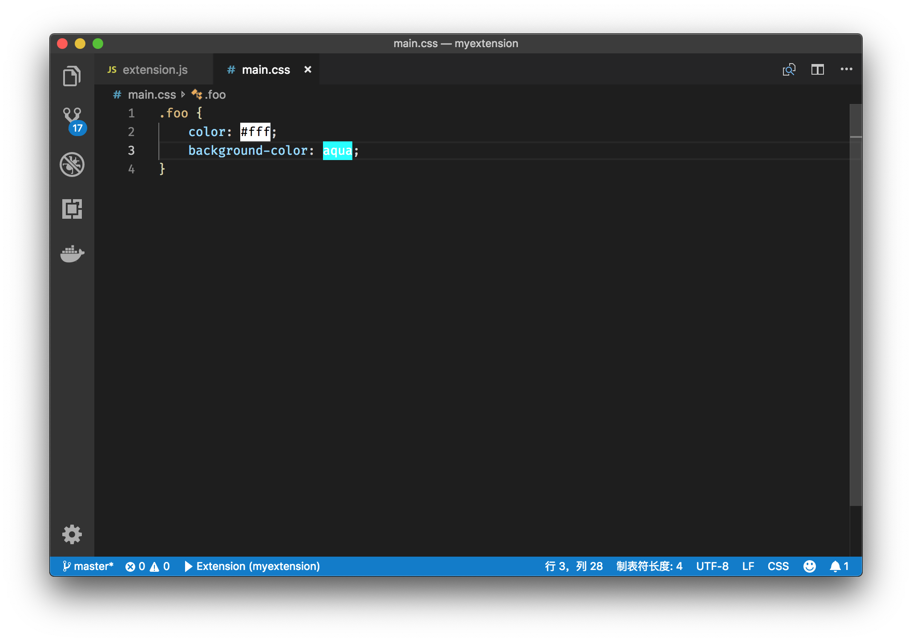
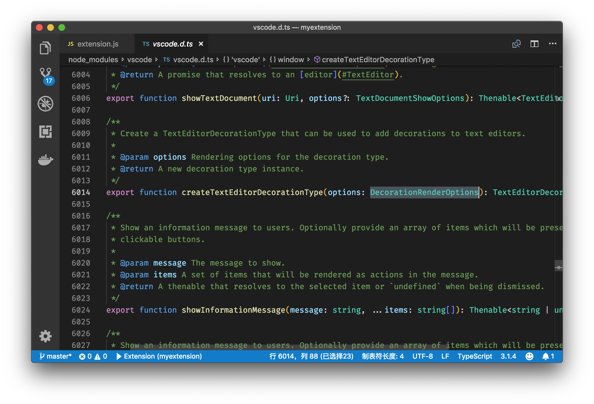
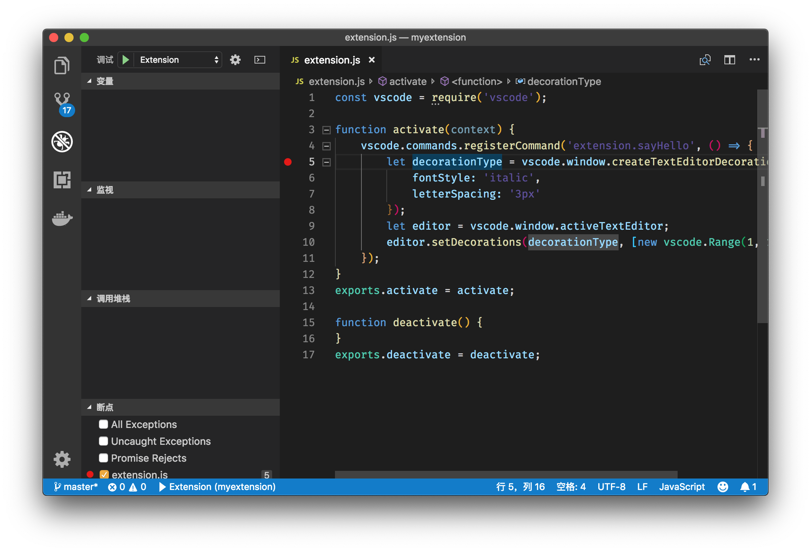
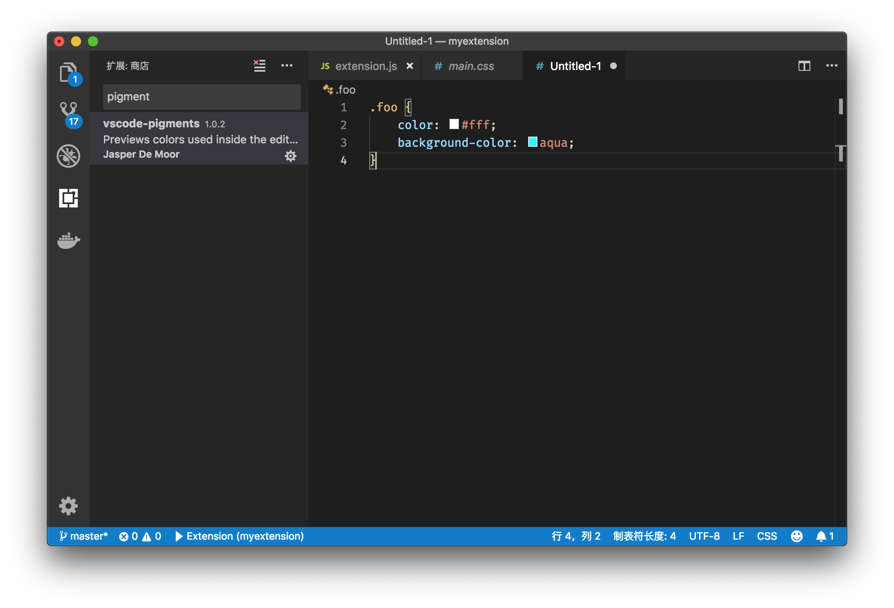
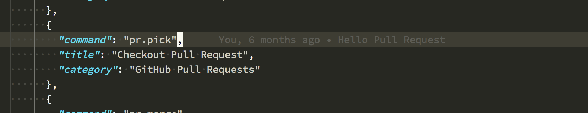

# 35 | 插件开发（四）：Decorations 装饰器

mp3: https://static001.geekbang.org/resource/audio/47/1e/4701362ceb85f7016fd92811f21c3e1e.mp3

今天，我们一起来聊一聊 Decorations 装饰器。

在[专栏第29讲《不错的插件推荐》](https://time.geekbang.org/column/article/68800)里，我介绍过[Pigment](https://marketplace.visualstudio.com/items?itemName=jaspernorth.vscode-pigments) 这个插件，有了这个插件，你在代码中书写的颜色，将会以背景色的形式，直接被渲染在代码下面。

Pigment 插件效果

这个功能，就是通过 Decorations API 来实现的。同样的，我之前介绍的 [Rainbow Brackets](https://marketplace.visualstudio.com/items?itemName=2gua.rainbow-brackets) 和 [Indent Rainbow](https://marketplace.visualstudio.com/items?itemName=oderwat.indent-rainbow)，都是使用的这套 API。

Rainbow Brackets 插件效果

Indent Rainbow 插件效果

**那今天我们就来看看如何使用 Decorations API 来实现类似的效果，以及在这个过程中有哪些注意点。**

样例
--

首先，我们依然使用[专栏插件部分第一讲](https://time.geekbang.org/column/article/69768)里使用的 JavaScript 插件模板。这个模板的 extension.js 文件，现在被修改成如下内容：

    const vscode = require('vscode');
    
    function activate(context) {
        vscode.commands.registerCommand('extension.sayHello', () => {
            let decorationType = vscode.window.createTextEditorDecorationType({
                backgroundColor: '#fff'
            });
            let editor = vscode.window.activeTextEditor;
            editor.setDecorations(decorationType, [new vscode.Range(0, 0, 0, 1)]);
        });
    }
    exports.activate = activate;
    
    function deactivate() {
    }
    exports.deactivate = deactivate;
    

这段代码依然是注册了一个名为 extension.sayHello 的命令，只不过命令执行的内容变了。这段代码做的第一件事情，就是创建了一个 DecorationType：

    let decorationType = vscode.window.createTextEditorDecorationType({
        backgroundColor: '#fff'
    })
    

从中可以看到我们使用了 vscode.window.createTextEditorDecorationType API，同时传入了一个参数对象，对象里添加了属性 backgroundColor，顾名思义，这个参数是用于定义背景色的。

接着我们就获取了当前的编辑器对象 editor。然后使用了 editor 上的方法 setDecorations，并且传入两个参数，第一个就是我们上面创建的 DecorationType，第二个则是代码范围 Range。通过这个 API，我们在这个代码片段 Range 上使用 decorationType 所代表的装饰器，也就是将背景色调整成 `#fff`，即白色。

下面，我们就运行这个插件看看：

运行 Decoration 插件

无论是Pigment、Rainbow Brackets，还是GitLens，它们修改编辑器内代码颜色和背景色的逻辑，跟上面的这一小段代码基本一致。只不过 VS Code 的 Decoration API，有非常多不同的属性可以设置，这也让 Decoration 效果千差万别。

下面我们就来看看都有哪些不同的设置。

DecorationRenderOptions
-----------------------

如果我们在 createTextEditorDecorationType 运行 F12，我们就能够跳转到 createTextEditorDecorationType 函数的定义处，接着我们就能看到这个函数的参数类型是 DecorationRenderOptions。

createTextEditorDecorationType

而 createTextEditorDecorationType 的结构如下：

    export interface DecorationRenderOptions extends ThemableDecorationRenderOptions {
            isWholeLine?: boolean;
            rangeBehavior?: DecorationRangeBehavior;
            overviewRulerLane?: OverviewRulerLane;
            light?: ThemableDecorationRenderOptions;
            dark?: ThemableDecorationRenderOptions;
    }
    

createTextEditorDecorationType 继承自 ThemableDecorationRenderOptions ，不过它多加了几个属性。比如是否将这个 decoration 运用在整行代码上，是否要将颜色渲染在滚动条上等。不过比较重要的两个属性其实是 light 和 dark。

**light** 和 **dark** 的类型，都是 ThemableDecorationRenderOptions，只要设置了这两个值，VS Code 就会根据当前的主题是深色还是浅色，决定是加载 light 还是 dark 的值，如果这两个值没有设置的话，那么就会查看 DecorationRenderOptions 上的其他属性。

接下来，我们就看看 ThemableDecorationRenderOptions 里有哪些属性：

        export interface ThemableDecorationRenderOptions {
            backgroundColor?: string | ThemeColor;
            outline?: string;
            outlineColor?: string | ThemeColor;
            outlineStyle?: string;
            outlineWidth?: string;
            border?: string;
            borderColor?: string | ThemeColor;
            borderRadius?: string;
            borderSpacing?: string;
            borderStyle?: string;
            borderWidth?: string;
            fontStyle?: string;
            fontWeight?: string;
            textDecoration?: string;
            cursor?: string;
            color?: string | ThemeColor;
            opacity?: string;
            letterSpacing?: string;
            gutterIconPath?: string | Uri;
            gutterIconSize?: string;
            overviewRulerColor?: string | ThemeColor;
            before?: ThemableDecorationAttachmentRenderOptions;
            after?: ThemableDecorationAttachmentRenderOptions;
        }
    

看到这里你可能会大吃一惊，这也太多了，那应该从哪里学起呢？别着急，我们来给这些属性归归类。

### 1、Color

首先，就是跟代码颜色和背景相关的属性。

    backgroundColor?: string | ThemeColor;
    color?: string | ThemeColor;
    overviewRulerColor?: string | ThemeColor;
    

我们除了使用类似于 “#fff” 这样的字符串以外，还可以使用 ThemeColor，也就是颜色主题（themes）里的颜色定义，比如：

    new vscode.ThemeColor('editorWarning.foreground') 
    

这样一来，当我们切换主题的时候，这个颜色就会随之改变了。这几个属性的效果，通过文章一开始的例子，相信你已经有所了解，这里不多赘述。

### 2、Border

第二类就是 Border 边框，熟悉 CSS 的同学肯定不会觉得陌生。

    border?: string;
    borderColor?: string | ThemeColor;
    borderRadius?: string;
    borderSpacing?: string;
    borderStyle?: string;
    borderWidth?: string;
    

比如，我们对上面的样例代码略作修改：

    vscode.commands.registerCommand('extension.sayHello', () => {
            let decorationType = vscode.window.createTextEditorDecorationType({
                border: '1px solid red;'
            });
            let editor = vscode.window.activeTextEditor;
            editor.setDecorations(decorationType, [new vscode.Range(0, 0, 0, 1)]);
        }); 
    

然后运行代码，就能够给代码块添加边框了。

设置 Border

### 3、Outline

在 CSS 中 Outline （轮廓）是用于在 Border 边框的周围画一条线，以突出元素。我们同样可以使用下面这些配置，来分别控制 Outline 的各个属性。

            outline?: string;
            outlineColor?: string | ThemeColor;
            outlineStyle?: string;
            outlineWidth?: string;
    

比如，我们将样例代码修改成如下：

        vscode.commands.registerCommand('extension.sayHello', () => {
            let decorationType = vscode.window.createTextEditorDecorationType({
                outline: '#00FF00 dotted'
            });
            let editor = vscode.window.activeTextEditor;
            editor.setDecorations(decorationType, [new vscode.Range(1, 1, 1, 4)]);
        });
    

然后运行，

设置 Outline

这里还请注意，为了更好地看到效果，我把 range 修改成了 new vscode.Range(1, 1, 1, 4)。

### 4、Font

下一组属性则是跟文字相关，我们可以通过 fontStyle 和 fontWeight 来控制字体，也可以通过 opacity 来控制透明度，或者使用 letterSpacing 控制文字之间的间距。

    fontStyle?: string;
    fontWeight?: string;
    opacity?: string;
    letterSpacing?: string;
    

比如我们将代码修改为：

    vscode.commands.registerCommand('extension.sayHello', () => {
            let decorationType = vscode.window.createTextEditorDecorationType({
                fontStyle: 'italic',
                letterSpacing: '3px'
            });
            let editor = vscode.window.activeTextEditor;
            editor.setDecorations(decorationType, [new vscode.Range(1, 1, 1, 4)]);
        });
    

然后运行代码。

设置字体

### 5、其他

除此之外，我们还可以通过 gutterIconPath 和 gutterIconSize 在行号旁边添加图标。

    gutterIconPath?: string | Uri;
    gutterIconSize?: string;
    

比如说 VS Code 中的断点，就可以通过这个属性在插件中实现。

断点

另外，也可以通过 before 和 after 在某个代码的前面或者后面创建 decorations，

    before?: ThemableDecorationAttachmentRenderOptions;
    after?: ThemableDecorationAttachmentRenderOptions;
    

比如说，CSS 文件里颜色前的 Color Decorator “小方格”，就是使用 before 属性来实现。

CSS color decorator

小结
--

以上就是 Decoration API 的大部分知识了，可能还有部分 API 或者属性，我没有介绍，不过相信你可以自己挖掘出它们的作用。

最后，我想对 Decoration 的使用讲讲我自己的心得体会。

DecorationRenderOptions 里的大部分属性，其实就是 CSS 里的各种属性，如果你知道如何使用 CSS 来对元素布局的话，那么使用这些 API 就难不倒你。不过，最难的还是想象力，如何活用这套 API，将重要的信息呈现给用户，而又不会打扰到用户的正常体验，这就体现功力了。

比如说，我们之前介绍过 Import Cost 插件，这个插件就巧妙地将每个 javascript 模块的大小，渲染在了这一行代码的最后，十分显眼，但又不会影响到你查看代码。

Import Cost

GitLens 插件也有类似的设计，它可以把当前这行是谁写的从 Git 中读取出来，然后渲染在本行代码的最后，同时，这些信息的颜色比较浅，从而不会喧宾夺主，但是当你需要的时候，也可以轻松迅速地查看代码的修改信息。

GitLens Blame 信息

而文章最开始介绍的 Rainbow Brackets 等，也都是对 Decoration API 的活用。看完这些例子后，不知道你有没有酝酿出什么有趣的想法和技巧，不妨和我们分享分享，一起学习 ;)

* * *

