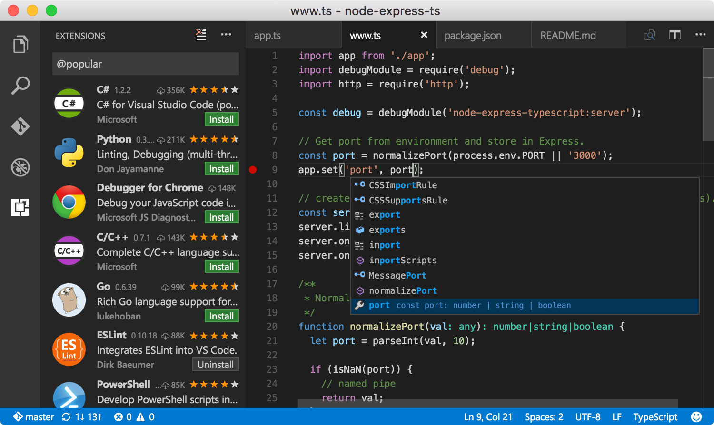

# 开篇词 | 玩转编辑器，向高效能编程再进一步

mp3: https://res001.geekbang.org/resource/audio/fc/28/fc45f986027c1eb7751a66816ec50428.mp3

你好，我是吕鹏。今天我来和你聊聊代码编辑器与高效能编程的故事。

代码编辑器的选择，可以说是开发者社区中一个经久不衰的话题，我也深受其扰。刚学会了怎么从 Vim 里退出来，就了解到 Emacs 居然可以煮咖啡；好不容易省下半个月口粮买了 Sublime Text，突然间发现大家却都开始用 Atom 了……

当然，上面我说的编辑器切换速度有些夸张，甚至有点像女生选购包包的过程，反正我老婆是这样，看到这个喜欢那个，看到那个又喜欢这个。但换个角度来看，开发工具的选择可以让程序员心花怒放，也能侧面说明他们对于开发的重要程度。编辑器的使命是提升效率，但由于时代背景和设计哲学的不同，不同工具的侧重点也千差万别。是 “专注做一件事儿并做到最好”，还是提供高度可扩展性？抑或是为初级用户提供“开箱即用”的体验？不同的选择最终导致了不同的产品形态。

对于像你我一样的开发者而言，如何挑选适合自己的编辑器这件事也开始变得让人头疼，就和前面举的女生狂街选包包的例子一样，没有一件是最合适的，但又好像每一件都还不错。同样，编辑器也一样，每个开发者都有不同的开发习惯和需求，幻想“**One editor to rule them all**”也极是不现实的，找到自己的最爱就好。

前段时间微软宣布收购 GitHub，消息立刻在 Atom 用户间炸开了锅。要知道，微软已经拥有号称“宇宙第一集成开发工具”的 Visual Studio 和新晋跨平台编辑器 Visual Studio Code，这一收购让 Atom 的前景变得扑朔迷离。不过很快 GitHub 下任 CEO Nat Friedman 给出了一个极其精彩的回答：

> Developers are really particular about their setup, and choosing an editor is one of the most personal decisions a developer makes. Languages change, jobs change, you often get a new computer or upgrade your OS, but you usually pick an editor and grow with it for years. The last thing I would want to do is take that decision away from Atom users.

上面是英文，我简单翻译下：

> 开发者极其在乎他们的开发环境，选择一款适合自己的开发工具也是非常个性化的决定。你使用的编程语言可能会变，工作会换，电脑会换，操作系统会换，但是一旦选择了一款开发工具，你可能很多年都会坚持使用它。所以只要 Atom 的社区还在，我们就会坚持把它开发下去。

这个例子恰好说明，你不停地折腾手中的开发工具，并不意味着你“喜新厌旧”，更不是说你“闲着没事”，不断追求更适合自己的工具是整个开发者社区的共同特征，也是他们编程的乐趣之一。

从我学习写代码开始，使用过的开发工具不下十余种。最开始学 C++，我用的是学校机器上的 Visual C++ 6.0，对于一个编程小白来说，它几乎意味着软件开发的全部。后来看到有同学在使用 Code Blocks，我才意识到编程语言和开发工具原来是两个不同层面的事情。

大二的时候上操作系统课，老师规定我们必须在 Minix （一种微内核架构的类 Unix 操作系统）上进行开发，没有了图形界面，我不得不硬着头皮学习了 Vi。Vi 和它的继任者 Vim 被不少人称为“编辑器之神”，但刚接触的时候，我对着键盘完全无从下手，既不知道如何输入代码也不知道怎么退出 Vi。

然而，在经过一个礼拜的适应期后，我被它“拒绝重复”的理念折服了。虽然课程压力大经常赶 deadline，但我不断地尝试如何让自己再快一点，完成一个操作如何再少一些按键。这是我第一次对开发工具产生了“信仰”，我的手指肌肉可能这辈子都没办法忘掉 Vim 的那些操作了。

我第二次被开发工具刷新世界观，是在 Mac 上看到 TextMate。TextMate 有着细腻的图形化界面，性能也非常不错，完全没有 IDE 的笨重感，对主流编程语言都有很好的语法高亮支持。那时候看Rails 作者 DHH 在视频里用 TextMate 写 Ruby ，我都惊呆了，原来无论是操作系统、编程语言还是开发工具，都可以这么性感。

这之后，每每有新的开发工具出现，我都会安装了把玩把玩。他们中有些让人眼前一亮，比如 Sublime Text 重写的第二版，Visual Studio 2013 和它比较成熟的深色主题。有些则让人有点摸不着头脑，没有留下深刻的印象。

最近几年随着前端和 JavaScript 社区的蓬勃发展，开始出现不少基于浏览器引擎进行二次开发的有趣尝试。我最先使用的是 Adobe 的 Brackets，它是基于 Chromium 浏览器嵌入式框架 CEF 开发的。Brackets 在 HTML、JavaScript、CSS 这三门语言的支持上可以称得上完美，不过刚开始它的性能实在是太差了，动不动就卡死。

再之后的故事相信你就比较熟悉了，GitHub 和微软相继推出了基于 Electron 的开发工具 Atom 和 Visual Studio Code，前端社区已经火到不行了，扩展和定制 Atom 或者 VS Code 的难度都大大降低，很快便收获了一众拥趸。

到这里你可能会问，吕鹏你讲了这么多开发工具，到底哪个最好呢？很抱歉，我没法给出答案。

就像我在最开始提到的，开发工具的选择是一个非常私人的事情，不同工具的侧重点也不同，所以你不是要找绝对最好的，而是要找一个当下最适合自己，能够最大程度发挥自己开发热情和效率的那一个。

从我的角度，在选择编辑器时，需要考虑以下三个因素。

**第一，你对文本、代码的编辑效率要求有多高**？比如说，在Vim里面你可以通过快捷键快速删掉一行或者某些单词，如果你喜欢这样的功能，那在选择编辑器的时候就要考虑它是否支持这样的特性了。

**第二，这个编辑器对编程语言的支持如何，配置是否繁琐**？比如你用Java，所以选择编辑器前，先要去官网查查官方是否重点支持这门编程语言，相关的配置之类的东西是不是繁琐。如果官方都不支持，那你可能就会吃力不讨好了。

**第三，它的插件生态怎么样，能否满足我的需求**？对于大部分编辑器来说，插件对于已有的编辑器功能来说，都是一个很好的互补，你也会大概率使用到插件的功能。所以使用之前，你要看看它的插件生态是否繁荣，能否支持你的基础需求。如果整个插件社区比较冷清，那你可要慎重…

相信你问完自己这三个问题，你心里已经有了一杆秤。**只有对它有足够的了解，你才知道它是不是适合你，你也才能像杨过一样把“剑”舞得炉火纯青，出神入化**。

好了，以上就是我对编辑器的认知，你可能感觉我夸大了工具在软件开发过程中的重要性，但就我个人的经验而言，如果你不能熟练使用代码编辑器，那就可能在工作中浪费很多时间。再进一步说，作为程序员，你每天都在与代码编辑器打交道，但是你却不能完全驾驭你最应该熟悉的东西，不觉得奇怪吗？

你不妨回想一下，当你连续工作了数小时来研究一个问题，大脑运转速度开始放缓，你在操作编辑器、编写代码或者调试的时候，是不是越来越依赖于直觉和肌肉记忆？当你们产品线上出现问题，需要火速修复和发布的时候，你是不是每一个操作都非常谨慎地选择自己最熟悉的方式，哪怕它不是最高效的那个？细细深究下去，相信我们可以找到非常多的例子，我们因为这样或那样的原因，不知不觉多了一些重复劳动。

我们都说程序员是最懒的一群人，他们致力于减少任何重复性劳动。一个更高效的快捷方式或者工作流，可能一次只能帮你省下几秒钟，相对于你在思考解决方案上花的时间而言可能完全不值一提。但如果把省下的时间累加起来，能够让你每天多休息二十分钟，一年下来就是几十个小时，算到这里，我想你应该明白我的意思了。

再回过来说编辑器的选择，如果这个时间点，你让我推荐一款我最喜欢的编辑器。我肯定毫不犹豫地和你说VS Code。**VS Code是一款免费的、开源的、高性能的、跨平台的、轻量级的代码编辑器**。它综合了Eclipse等很多优秀编辑器的优势，同时，也解决了它们的痛点问题，在性能、语言支持、开源社区方面都做得不错。

**恰好，这个专栏的主体就是VS Code。作为VS Code团队的开发者，我写这个专栏的意义就是希望能够带你全面了解 VS Code，以及帮助你在日常工作中更好地运用它，以便提升工作效率。**

我刚加入 VS Code 项目组的时候，使用了很长时间的 Vim 插件，因为我很熟悉那一套操作方式。但由于我在 VS Code 这个产品上负责的部分刚好就是编辑器，如果我都不使用自己做的功能，好像也说不过去。于是我索性卸载了 Vim 插件，开始吃自己的“狗粮”。

刚开始总有一些水土不服，跟同事结对编程的时候，我甚至会像个刚学代码的学生一样手足无措。但也正是这段充当自己产品用户的经历，让我意识到，你可能同样需要一个除了官方文档之外，相对系统了解 VS Code 的途径，毕竟少走弯路也是在省时间。

择日不如撞日，我想既然你已经看到这里，那也应该已经订阅了专栏。在这里，我先欢迎你的加入。让我们就从今天开始，一起“结对编程”，共同探索VS Code的高效使用之道。作为VS Code的开发者，我更是希望通过这门课程，能帮助你熟练掌握代码编辑器的“精髓”，更能彻底爱上VS Code。

我们这个专栏的终局是**双手不离键盘，从容随性Coding**，你准备好了么？接下来，让我给你先布置一些预习作业：

如果你还没有下载VS Code，那请先到官网自行[安装VS Code](https://code.visualstudio.com)，安装完成之后，可以简单写几行代码，看看菜单之类的基础功能。同时，还请仔细浏览下官网，对照我前面讲的编辑器选择三要素，思考下VS Code到底哪里做的还不错，哪里做的不如其他编辑器。

如果你已经是VS Code的用户，那你同样也需要浏览下官网，看看用了这么久，你是否已经体会到VS Code的精髓。同时，也请你在评论里列出来目前你在使用过程中的一些感受，以及一些迷惑的点。在未来的这些日子里，我将会一一帮你解答。

* * *

